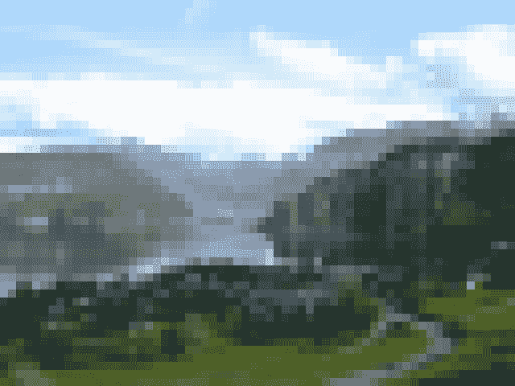
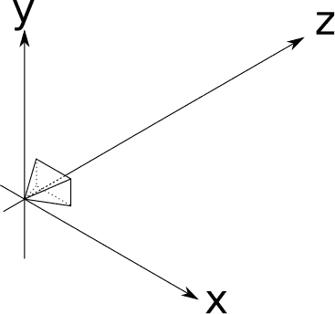
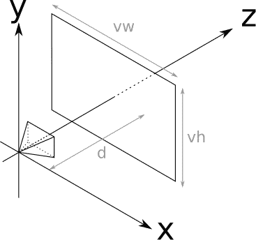
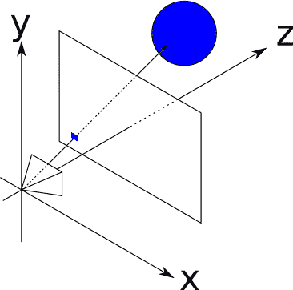
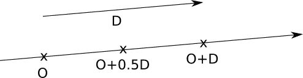
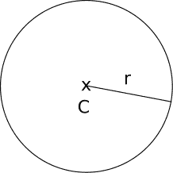
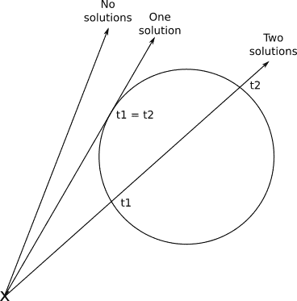
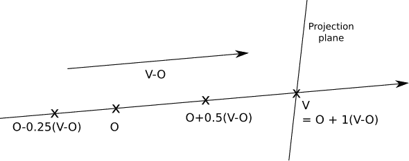
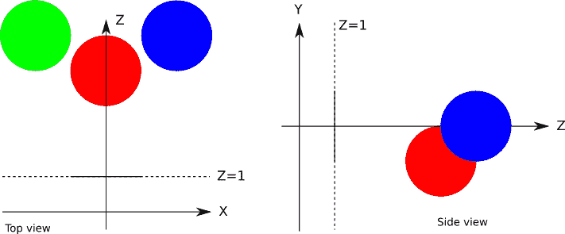
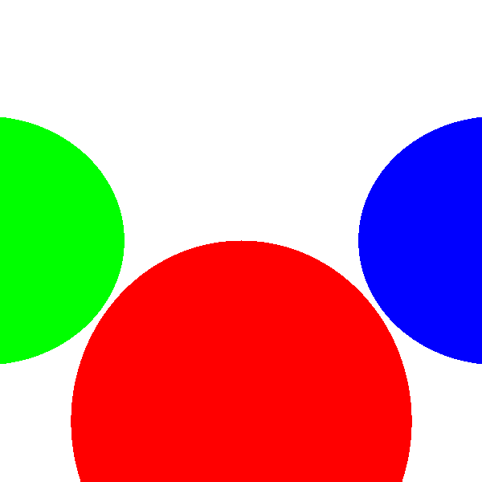

# 二,基本光线追踪

> 原文:[https://Gabriel gambetta . COm/COmputer-graphics-from scratch/02-basic-ray tracing . html](https://gabrielgambetta.COm/COmputer-graphics-from-scratch/02-basic-raytracing.html)

在这一章中，我们将介绍光线追踪，这是我们将涉及的第一个主要算法。我们从启发你的算法和设计一些基本的伪代码开始。然后我们看看如何表现场景中的光线和物体。最后，我们推导出一种方法来计算哪些光线构成了场景中每个物体的可见图像，并看看我们如何在画布上表现它们。

## [渲染瑞士风景](#rendering-a-swiss-landscape)

假设你正在游览一个充满异国情调的地方，遇到了一处令人惊叹的风景——如此令人惊叹，你只需*用*就能画出一幅捕捉到它的美丽的画。图 2-1 展示了这样一种景观。


Figure 2-1: 令人惊叹的瑞士风景  
你有画布和画笔，但你绝对缺乏艺术天赋。你的图形学之路是真的没戏了吗？

不一定。你可能没有艺术天赋，但你有条不紊。所以你做了最明显的事情:你得到了一个视窗口。你切下一块长方形的东西，把它框起来，然后将框固定在一根棍子上。现在你可以透过网状窗户看风景了。接下来，你选择最佳的角度来欣赏这一景观，并种植另一根棍子来标记你的眼睛应该在的确切位置。（描述的是摄像机的基本概念，不过这个例子真的很抽象，可以理解为unity或者unreal等常见引擎中的摄像机）

你还没有开始画，但现在你有了一个固定的视角和一个固定的框架，通过它你可以看到风景。而且这个固定的框架被网格分割成了一个个小方块。现在到了有条理的部分。你在画布上画一个网格，给它和昆虫网一样多的方格。然后你看网的左上角的方块。你能透过它看到的主要颜色是什么？天蓝色。所以你把画布左上角的正方形画成天蓝色。你对每个方格都这样做，很快画布就包含了一幅很好的风景画，就像透过画框看到的那样。最终的绘画如图 2-2 所示。



Figure 2-2: 粗略地估计风景画   
仔细想想，电脑本质上是一台非常有条理的机器，绝对缺乏艺术天赋。我们可以将绘画的创作过程描述如下:

```
For each little square on the canvas
    Paint it the right COlor
```

轻松点。然而，这个公式太抽象，不能直接在计算机上实现。我们可以更深入一点:

```
Place the eye and the frame as desired
For each square on the canvas
    Determine which square on the grid COrresponds to this square on the canvas
    Determine the COlor seen through that grid square
    Paint the square with that COlor
```

这仍然太抽象，但它开始看起来像一个算法——也许令人惊讶的是，这是完整光线跟踪算法的高级概述！是的，就这么简单。

## [基本假设](#basic-assumptions)

计算机图形学的魅力之一是在屏幕上画图。为了尽快实现这一点，我们将做一些简化的假设。当然，这些假设对我们能做什么施加了一些限制，但是我们将在后面的章节中取消这些限制。

首先，我们假设一个固定的观察位置。观察位置，也就是你在瑞士风景类比中放眼睛的地方，通常被称为*相机位置*；姑且称之为 $O$ 。我们将假设摄像机占据了空间中的一个点，它位于坐标系的原点，并且它永远不会从那里移动，所以 $O = (0，0，0)$ 现在。

其次，我们将假设一个固定的摄像机方向。相机方向决定了相机指向的位置。我们假设它看起来是朝着正的 $Z$ 轴的方向(我们将把它简化为 $(\vec{Z_+})$，正的 Y 轴$(\vec{Y_+})$向上，正的 X 轴$(\vec{X_+})$向右(图 2-3)。



Figure 2-3: 相机的位置和方向相机的位置和方向现在是固定的。类比中仍然缺少的是我们观察场景的“框架”。我们将假设这个帧具有尺寸 $(V_w)$ 和 $(V_h)$，并且在相机方向的前面，即垂直于 $(\vec{Z_+})$ 。我们还假设它在距离 $d$ 处，它的边平行于 $X$ 和 $Y$ 轴，并且它相对于 $(\vec{Z})$居中。这听起来很拗口，但实际上很简单。看一下图 2-4。

将作为我们对世界的窗口的矩形被称为*视窗*（viewport，也有翻译成视口）。本质上，我们将在画布上绘制通过视窗看到的任何东西。请注意，视窗的大小和到摄像机的距离决定了从摄像机可见的角度，称为*视场*（也有翻译成视锥），或简称为 FOV。人类几乎拥有$(180^\circ)$水平视野(尽管大部分是模糊的周边视觉，没有深度感,但当你了解工业摄像头你就会知道人眼是多么牛逼)。为简单起见，我们将设置$(V _ w$ = $V_h$ = d = 1 $；这导致了大约 $(53^\circ)$ 的 FOV，这产生了看起来合理的图像，不会过度失真。



Figure 2-4: 视窗的位置和方向  
让我们回到前面提到的“算法”,使用适当的技术术语，并将步骤编号在清单 2-1 中:

```
❶Place the camera and the viewport as desired
For each pixel on the canvas
    ❷Determine which square on the viewport COrresponds to this pixel
    ❸Determine the COlor seen through that square
    ❹Paint the pixel with that COlor
```

Listing 2-1: A high-level description of our raytracing algorithm我们刚刚完成了❶步骤(或者，更准确地说，现在把它解决掉了)。步骤❹是琐碎的:我们简单地使用`canvas.PutPixel(x, y, COlor)`。让我们快速地完成步骤❷，然后在接下来的几章里，我们将注意力集中在步骤❸的方法上。

## [画布转视口](#canvas-to-viewport)

清单 2-1 中算法的步骤❷要求我们`Determine which square on the viewport COrresponds to this pixel`。我们知道像素的画布坐标—让我们称它们为 $(C_x)$ 和 $(C_y)$ 。请注意，我们是如何方便地放置视口的，以便它的轴与画布的轴相匹配，并且它的中心与画布的中心相匹配。因为视口是以世界单位测量的，而画布是以像素测量的，所以从画布坐标到空间坐标只是比例的变化！（记住这个过程以后会更复杂）

$[V_x = C_x \cdot { V_w \over C_w } ]$

$[V_y = C_y \cdot { V_h \over C_h } ]$

还有一个额外的细节。虽然视口是 2D，但它嵌入在 3D 空间中。我们将它定义为距离摄像机$d $；根据定义，这个平面(称为*投影平面*)中的每个点都有 $z = d$ 。因此，

$[V_z = d]$

我们完成了这一步。对于画布上的每个像素 $((C_x，C_y))$ ，我们可以确定其在视口 $((V_x，V_y，V_z))$ 上的对应点。

## [追踪光线](#tracing-rays)

下一步就是要弄清楚从相机的角度看， $((V_x，V_y，V_z))$ 出来的光是什么颜色的 $(O_x，O_y，O_z)$ 。

在现实世界中，光来自一个光源(太阳,灯泡等等)，经过几个物体的反射，最终到达我们的眼睛。我们可以尝试模拟每一个光子离开模拟光源的路径，但这将非常耗时。我们不仅要模拟数量惊人的光子(一个 100 瓦的灯泡每秒发射$10^{20}$光子!，其中只有极少数在通过视口后会碰巧到达 $(O_x，O_y，O_z)$ 。这种技术被称为*光子追踪*或*光子映射*；不幸的是，这超出了本书的范围。

相反，我们将“反向”考虑光线；我们将从相机发出的光线开始，穿过视口中的一个点，并跟踪其路径，直到它击中场景中的某个对象。该对象是摄影机通过视口的该点“看到”的对象。所以，作为第一个近似，我们将把那个物体的颜色作为“穿过那个点的光的颜色”，如图 2-5 所示。



Figure 2-5: 视口中的小方块，代表画布上的单个像素，用相机通过它看到的物体的颜色绘制  
现在我们只需要一些方程式。

### [光线方程](#the-ray-equation)

为了我们的目的，表示射线的最方便的方法是使用参数方程。我们知道射线穿过 $O$ ，我们知道它的方向(从 $O$ 到 $V$ ，所以我们可以把射线中的任意一点 P 表示为

$P = O + t(V - O)$

其中 $t$ 为任意实数。通过将 $t$ 从 $-\infty$ 到 $+\infty$ 的每一个值代入这个方程，我们得到沿射线的每一个点 $P$ 。

我们姑且称之为 $(V - O)$ ,光线的方向, $\vec{D}$ 。等式变成了

$[P = O + t \vec {D}]$

理解这个方程的一个直观的方法是，我们从原点$O$开始射线，沿着射线的方向 $\vec{D}$ 前进一定的量$t$；很容易看出，这包括了沿射线的所有点。你可以在线性代数附录中读到关于这些向量运算的更多细节。图 2-6 显示了我们的等式在起作用。



Figure 2-6: 一些光线上的点  *O* + *t*$\vec{\mathsf{D}}$   对于不同的*t*取值.  
图 2-6 显示了光线上对应于 $t = 0.5$ 和 $t = 1.0$ 的点。 $t$ 的每一个值都沿着射线产生一个不同的点。

### [球面方程](#the-sphere-equation)

现在我们需要在场景中有某种物体，这样我们的光线就可以碰到某个物体。我们可以选择任意几何图元作为场景的构建模块；对于光线追踪，我们将使用球体，因为它们很容易用方程式操作。

什么是球体？球面是距离一个固定点固定距离的一组点。这个距离叫做球体的*半径*，这个点叫做球体的*中心*。图 2-7 显示了一个球体，由它的中心 $C$ 和它的半径 $r$ 定义。



Figure 2-7:由中心和半径确定的球体  
根据我们上面的定义，如果 $C$ 是一个球面的中心， $r$ 是一个球面的半径，那么这个球面上的点 $P$ 必须满足下面的等式:

$distance(P，C) = r$

我们以此等式做一个练习。如果你发现这些数学不熟悉，通读线性代数附录。

$P$ 和 $C$ 之间的距离是从 $P$ 到 $C$ 的向量的长度:

$|P - C| = r$

向量的长度(表示为 $|\vec{V}|$ )是其与自身的点积的平方根(表示为$(\langle \vec{V}，\vec{V} \rangle$ ):

$\sqrt { \lang P-C，P - C \rangle} = r$

为了去掉平方根，我们可以两边都平方:

$\langle P - C，P - C \rangle = r^2$

所有这些球方程的公式都是等价的，但最后一个公式在下面的步骤中操作起来最方便。

### [光线与球体相交](#ray-meets-sphere)

我们现在有两个方程:一个描述球体上的点，一个描述射线上的点:

$\langle P - C，P - C \rangle = r^2$

$P = O + t\vec{D}$

射线和球体相交吗？如果有，在哪里？

假设光线和球体相交于点 $P$ 。这个点既沿射线，又在球面上，所以必须同时满足这两个方程。请注意，这些方程中唯一的变量是参数 $t$ ，因为 $O$ , $\vec{D}$ , $C$ 和 $r$ 是给定的，而 $P$ 是我们试图寻找的点。

由于 $P$ 在两个等式中表示同一点，我们可以用第二个等式中的 $P$ 的表达式来代替第一个等式中的 $P$ 。这给了我们

$\langle O + t \vec{D} - C，O + t \vec{D} - C \rangle = r^2$

如果能找到满足这个方程的 $t$ 的值，就可以把它们放到光线方程中，找到光线与球体相交的点。

就目前的形式而言，这个等式有点难以理解。让我们做一些代数运算，看看我们能从中得到什么。

先设 $\vec{CO} = O - C$ 。那么我们可以把方程写成

$\langle \vec{CO} + t \vec{D} ，\vec {CO} + t \vec{d}\rangle = r^2$

然后，我们利用它的分配律将点积展开成它的分量(同样，请随意查阅线性代数附录):

$\langle \vec{CO}+t\vec{D} ,\vec{CO},\rangle + \langle \vec { CO }+t \vec { D },t\vec{D},\rangle = r^2$

$\langle \vec{CO},\vec{CO} \rangle+\lang t \vec { D }，\vec { CO }\rangle+\langle \vec { CO },t\vec { D } \rangle+\langle t\vec { D },t\vec { D } \rangle = r^2$

整理一下式子，我们得到

$\langle t \vec { D },t \vec { D } \rangle+2 \langle  \vec{CO},t \vec { D } \rangle+\langle  \vec { CO },\vec { CO },\rangle = r ^ 2$

将参数 $t$ 移出点积，并将 $r^2$ 移至等式的另一侧，得到

$t ^ 2 \langle \vec{D},\vec { D },\rangle+t(2 \langle \vec{CO},\vec { D }  \rangle+\langle \vec { CO },\vec { CO },\rangle-r ^ 2 = 0$

记住两个向量的点积是实数，所以尖括号之间的每一项都是实数。如果我们给它们命名，我们会得到更熟悉的东西:

$a = \langle \vec { D }，\vec{D} \rangle$

$b = 2 \langle \vec { CO }，\vec{D} \rangle$

$c = \langle \vec { CO }，\vec{CO} \rangle - r^2$

$at^2+bt+c = 0$

这完全是一个古老的二次方程！它的解是光线与球体相交的参数 $t$ 的值:

${ t_1，t_2  } = { {-b \pm \sqrt { b^2-4ac } \over { 2a } } }$

幸运的是，这具有几何意义。你可能还记得，一个二次方程可能无解，一个双解，或者两个不同的解，这取决于判别式 $b^2 -4ac$ 的值。这分别对应于光线不与球体相交,光线与球体相切以及光线进入和离开球体的情况(图 2-8)。



Figure 2-8: 一元二次方程解的几何解释:无解、一个解或两个解。一旦我们找到了 $t$ 的值，我们就可以把它插回到射线方程中，我们最终得到了与 $t$ 的值对应的交点 $P$ 。

## [渲染我们的第一个球体](#rendering-our-first-spheres)

概括地说，对于画布上的每个像素，我们可以计算视口中的对应点。给定相机的位置，我们可以表示从相机开始并通过视口中该点的光线方程。给定一个球体，我们可以计算出射线与该球体的交点。

因此，我们需要做的就是计算光线和每个球体的交点，保持交点最靠近相机，并用适当的颜色在画布上绘制像素。我们几乎准备好渲染我们的第一个球体了！

不过，参数 $t$ 值得特别注意。让我们回到射线方程:

$P = O + t(V - O)$

由于射线的来源和方向是固定的，所以在所有实数上改变 $t$ 将产生该射线中的每个点 $P$ 。注意对于 $t = 0$ 我们得到$P = 0$，对于 $t = 1$ 我们得到 $P = V$ 。 $t$ 的负值在与方向相反的*方向产生点，即在*摄像机后面的*。因此，我们可以把参数空间分成三部分，如表 2-1 所示。图 2-9 显示了参数空间的示意图。*



Figure 2-9: 参数空间中的几个点  
注意，相交方程中没有表明球体必须在相机的前面；该方程将很高兴地产生摄像机后的交点*的解。（有解但没渲染必要）显然，这不是我们想要的，所以我们应该忽略任何带有 $t < 0$ 的解。为了避免程序写起来过于蛋疼，我们将把解决方案限制在$t>1$；也就是说，我们将渲染超出投影平面的部分。
。
另一方面，我们不想给 $t$ 的值设一个上界；我们希望看到摄像机前的所有物体，不管它们有多远。然而，因为在后面的阶段我们*将*想要缩短射线，所以我们现在将引入这种形式主义，并给 $t$ 一个上限值 $+\infty$ (对于不能直接表示“无穷大”的语言，一个非常非常大的数就可以实现)。
（t=1为相机近平面，t取大数为远平面）

我们现在可以用一些伪代码来形式化我们到目前为止所做的一切。作为一般规则，我们将假设代码可以访问它需要的任何数据，所以我们不会麻烦显式地传递参数，如画布，并将重点放在真正必要的数据上。

main 方法现在看起来如清单 2-2 所示。

```
O = (0, 0, 0)
for x = -Cw/2 to Cw/2 {
    for y = -Ch/2 to Ch/2 {
        D = CanvasToViewport(x, y)
        COlor = TraceRay(O, D, 1, inf)
        canvas.PutPixel(x, y, COlor)
    }
}
```

Listing 2-2: The main method`CanvasToViewport`函数非常简单，如清单 2-3 所示。常数`d`代表摄像机和投影平面之间的距离。（相似三角形）

```
CanvasToViewport(x, y) {
    return (x*Vw/Cw, y*Vh/Ch, d)
}
```

Listing 2-3: The `CanvasToViewport` function`TraceRay`方法(清单 2-4)计算光线与每个球体的交点，并返回在 $t$ 请求范围内最近交点处球体的颜色。

```
TraceRay(O, D, t_min, t_max) {
    closest_t = inf
    closest_sphere = NULL
    for sphere in scene.spheres {
        t1, t2 = IntersectRaySphere(O, D, sphere)
        if t1 in [t_min, t_max] and t1 < closest_t {
            closest_t = t1
            closest_sphere = sphere
        }
        if t2 in [t_min, t_max] and t2 < closest_t {
            closest_t = t2
            closest_sphere = sphere
        }
    }
    if closest_sphere == NULL {
       ❶return BACKGROUND_COLOR
    }
    return closest_sphere.COlor
}
```

Listing 2-4: The `TraceRay` method在清单 2-4 中，`O`代表射线的原点；虽然我们在追踪来自放置在原点的相机的光线，但在后面的阶段不一定是这样，所以它必须是一个参数。这同样适用于`t_min`和`t_max`。

注意，当光线不与任何球体相交时，我们仍然需要返回*一些*颜色，❶— 我已经在大多数例子中选择了白色。

最后，`IntersectRaySphere`(清单 2-5)只是解二次方程。

```
IntersectRaySphere(O, D, sphere) {
    r = sphere.radius
    CO = O - sphere.center

    a = dot(D, D)
    b = 2*dot(CO, D)
    c = dot(CO, CO) - r*r

    discriminant = b*b - 4*a*c
    if discriminant < 0 {
        return inf, inf
    }

    t1 = (-b + sqrt(discriminant)) / (2*a)
    t2 = (-b - sqrt(discriminant)) / (2*a)
    return t1, t2
}
```

Listing 2-5: The `IntersectRaySphere` method为了将所有这些付诸实践，让我们定义一个非常简单的场景，如图 2-10 所示。



Figure 2-10: 一个非常简单的场景，从上(左)和从右(右)看。在伪场景语言中，大概是这样的:

```
viewport_size = 1 x 1
projection_plane_d = 1
sphere {
    center = (0, -1, 3)
    radius = 1
    COlor = (255, 0, 0)  # Red
}
sphere {
    center = (2, 0, 4)
    radius = 1
    COlor = (0, 0, 255)  # Blue
}
sphere {
    center = (-2, 0, 4)
    radius = 1
    COlor = (0, 255, 0)  # Green
}
```

当我们在这个场景上运行我们的算法时，我们最终得到了一个非常棒的光线追踪场景(图 2-11)。



Figure 2-11: 真不敢相信，你居然成功了（笑

[源代码和现场演示> >](https://gabrielgambetta.COm/cgfs/basic-rays-demo)

我知道，这有点令人失望，不是吗？哪里有倒影和阴影，哪里有精致的外观？别担心，我们会到达那里的。这是良好的第一步。球体看起来像圆形，总比它们看起来像猫要好。（这老师不会是德国来的吧，这笑话实在是太冷了）它们看起来不太像球体的原因是，我们缺少了人类如何确定物体形状的一个关键因素:它与光相互作用的方式。我们将在下一章讨论这个问题。

## [总结](#summary)

在这一章中，我们已经奠定了光线跟踪器的基础。我们选择了一个固定的设置(摄像机和视口的位置和方向，以及视口的大小)；我们选择了球体和射线的表示；我们已经探索了计算球体和光线如何相互作用所必需的数学；我们把这些放在一起，用纯色在画布上画出球体。
接下来的章节建立在这个基础上，通过模拟光线与场景中的物体相互作用的方式，增加了细节。