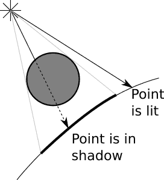
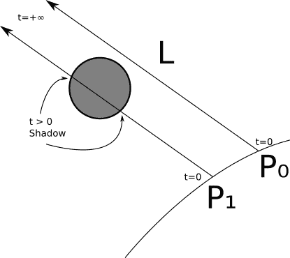
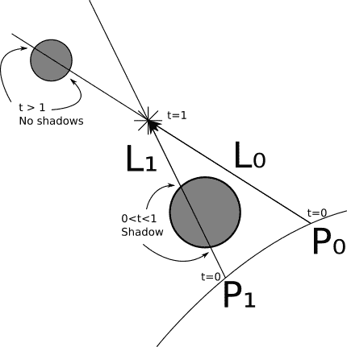
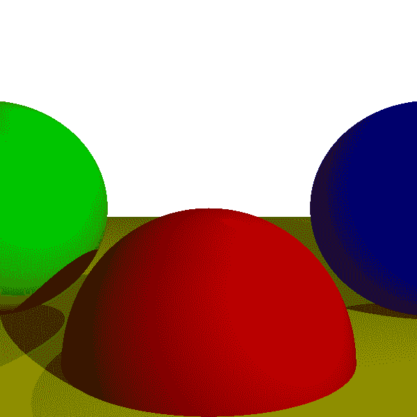
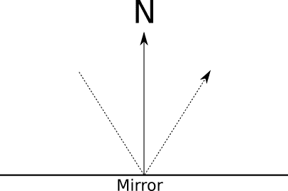
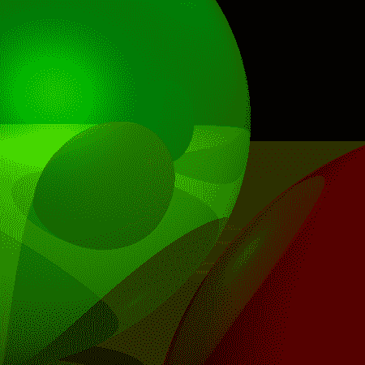
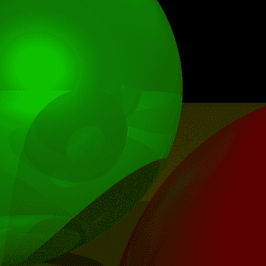
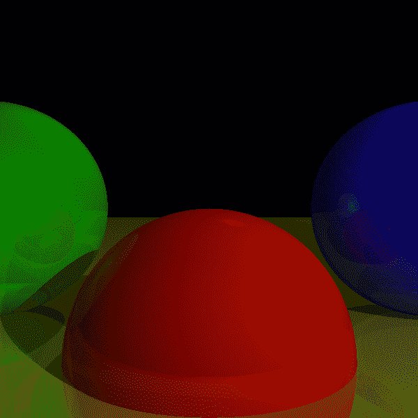

# 四、阴影和倒影

> 原文:[https://gabrielgambetta . com/computer-graphics-from scratch/04-shadows-and-reflections . html](https://gabrielgambetta.com/computer-graphics-from-scratch/04-shadows-and-reflections.html)

我们继续寻求以更真实的方式渲染场景。在上一章中，我们模拟了光线与表面相互作用的方式。在这一章中，我们将从两个方面来模拟光线与场景的交互：物体投射的阴影和物体在其他物体上的反射。

## [阴影](#shadows)

哪里有光和物体，哪里就有阴影。现在我们有光线和物品，那么阴影在哪里？

### [理解阴影](#understanding-shadows)

让我们从一个更基本的问题开始。为什么*要有* 阴影？当光线无法到达某个物体时就会产生阴影，因为有其他物体挡住了光线。

在前一章中，我们只看了光源和表面之间非常局部的相互作用，忽略了场景中发生的其他事情。对于阴影的产生，我们需要一个更全局的视角，并考虑光源、我们想要绘制的表面和场景中其他物体之间的相互作用。

从概念上讲，我们要做的事情相对简单。我们想添加一点逻辑表明，“如果在某点和光线之间有一个物体，不要添加来自这个光源的光线。”

我们要区分的两种情况如图 4-1 所示。



Figure 4-1: 如果有一个物体挡在光源和那个点中间，阴影就被投射到了那个点。事实证明，我们已经拥有了完成这项工作所需的所有工具。让我们从一盏方向灯开始。我们知道\(P\)；这是我们感兴趣的一点。我们知道 $(\vec{L})$ ；这是光的定义的一部分。知道了 \(P\) 和 $(\vec{L})$ ，我们就可以定义一条光线，即 $(P + t\vec{L})$ ，它从表面上的一点到无限远的光源。这条射线和其他物体相交吗？如果没有，在点和光之间没有任何东西，所以我们像以前一样从这个光计算照明。如果是的话，这个点就在阴影中，所以我们忽略这个灯光的照明。

事实证明，我们已经拥有了完成这项工作所需的所有工具。让我们从平行光开始。我们知道 \(P \) ；这是我们感兴趣的一个点。我们知道 \(\vec{L}\) ；这是光的定义的一部分。知道了 \(P\) 和 \(\vec{L}\) ，就可以定义一条光线，即 \(P + t\vec{L}\) ，即从表面上的一点到无限远的光源。这条射线和其他物体相交吗？如果没有，在点和光之间没有任何东西，所以我们像以前一样计算这个光源的光照。如果是的话，这个点就在阴影中，所以我们忽略这个光源的光照。

我们已经知道如何计算光线和球体之间的最近交点：用来追踪来自镜头的光线的 `TraceRay` 函数。我们可以重用其中的大部分来计算光线和场景其余部分之间的最近交点。

不过，该函数的参数略有不同:

*   光线不是从相机开始，而是从 \(P\) 开始。


*   光线的方向不是 $(V - O)$ 而是 $\vec{L}$ 。


*   我们不希望 \(P\) 后面的物体*在上面投下阴影，所以我们需要 $(t_{min} = 0)$ 。

*   由于我们处理的是无限远的平行光，一个非常远的物体应该仍然会在 \(P\) 上投下阴影，所以 
 $(t_{max} = +\infty)$ 。

图 4-2 显示了两点，\(P0\)和\(P1\)。当从\(P0\)沿着光的方向追踪一条光线时，我们发现它与任何物体都没有交集；这意味着光线可以到达\(P0\)，所以上面没有阴影。在\(P1\)的情况下，我们发现光线和球体有两个交点，分别是 \(t > 0\) (意思是交点在曲面和光线之间)；所以，重点在阴影里。



Figure 4-2: 球体投射在*P*<sub>1</sub>上, 但没有在 *P*<sub>0</sub>上.我们可以用非常相似的方式对待点光源，有两个例外。第一， $(\vec{L})$ 不是常数，但是我们已经知道如何从 \(P\) 和光的位置计算出来。第二，我们不希望距离光线更远的物体能够在 \(P\) 上投下阴影，所以在这种情况下我们需要 $(t_{max} = 1)$ 让光线“停”在光线上。

图 4-3 显示了这些情况。当我们从\(P0\)投射一条方向为\(l0\)的光线时，我们找到了与小球的交点；但是，这些有 $(t > 1)$ ，意思是它们不在光和\(P0\)之间，所以我们忽略它们。因此\(P0\)不在阴影中。另一方面，来自\(P1\)方向为\(L1\)的光线与大球体 \(0 < t < 1\) 相交，因此球体在\(P1\)上投下阴影。

我们需要考虑一个字面上的边缘情况。考虑一下光线 $(P + t\vec{L})$ 。如果我们从 $(t_{min} = 0)$ 开始寻找路口，我们会在 \(P\) 本身找到一个！我们知道 \(P\) 在一个球面上，那么对于 \(t = 0\) ，$(P+0 \ vec { L } = P)$ ；换句话说，每一个点都会给自己投下阴影！



Figure 4-3: 我们用 *t*的值在相交处去决定他们是否在点上投影.最简单的解决方法是将 $(t_{min})$ 设置为一个很小的值\(ε\)而不是 \(0\) 。从几何学上来说，我们说我们希望光线从 \(P\) 所在的表面一点点开始，而不是正好在 \(P\) 处。因此，对于平行光，范围将为 
 $[\epsilon，+\infty]$ ，对于点光源，范围将为 $[\epsilon，+\infty]$ 。

通过不计算光线和球体 $P$ 之间的交点来解决这个问题可能很有吸引力。这对球体有效，但对形状更复杂的物体无效。例如，当你用手保护眼睛免受阳光照射时，你的手在你的脸上投下阴影，两个表面都是同一个物体的一部分——你的身体。

### [阴影渲染](#rendering-with-shadows)

让我们把上面的讨论变成伪代码。

在它的先前版本中， `TraceRay` 计算最近的光线-球体交点，然后计算交点上的光照。我们需要提取最近的交点代码，因为我们想重用它来计算阴影(示例 4-1)。

```
ClosestIntersection(O, D, t_min, t_max) {
    closest_t = inf
    closest_sphere = NULL
    for sphere in scene.Spheres {
        t1, t2 = IntersectRaySphere(O, D, sphere)
        if t1 in [t_min, t_max] and t1 < closest_t {
            closest_t = t1
            closest_sphere = sphere
        }
        if t2 in [t_min, t_max] and t2 < closest_t {
            closest_t = t2
            closest_sphere = sphere
        }
    }
    return closest_sphere, closest_t
}
```


示例 4-1: 计算最近的交集

我们可以重写 `TraceRay` 来重用函数，生成的版本要简单多了(示例 4-2)。


```
TraceRay(O, D, t_min, t_max) {
    closest_sphere, closest_t = ClosestIntersection(O, D, t_min, t_max)
    if closest_sphere == NULL {
        return BACKGROUND_COLOR
    }
    P = O + closest_t * D
    N = P - closest_sphere.center
    N = N / length(N)
    return closest_sphere.color * ComputeLighting(P, N, -D, closest_sphere.specular)
}
```


示例 4-2：在分解出 `ClosestIntersection` 之后的更简单版本的 `TraceRay`

然后，我们需要添加阴影检查❶到 `ComputeLighting` (示例 4-3)。


```
ComputeLighting(P, N, V, s) {
    i = 0.0
    for light in scene.Lights {
        if light.type == ambient {
            i += light.intensity
        } else {
            if light.type == point {
                L = light.position - P
                t_max = 1
            } else {
                L = light.direction
                t_max = inf
            }

            // Shadow check
         ❶ shadow_sphere, shadow_t = ClosestIntersection(P, L, 0.001, t_max)
            if shadow_sphere != NULL {
                continue
            }

            // Diffuse
            n_dot_l = dot(N, L)
            if n_dot_l > 0 {
                i += light.intensity * n_dot_l / (length(N) * length(L))
            }

            // Specular
            if s != -1 {
                R = 2 * N * dot(N, L) - L
                r_dot_v = dot(R, V)
                if r_dot_v > 0 {
                    i += light.intensity * pow(r_dot_v / (length(R) * length(V)), s)
                }
            }
        }
    }
    return i
}
```


示例 4-3：带有阴影支持的 `ComputeLighting`

图 4-4 显示了新渲染的场景。



图 4-4：光线追踪场景，现在带有阴影


[源代码和live演示> >](https://gabrielgambetta.com/cgfs/shadows-demo)

现在我们有所进展。场景中的物体以更真实的方式相互交互，相互投射阴影。接下来，我们将探索更多的物体之间的交互——即物体反射其他物体。

## [反射](#reflections)

在前一章中，我们讨论了“像镜子一样”的表面，但这只是给了它们一个闪亮的外观。我们能拥有看起来像真镜子的物体吗——也就是说，我们能看到其他物体反射到它们的表面上吗？我们可以，事实上在光线跟踪器中做到这一点非常简单，但是当你第一次明白它是如何做到的时候，你可能会感到困惑。

### [镜子和反射](#mirrors-and-reflection)

让我们看看镜子是如何工作的。当你看着镜子时，你看到的是从镜子反射回来的光线。光线相对于表面法线对称反射，如图 4-5 所示。




图 4-5：一束光线从镜子上反射出来，其方向与镜子的法线对称。


如果我们有一个函数，给定一条光线，返回从它的方向来的光的颜色就好了。 . .

哦，等等！我们确实有一个，叫`TraceRay`！

在主循环中，对于每个像素，我们创建一条从相机到场景的光线，并调用`TraceRay`来计算相机在那个方向“看到”什么颜色。如果`TraceRay`确定相机看到的是一面镜子，它只需要计算反射光线的方向，并计算出来自该方向的光线的颜色；它必须召唤。 *本身*。

在这一点上，我建议你再读一遍最后几段，直到你明白为止。如果这是你第一次阅读递归光线追踪，你可能需要反复阅读和一些挠头，直到你真正理解它。

去吧，我会等着——一旦这美丽的欣快感到来，啊哈！时刻已经开始变短，让我们把它正式化一点。

当我们设计一个递归算法(一个调用自身的算法)时，我们需要确保我们不会导致一个无限循环(也称为“这个程序已经停止响应。您想终止它吗？”).这个算法有两个自然的退出条件:光线碰到不反光的物体的时候和没有碰到任何东西的时候。但是有一个简单的例子可以让我们陷入无限循环:无限霍尔效应。这就是当你把一面镜子放在另一面镜子前照进去时会发生的事情——你自己的无限复制品！

有许多方法可以防止无限递归。我们将在算法中引入一个*递归限制*；这将决定它能有多深。姑且称之为 \(r\) 。当 \(r = 0\) 时，我们看到物体，但没有反射。当 \(r = 1\) 时，我们看到物体以及一些物体在其上的倒影(图 4-6)。




Figure 4-6: 1次递归后的反射情况 (*r* = 1). 我们可以看到球体反射后的球体, 但反射后的球体自己并不反射.当 \(r = 2\) 时，我们看到的是物体，一些物体的倒影，一些物体的倒影(以此类推得到更大的 \(r\) 值)。图 4-7 显示了 \(r = 3\) 的结果。一般来说，深入到三个级别以上没有多大意义，因为在这一点上差异几乎不明显。




Figure 4-7: 3次递归后的反射情况 (r = 3). 现在我们可以看到球体的反射的反射的反射.我们会做另一个区分。“反思”不一定是一个全有或全无的命题；物体可能只是部分反射。我们将为每个表面分配一个介于 \(0\) 和 \(1\) 之间的数字，指定它的反射率。然后，我们将使用该数字作为权重来计算局部照明颜色和反射颜色的加权平均值。

最后，递归调用`TraceRay`的参数是什么？

*   光线从物体表面开始， \(P\) 。

*   反射光线的方向就是入射光线反弹 \(P\) 的方向；在`TraceRay`中我们有 $(\vec{D})$ ，入射光线的方向朝向 \(P\) ，所以反射光线的方向是 $(\vec{-D}$\)$ 相对于 $(\vec{N})$ 反射。


*   与阴影发生的情况类似，我们不希望物体反射自己，所以 $(t_{min} = \epsilon)$ 。

*   我们希望看到物体被反射，不管它们有多远，所以 $(t_{max} = +\infty)$ 。


*   递归限制比当前递归限制小 1(以避免无限递归)。

现在我们准备把它变成真正的伪代码。

### [反射渲染](#rendering-with-reflections)

让我们把反射添加到我们的光线跟踪器中。首先，我们通过向每个表面添加一个 `reflective` 属性来修改场景定义，描述它的反射程度，从 0.0 (完全不反射)到 1.0 (完美的镜子):

```
sphere {
    center = (0, -1, 3)
    radius = 1
    color = (255, 0, 0)  # Red
    specular = 500  # Shiny
    reflective = 0.2  # A bit reflective
}
sphere {
    center = (-2, 0, 4)
    radius = 1
    color = (0, 0, 255)  # Blue
    specular = 500  # Shiny
    reflective = 0.3  # A bit more reflective
}
sphere {
    center = (2, 0, 4)
    radius = 1
    color = (0, 255, 0)  # Green
    specular = 10  # Somewhat shiny
    reflective = 0.4  # Even more reflective
}
sphere {
    color = (255, 255, 0)  # Yellow
    center = (0, -5001, 0)
    radius = 5000
    specular = 1000  # Very shiny
    reflective = 0.5  # Half reflective
}
```

我们已经在计算镜面反射时使用了“反射光线”公式，所以我们可以把它去掉。它取一条光线 $(\vec{R})$ 和一条法线 $(\vec{N})$ ，返回相对于 $(\vec { R })$ 反射的 $(\vec{R})$ 。

```
ReflectRay(R, N) {
    return 2 * N * dot(N, R) - R;
}
```

我们需要对 `ComputeLighting` 做的唯一改变是调用这个新的 `ReflectRay` 的替换反射等式。

在 main 方法中有一个小的更改 —— 我们需要传递一个递归限制给顶层的`TraceRay` 以便进行调用:

```
color = TraceRay(O, D, 1, inf, recursion_depth)
```

如前所述，我们可以将 `recursion_depth` 的初始值设置为一个合理的值，例如 3。

唯一显著的变化发生在 `TraceRay` 的末尾，在这里我们递归地计算反射。你可以在示例 4-4 中看到这些变化。

```
TraceRay(O, D, t_min, t_max, recursion_depth) {
    closest_sphere, closest_t = ClosestIntersection(O, D, t_min, t_max)

    if closest_sphere == NULL {
        return BACKGROUND_COLOR
    }

    // Compute local color
    P = O + closest_t * D
    N = P - closest_sphere.center
    N = N / length(N)
    local_color = closest_sphere.color * ComputeLighting(P, N, -D, closest_sphere.specular)

    // If we hit the recursion limit or the object is not reflective, we're done
 ❶ r = closest_sphere.reflective
    if recursion_depth <= 0 or r <= 0 {
        return local_color
    }

    // Compute the reflected color
    R = ReflectRay(-D, N)
 ❷ reflected_color = TraceRay(P, R, 0.001, inf, recursion_depth - 1)

   ❸return local_color * (1 - r) + reflected_color * r
}
```
示例 4-4：带有反射的光线追踪器伪代码


Listing 4-4: 光线追踪渲染的伪代码, 没有反射。对代码的修改出奇的简单。首先，我们检查是否需要计算所有❶.的反射如果球体不是反射性的，或者我们达到了递归极限，我们就完成了，我们可以返回球体自己的颜色。


最有趣的变化是递归调用❷；用适当的反射参数调用自身，重要的是，递归深度计数器与检查❶相结合，防止了无限循环的出现。

最后，一旦我们有了球体的局部颜色和反射颜色，我们将“这个球体的反射程度”作为混合权重，把它们混合在一起❸。

事实胜于雄辩，可以查看下图 4-8 观察效果。




Figure 4-8: 光线追踪渲染场景, 没有反射


[源代码和现场演示> >](https://gabrielgambetta.com/cgfs/reflections-demo)

## [总结](#summary)

在前几章中，我们开发了一个在 2D 画布上渲染 3D 场景的基本框架，模拟光线与物体表面的交互方式。这给了我们一个简单的场景的初始表示。

在本章中，我们扩展了这个框架，以模拟场景中不同的对象不仅与光线相互作用，还相互作用——通过相互投射阴影和相互反射。因此，渲染的场景看起来更加真实。

在下一章, 我们会简单讨论扩展这项工作的不同方法, 从除球体外的其他物体到实际场景的一些考虑，比如渲染性能。