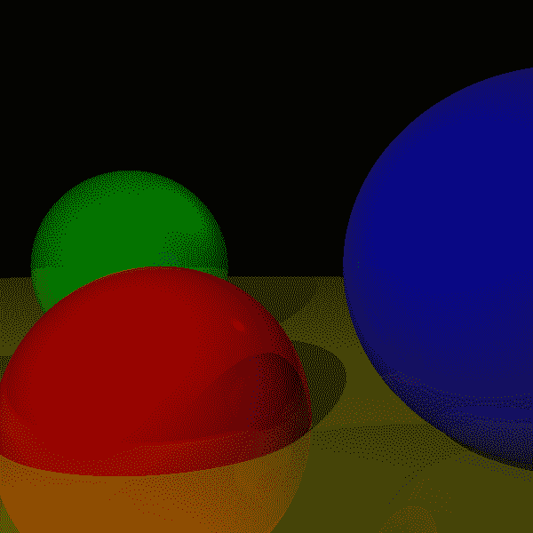
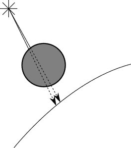
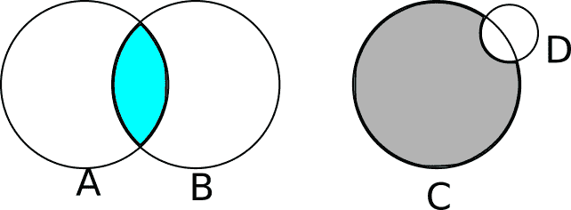
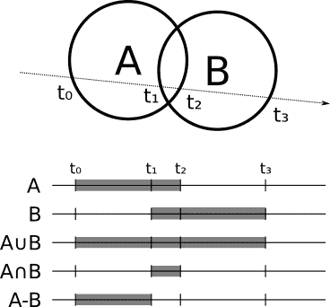
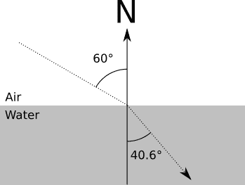

# 五、扩展光线跟踪器

> 原文:[https://Gabriel gambetta . com/computer-graphics-from scratch/05-extending-the-ray tracer . html](https://gabrielgambetta.com/computer-graphics-from-scratch/05-extending-the-raytracer.html)

我们将以几个我们尚未涉及的有趣主题的快速讨论来结束本书的第一部分:将相机放置在场景中的任何位置、性能优化、除球体之外的图元、使用构造性立体几何来建模对象、支持透明表面和超级采样。我们不会实现所有这些变化，但我鼓励您尝试一下！前面的章节，加上下面的描述，为你自己探索和实现它们打下了坚实的基础。

## [任意摄像机定位](#arbitrary-camera-positioning)

在讨论光线追踪的最开始，我们做了三个重要的假设:摄像机固定在 \((0，0，0)\) ，它指向 \(\vec{Z_+}\) ，它的“向上”方向是 \(\vec{Y_+}\) 。在这一节中，我们将取消这些限制，这样我们可以将相机放在场景中的任何地方，并指向任何方向。

先说相机位置。您可能已经注意到， \(O\) 在所有伪代码中只使用了一次:在顶层方法中作为来自相机的光线的原点。如果我们想改变摄像机的位置，我们需要做的唯一一件事*就是对 \(O\) 使用不同的值，我们就完成了。*

 **位置*的变化会影响光线的*方向*吗？一点也不。光线的方向是从相机到投影平面的向量。当我们移动相机时，投影平面也随之移动，因此它们的相对位置不会改变。我们写`CanvasToViewport`的方式和这个想法是一致的。

让我们把注意力转向相机的方向。假设您有一个旋转矩阵，它表示摄像机的期望方向。如果你只是旋转相机，相机的*位置*不会改变，但是它看向的方向会改变；它经历与整个照相机相同的旋转。所以如果你有了光线方向 \(\vec{D}\) 和旋转矩阵 \(R\) ，旋转后的 \(D\) 正好是 \(R \cdot \vec{D}\) 。

总之，唯一需要改变的函数是我们在清单 2-2 中写的 main 函数。清单 5-1 显示了更新后的函数:

```
for x in [-Cw/2, Cw/2] {
    for y in [-Ch/2, Ch/2] {
       ❶D = camera.rotation * CanvasToViewport(x, y)
       ❷color = TraceRay(camera.position, D, 1, inf)
        canvas.PutPixel(x, y, color)
    }
}
```

Listing 5-1: The main loop, updated to support an arbitrary camera position and orientation我们将相机的旋转矩阵❶应用于我们要追踪的光线方向，该矩阵描述了相机在空间中的方向。然后我们用相机的位置作为光线❷.的起点

图 5-1 显示了我们的场景从不同的位置和不同的摄像机方向渲染时的样子。



Figure 5-1: Our familiar scene, rendered with a different camera position and orientation

[源代码和现场演示> >](https://gabrielgambetta.com/cgfs/camera-demo)

## [性能优化](#optimization)

前面的章节集中在解释和实现光线跟踪器的不同特性的最清晰的方法上。因此，它功能齐全，但速度不是特别快。这里有一些想法，你可以自己探索，使光线跟踪更快。只是为了好玩，测量一下每一项的前后时间。结果会让你大吃一惊！

### [并行化](#parallelization)

使光线跟踪器更快的最明显的方法是一次跟踪多条光线。由于离开相机的每条光线都独立于其他光线，并且场景数据是只读的，所以您可以在每个 CPU 内核上跟踪一条光线，而不会有太多的损失或同步复杂性。事实上，光线跟踪器属于一类叫做*令人尴尬的可并行化*的算法，正是因为它们的本质使得它们非常容易并行化。

不过，每条光线生成一个线程可能不是一个好主意；管理潜在的数百万个线程的开销可能会抵消您获得的速度提升。一个更明智的想法是创建一组“任务”，每个任务负责光线跟踪画布的一部分(一个矩形区域，下至一个像素)，并在它们可用时将它们分派给运行在物理内核上的工作线程。

### [缓存不可变值](#value-caching)

*缓存*是一种避免反复重复相同计算的方法。每当有一个昂贵的计算，并且您希望重复使用这个计算的结果时，存储(缓存)这个结果并在下次需要它时重用它可能是一个好主意，特别是如果这个值不经常改变的话。

考虑在`IntersectRaySphere`中计算的值，光线跟踪器通常在这里花费大部分时间:

```
a = dot(D, D)
b = 2 * dot(OC, D)
c = dot(OC, OC) - r * r
```

不同的值在不同的时间段是不可变的。

一旦你加载了场景并且知道了球体的大小，你就可以计算`r * r`。除非球体的大小改变，否则该值不会改变。

至少对于整个帧来说，有些值是不可变的。一个这样的值是`dot(OC, OC)`,如果相机或球体移动，它只需要在帧之间改变。(请注意，阴影和反射跟踪的光线不是从相机开始的，因此需要注意确保在这种情况下不会使用缓存的值。)

有些值在整个光线中不会改变。例如，你可以在`ClosestIntersection`中计算`dot(D, D)`，并将其传递给`IntersectRaySphere`。

还有许多其他计算可以重复使用。发挥你的想象力！然而，并不是每个缓存的值都会使事情总体上变得更快，因为有时簿记开销可能比节省的时间更高。总是使用基准来评估优化是否真的有帮助。

### [阴影优化](#shadow-optimizations)

当一个表面的一个点因为有另一个物体挡路而处于阴影中时，它旁边的那个点很可能也会处于同一个物体的阴影中(这被称为*阴影一致性*)。你可以在图 5-2 中看到这样的例子。



Figure 5-2: Points that are close together are likely to be in the shadow of the same object.当搜索点和光之间的物体时，为了确定点是否在阴影中，我们通常会检查与其他物体的交点。但是，如果我们知道紧挨着它的点在特定对象的阴影中，我们可以首先检查与该对象的交点。如果我们找到一个，我们就完成了，我们不需要检查每一个其他对象！如果我们没有找到与该对象的交集，我们就返回到检查每个对象。

同样，当寻找光线-物体交点来确定一个点是否在阴影中时，你并不真的需要最近的*交点；知道*至少有一个*路口就足够了，因为那足以阻止光线到达那个点！所以你可以写一个专门版本的`ClosestIntersection`,它一找到*的交集就返回。你也不需要计算并返回`closest_t`；相反，您可以只返回一个布尔值。**

### [空间结构](#spatial-structures)

计算光线与场景中每个球体的交点有点浪费。有许多数据结构可以让您一次性丢弃整组对象，而不必单独计算交集。

假设你有几个相互靠近的球体。你可以计算包含所有这些球体的最小球体的中心和半径。如果光线不与这个*边界球*相交，你可以确保它不与它包含的任何球相交，代价是一次相交测试。当然，如果有，你仍然需要检查它是否与它包含的任何球体相交。

你可以更进一步，有几个层次的边界球体(即球体组)，形成一个层次结构，只有当一个实际的球体很有可能被一条光线穿过时，才需要一直遍历到底部。

虽然这一系列技术的具体细节超出了本书的范围，但是您可以在名称*包围体层次*下找到更多信息。

### [二次采样](#subsampling)

这里有一个简单的方法可以让你的光线跟踪 \(N\) 快一倍:计算 \(N\) 倍少的像素！

对于画布中的每个像素，我们通过视口追踪一条光线来对来自那个方向的光的颜色进行采样。如果光线少于像素，我们将对场景进行*二次采样*。但是，我们如何做到这一点，并仍然正确地渲染场景呢？

假设你追踪像素 \((10，100)\) 和 \((12，100)\) 的光线，它们恰好击中同一个物体。您可以合理地假设像素 \((11，100)\) 的光线也将击中同一个对象，因此您可以跳过最初搜索场景中所有对象的交点，直接跳到计算该点的颜色。

如果您在水平和垂直方向上跳过每隔一个像素，您可以减少 75%的主光线-场景相交计算-这是 4 倍的加速！

当然，你可能会错过一个非常薄的物体；这是一种“不纯的”优化，与前面讨论的不同，它产生的图像与未经优化的图像非常相似，但不能保证完全相同。某种程度上，这是偷工减料的“欺骗”。诀窍是知道哪些地方可以偷工减料，同时保持满意的结果；在计算机图形学的许多领域，重要的是结果的主观质量。

## [支持其他原语](#other-primitives)

在前几章中，我们使用球体作为基本体，因为它们在数学上很容易操作；也就是说，求射线和球体交点的方程相对简单。但是一旦你有了一个可以渲染球体的基本光线跟踪器，添加对渲染其他图元的支持就不需要太多额外的工作了。

请注意，`TraceRay`只需要能够为光线和任何给定的对象计算两件事:它们之间最近的交点的 \(t\) 的值和该交点处的法线。光线跟踪器中的其他东西都是独立于对象的！

三角形是一个很好的支持图元。三角形是最简单的多边形，所以你可以用三角形构建任何其他的多边形。它们在数学上很容易操作，所以它们是表示更复杂表面的近似的好方法。

要给光线跟踪器添加三角形支持，你只需要改变`TraceRay`。首先，计算射线(由其原点和方向给出)和包含三角形的平面(由其法线和距原点的距离给出)之间的交点。

由于平面无限大，光线几乎总是与任何给定的平面相交(除非它们完全平行)。所以第二步是确定光线-平面交点是否真的在三角形内部。有很多方法可以做到这一点，包括使用重心坐标或使用叉积来检查该点是否相对于三角形的三条边中的每一条边都“在内”。

一旦你确定了这个点在三角形内部，那么交点处的法线就是平面的法线。让`TraceRay`返回适当的值，并且不需要进一步的更改！

## [构造立体几何](#constructive-solid-geometry)

假设我们想要渲染比球体或曲面对象更复杂的对象，这些对象很难使用一组三角形精确建模。两个很好的例子是透镜(像放大镜里的那种)和死星(那不是月亮。 . . ).

我们可以很容易地用简单的语言描述这些物体。放大镜看起来像两片粘在一起的球体；死星看起来像一个球体，其中取出了一个更小的球体。

我们可以更正式地将它表达为对其他对象应用集合运算(如并集、交集或差集)的结果。继续我们上面的例子，一个透镜可以被描述为两个球体的交集，死星是一个大球体，从中减去一个小球体(见图 5-3)。



Figure 5-3: Constructive solid geometry in action. *A* \(\cap\) *B* gives us a lens. *C* – *D* gives us the Death Star.你可能认为计算实体对象的布尔运算是一个非常棘手的几何问题。你就完全正确了！幸运的是，*构造立体几何*让我们无需显式计算这些结果就能呈现对象间集合运算的结果！

我们如何在光线跟踪器中做到这一点？对于每个物体，你可以计算光线进入和离开物体的点；例如，在球体的情况下，光线在\(min(T1，T2)\)处进入，并在\(max(T1，T2)\)处离开。假设你想计算两个球体的交集；当光线在*两个*球体内部时，光线在交点内部，当光线在*两个*球体外部时，光线在交点外部。在减法的情况下，当光线在第一个物体内部而不是第二个物体内部时，光线在内部。对于两个对象的联合，当光线在任一对象内部时，它就在内部。

更一般地说，如果你想计算光线和物体 \(A \bigodot B\) (其中 \(\bigodot\) 是任何集合运算)，你首先分别计算光线和 \(A\) 和 \(B\) 之间的交集，这给你每个物体的 \(t\) 、 \(R_A\)的范围然后你计算 \(R_A \bigodot R_B\) ，这是 \(A \bigodot B\) 的“内部”范围。一旦你有了这个，光线和 \(A \bigodot B\) 之间最近的交点就是 \(t\) 的最小值，它既在物体的“内部”范围内，也在 \(t_{min}\) 和 \(t_{max}\) 之间。图 5-4 显示了两个球的并、交和差的内部范围。



Figure 5-4: Union, intersection, and subtraction of two spheres交叉点处的法线要么是产生交叉点的对象的法线，要么是它的对立面，这取决于你看的是原始对象的“外部”还是“内部”。

当然， \(A\) 、 \(B\) 不一定是原语；它们可能是集合运算本身的结果！如果你干净利落地实现了这一点，你甚至不需要知道*什么是* \(A\) 和 \(B\) 是什么，只要你能从中获得交集和法线。这样你就可以拿三个球体来计算，比如 \((A \cup B) \cap C\) 。

## [透明度](#transparency)

到目前为止，我们已经渲染了每个对象，就好像它是完全不透明的一样，但是这并不是必须的。我们可以渲染部分透明的物体，比如鱼缸。

实现这一点与实现反射非常相似。当光线照射到一个部分透明的表面时，你像以前一样计算局部和反射的颜色，但是你也计算一个额外的颜色——通过物体进入*的光的颜色，通过另一个对`TraceRay`的调用获得。然后，根据物体的透明程度，将这种颜色与局部颜色和反射颜色混合，就像我们计算物体反射时所做的一样。*

### [折射](#refraction)

在现实生活中，当一束光线穿过透明物体时，它会改变方向(这就是为什么当你将一根吸管浸入一杯水中时，它看起来“碎了”)。更准确地说，当光线穿过一种材料(例如空气)并进入另一种材料(例如水)时，它会改变方向。

方向改变的方式取决于每种材料的属性，称为其*折射率*，根据以下等式，称为斯涅尔定律:

\[{ \ sin(\ alpha _ 1)\ over \ sin(\ alpha _ 2)} = { n _ 2 \ over n _ 1 } \]

这里， \(\alpha_1\) 和 \(\alpha_2\) 是光线穿过表面前后与法线的夹角，\(n1 \)和\(N2 \)是物体内外材料的折射率。

例如， \(n_{air}\) 约为 \(1.0\) ， \(n_{water}\) 约为 \(1.33\) 。所以对于一束以 \(60^\circ\) 角度进入水中的光线，我们有

\[{ \ sin(60)\ over \ sin(\ alpha _ 2)} = { 1.33 \ over 1.0 } \]

\[\ sin(\ alpha _ 2)= { \ sin(60)\ over 1.33 } \]

\[\ alpha _ 2 = \ arcsin({ \ sin(60)\ over 1.33 })= 40.628^\circ\]

这个例子如图 5-5 所示。



Figure 5-5: A ray of light is refracted (changes direction) as it leaves air and enters water.在实现层面上，每条光线都必须携带一条额外的信息:它当前通过的材料的折射率。当光线与部分透明的对象相交时，根据当前材质和新材质的折射率，从该点计算光线的新方向，然后像以前一样继续操作。

停下来想一想:如果你实现了建设性的立体几何和透明度，你就可以模拟一个放大镜(两个球体的交集)，它的行为就像一个物理上正确的放大镜！

## [超级采样](#supersampling)

超级采样或多或少与子采样相反。在这种情况下，您寻求的是准确性而不是性能。假设对应于两个相邻像素的光线击中不同的物体。你可以给每个像素涂上相应的颜色。

但是请记住让我们开始的类比:每条光线都应该决定我们正在查看的“网格”的每个*正方形*的“代表性”颜色。通过对每个像素使用一条光线，我们可以任意决定穿过正方形中间的光线的颜色代表整个正方形，但这可能不是真的。

解决这个问题的方法就是在每个像素上追踪更多的光线——4、9、16，你想要多少就追踪多少——然后平均它们来得到像素的颜色。

当然，这会使你的光线跟踪器慢 4、9 或 16 倍，原因与二次采样使它快 \(N\) 倍完全相同。幸运的是，有一个中间地带。您可以假设对象属性在其表面上平滑变化，因此每像素发射四条光线，在非常细微的不同位置击中同一个对象，可能不会对场景有太大的改善。因此，您可以从每个像素一条光线开始，并比较相邻的光线:如果它们击中不同的对象，或者如果颜色差异超过某个阈值，您可以对这两条光线应用像素细分。

## [总结](#summary)

在这一章中，我们简要介绍了几个你可以自己探索的想法。这些以新的有趣的方式修改了我们一直在开发的基本光线跟踪器——使它更有效，能够表现更复杂的对象，或者以更接近我们的物理世界的方式模拟光线。

这本书的第一部分应该证明光线跟踪器是美丽的软件，可以使用简单直观的算法和简单的数学产生惊人的美丽图像。

可悲的是，这种纯粹是有代价的:性能。虽然有很多方法可以优化和并行化光线跟踪器，正如本章所讨论，但对于实时性能来说，它们的计算量仍然太大；虽然硬件速度每年都在提高，但一些应用程序要求图片速度提高 100 倍，而质量却丝毫不减。在所有这些应用中，游戏是要求最高的:我们期望每秒钟至少绘制 60 次完美的图像。光线追踪器不能切断它。

那么，自 90 年代初以来，电子游戏是如何做到的呢？

The answer lies in a completely different family of algorithms that we’ll explore in the second part of this book.*