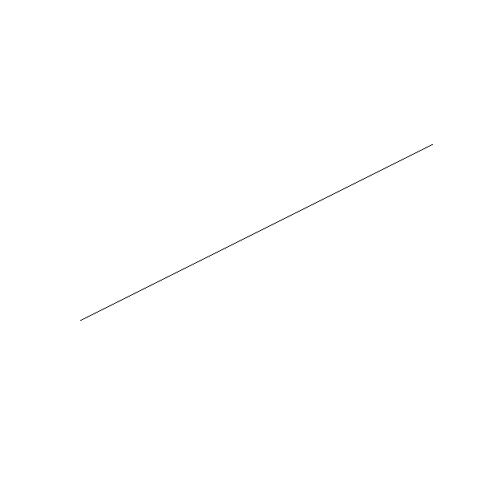
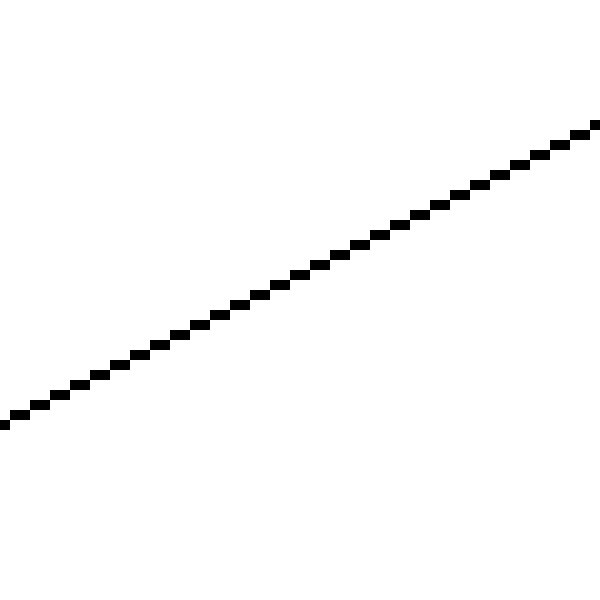
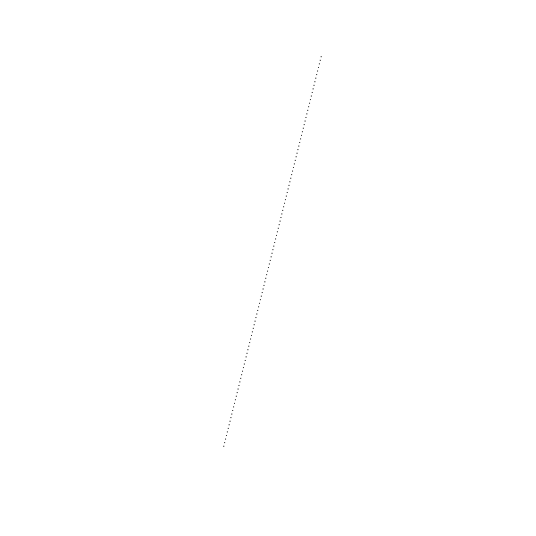
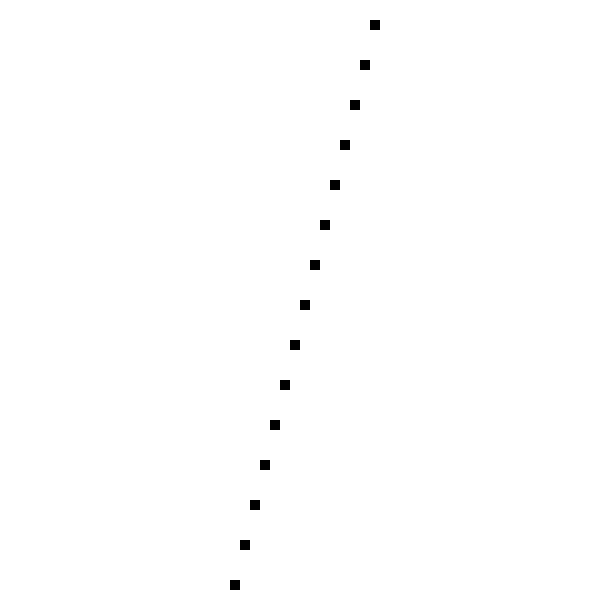

# 六、直线

> 原文:[https://gabrielgambetta . com/computer-graphics-from scratch/06-lines . html](https://gabrielgambetta.com/computer-graphics-from-scratch/06-lines.html)

在本书的第一部分中，我们广泛地研究了光线追踪，并开发了一个光线追踪器，它可以使用相对简单的算法和数学，使用精确的光照、材质属性、阴影和反射来渲染我们的测试场景。这种简单性是有代价的:性能。虽然非实时性能对于某些应用程序来说很好，比如建筑可视化或电影的视觉效果，但对于其他应用程序来说就不够了，比如视频游戏。

在这本书的这一部分，我们将探索一组完全不同的算法，它们更注重性能而不是数学的纯粹性。

我们的光线跟踪器从相机开始，通过视口探索场景。对于画布的每个像素，我们回答这个问题，*“场景的哪个对象在这里是可见的？”*现在我们将遵循一种在某种意义上相反的方法:对于场景中的每个对象，我们将尝试回答问题*“这个对象在画布的哪个部分是可见的？”*

事实证明，我们可以开发出比光线追踪更快的算法来回答这个新问题，只要我们愿意做出一些准确性的权衡。稍后，我们将探索如何使用这些快速算法来获得与光线跟踪器质量相当的结果。

我们再从头开始:我们有一个尺寸为 \(C_w\) 和 \(C_h\) 的画布，我们可以用`PutPixel()`设置单个像素的颜色，除此之外别无其他。让我们来探索如何在画布上绘制最简单的元素:两点之间的一条线。

## [描述线条](#describing-lines)

假设我们有两个画布点， \(P_0\) 和 \(P_1\) ，坐标分别为 \((x_0，y_0)\) 和 \((x_1，y_1)\) 。怎样才能画出 \(P_0\) 和 \(P_1\) 之间的直线段？

让我们从用参数坐标表示一条线开始，就像我们之前用光线表示一样(实际上，你可以把“光线”想象成 3D 中的线)。从\(P0 \)开始，沿着\(P0 \)到\(P1 \)的方向移动一段距离，可以得到直线上的任意一点\(P0 \):

\[P = P0+t(P1-P0)\]

我们可以把这个方程分解成两个，每个坐标一个:

\[x = x _ 0+t \ cdot(x _ 1-x _ 0)\]

\[y = y _ 0+t \ cdot(y _ 1-y _ 0)\]

让我们用第一个方程来求解 \(t\) :

\[x = x _ 0+t \ cdot(x _ 1-x _ 0)\]

\[x-x _ 0 = t \ cdot(x _ 1-x _ 0)\]

\[{ { x-x _ 0 } \ over { x _ 1-x _ 0 } } = t \]

我们现在可以将这个表达式代入第二个等式:

\[y = y _ 0+t \ cdot(y _ 1-y _ 0)\]

\[y = y _ 0+{ { x-x _ 0 } \ over { x _ 1-x _ 0 } } \ cdot(y _ 1-y _ 0)\]

稍微整理一下:

\[y = y _ 0+(x-x _ 0)\ cdot { { y _ 1-y _ 0 } \ over { x _ 1-x _ 0 } } \]

注意，\({ { y _ 1-y _ 0 } \ over { x _ 1-x _ 0 } } \)是一个仅依赖于线段端点的常数；姑且称之为 \(一\) 。所以我们可以将上面的等式改写为

\[y = y_0 + a\cdot(x - x_0)\]

什么是 \(a\) ？按照我们定义的方式，它测量的是 \(y\) 坐标的变化，单位是 \(x\) 坐标的变化；换句话说，它是直线斜率的度量。

让我们回到等式。分配乘法:

\【y = y _ 0+ax-ax _ 0 \]

将常数分组:

\[y = ax + (y_0 - ax_0)\]

还是那句话， \((y_0 - ax_0)\) 只取决于线段的端点；姑且称之为 \(b\) 。最终我们得到了

\【y = ax+b \]

这是一个线性函数的标准公式，可以用来表示*几乎*任何一条线。我们在求解 \(t\) 时，没有考虑如果 \(x_1 = x_0\) 会发生什么，就加了一个 \(x_1 - x_0\) 的除法。我们不能被零除，也就是说这个公式不能用 \(x_1 = x_0\) 来表示线——也就是垂直线。

为了解决这个问题，我们暂时忽略垂直线，以后再想办法处理它们。

## [画线](#drawing-lines)

我们现在有一种方法来获得我们感兴趣的 \(x\) 的每个值的 \(y\) 的值。这给了我们一对 \((x，y)\) 满足直线的方程。

我们现在可以写出一个函数的第一次近似，它画出一条从 \(P_0\) 到 \(P_1\) 的线段。设`x0`和`y0`分别为\(P0 \)的 \(x\) 和 \(y\) 坐标，`x1`和`y1`为\(P1 \)坐标。假设 \(x_0 < x_1\) ，我们可以从 \(x_0\) 到 \(x_1\) ，对 \(x\) 的每一个值计算 \(y\) 的值，在这些坐标上画一个像素:

```
DrawLine(P0, P1, color) {
    a = (y1 - y0) / (x1 - x0)
    b = y0 - a * x0
    for x = x0 to x1 {
        y = a * x + b
        canvas.PutPixel(x, y, color)
    }
}
```

注意，除法运算符`/`应该执行实数除法，而不是整数除法。尽管 \(x\) 和 \(y\) 在上下文中是整数，因为它们表示画布上像素的坐标。

还要注意，我们认为`for`循环包括范围的最后一个值。在 C、C++、Java 和 JavaScript 等语言中，这将被写成`for (x = x0; x <= x1; ++x)`。我们将在整本书中使用这个约定。

这个函数是上面等式的直接、简单的实现。它能工作，但是我们能让它更快吗？

我们不会为任何任意的 \(x\) 计算 \(y\) 的值。相反，我们只是以 \(x\) 的整数增量来计算它们，而且我们是按顺序进行的。就在计算完 \(y(x)\) 之后，我们计算 \(y(x+1)\) :

\【y(x)= ax+b \]

\[y(x+1) = a\cdot(x+1) + b\]

我们可以稍微修改一下第二个表达式:

\【y(x+1)= ax+a+b \]

\【y(x+1)=(ax+b)+a \]

\[y(x+1) = y(x) + a\]

这并不奇怪；毕竟，斜率 \(a\) 是当 \(x\) 增加 1 时 \(y\) 变化多少的度量，这正是我们在这里所做的。

这意味着我们可以计算出 \(y\) 的下一个值，只需取 \(y\) 的前一个值并加上斜率；不需要每像素乘法，这使得函数更快。开始时没有“T4 的前值”\(y\) ，所以我们从 \((x_0，y_0)\) 开始。然后我们继续把 \(1\) 加到 \(x\) 和 \(a\) 加到 \(y\) 直到我们到了 \(x_1\) 。

再次假设 \(x_0 < x_1\) ，我们可以将函数重写如下:

```
DrawLine(P0, P1, color) {
    a = (y1 - y0) / (x1 - x0)
    y = y0
    for x = x0 to x1 {
        canvas.PutPixel(x, y, color)
        y = y + a
    }
}
```

到目前为止我们一直假设 \(x_0 < x_1\) 。有一个简单的变通方法来支持这种情况下的线条:因为我们绘制像素的顺序并不重要，如果我们得到一条从右到左的线条，我们可以交换`P0`和`P1`来将其转换为同一线条的从左到右版本，并像以前一样绘制它:

```
DrawLine(P0, P1, color) {
    // Make sure x0 < x1
    if x0 > x1 {
        swap(P0, P1)
    }
    a = (y1 - y0) / (x1 - x0)
    y = y0
    for x = x0 to x1 {
        canvas.PutPixel(x, y, color)
        y = y + a
    }
}
```

让我们用函数画几条线。图 6-1 为线段 \((-200，-100)-(240，120)\) ，图 6-2 为该线的特写。



Figure 6-1: A straight line

Figure 6-2: Zooming in on the straight line线条呈现锯齿状是因为我们只能在整数坐标上画像素，数学线条实际上宽度为零；我们现在画的是从 \((-200，-100)-(240，120)\) 开始的理想线的量子化近似。有很多方法可以画出更漂亮的近似线条(你可能想看看 MSAA、FXAA、SSAA 和 TAA，它们可能是一组有趣的兔子洞的切入点)。我们不会去那里有两个原因:(1)它比较慢，(2)我们的目标不是画漂亮的线条，而是开发一些基本的算法来渲染 3D 场景。

再试试另一行， \((-50，-200)-(60，240)\) 。图 6-3 显示了结果，图 6-4 显示了相应的特写。



Figure 6-3: Another straight line with a higher slope

Figure 6-4: Zooming in on the second straight line哎呀。发生了什么事？

算法完全按照我们说的去做。它从左到右，为 \(x\) 的每个值计算一个 \(y\) 的值，并绘制相应的像素。问题是，它为 \(x\) 的每个值计算了*的一个*值 \(y\) ，而在这种情况下，我们实际上需要*的几个 \(y\) 的*值用于 \(x\) 的一些值。

这是因为我们选择了一个公式，其中\(y = f(x)\)；其实和我们不能画竖线是一个道理——一个极端的情况就是 \(y\) 的所有值对应 \(x\) 的同一个值。

## [画任意斜率的线](#drawing-lines-with-any-slope)

选择 \(y = f(x)\) 是一个任意的选择；我们同样可以选择将这条线表示为 \(x = f(y)\) 。通过交换 \(x\) 和 \(y\) 重新处理所有方程，我们得到以下算法:

```
DrawLine(P0, P1, color) {
    // Make sure y0 < y1
    if y0 > y1 {
        swap(P0, P1)
    }
    a = (x1 - x0)/(y1 - y0)
    x = x0
    for y = y0 to y1 {
        canvas.PutPixel(x, y, color)
        x = x + a
    }
}
```

这与之前的`DrawLine`相同，除了 \(x\) 和 \(y\) 的计算被交换了。这个可以处理垂直线，会正确的画出 \((0，0) - (50，100)\)；但是当然，它根本处理不了水平线，还是正确的画出 \((0，0) - (100，50)\) ！怎么办？

我们可以保留函数的两个版本，并根据我们要画的线选择使用哪一个。标准很简单。直线的 \(x\) 的不同值是否多于 \(y\) 的不同值？如果 \(x\) 的值比 \(y\) 多，我们用第一个版本；否则，我们使用第二个。

清单 6-1 显示了处理所有情况的`DrawLine`版本。

```
DrawLine(P0, P1, color) {
    dx = x1 - x0
    dy = y1 - y0
    if abs(dx) > abs(dy) {
        // Line is horizontal-ish
        // Make sure x0 < x1
        if x0 > x1 {
            swap(P0, P1)
        }
        a = dy/dx
        y = y0
        for x = x0 to x1 {
            canvas.PutPixel(x, y, color)
            y = y + a
        }
    } else {
        // Line is vertical-ish
        // Make sure y0 < y1
        if y0 > y1 {
            swap(P0, P1)
        }
        a = dx/dy
        x = x0
        for y = y0 to y1 {
            canvas.PutPixel(x, y, color)
            x = x + a
        }
    }
}
```

Listing 6-1: A version of `DrawLine` that handles all the cases这当然有效，但不美观。有许多重复的代码，选择使用哪个函数的逻辑、计算函数值的逻辑以及像素绘制本身都交织在一起。我们肯定能做得更好！

## [线性插值函数](#the-linear-interpolation-function)

我们有两个线性函数 \(y = f(x)\) 和 \(x = f(y)\) 。为了抽象出我们正在处理像素的事实，让我们以一种更通用的方式将其写成 \(d = f(i)\) ，其中 \(i\) 是*自变量*，我们为其选择值，而 \(d\) 是*因变量*，其值依赖于另一个变量，并且我们要对其进行计算。在水平式情况下， \(x\) 为自变量， \(y\) 为因变量；在垂直的情况下，情况正好相反。

当然，*任何*函数都可以写成 \(d = f(i)\) 。我们知道另外两个完全定义*我们的*函数的东西:它是线性的这个事实和它的两个值——即 \(d_0 = f(i_0)\) 和 \(d_1 = f(i_1)\) 。我们可以编写一个简单的函数，它接受这些值并返回一个包含所有中间值的列表，这些中间值是 \(d\) 的值，与之前一样，假设 \(i_0 < i_1\) :

```
Interpolate (i0, d0, i1, d1) {
    values = []
    a = (d1 - d0) / (i1 - i0)
    d = d0
    for i = i0 to i1 {
        values.append(d)
        d = d + a
    }
    return values
}
```

这个函数的“形状”与前两个版本的`DrawLine`相同，但变量被称为`i`和`d`，而不是`x`和`y`，并且这个函数不是绘制像素，而是将值存储在一个列表中。

注意， \(i_0\) 对应的 \(d\) 的值在`values[0]`中返回， \(i_0 + 1\) 的值在`values[1]`中返回，以此类推；一般情况下， \(i_n\) 的值在`values[i_n - i_0]`中返回，假设 \(i_n\) 在 \([i_0，i_1]\) 范围内。

这里有一个我们需要考虑的极限情况:我们可能想要为 \(i\) 的单个值计算\(d = f(I)\)——也就是说，当 \(i_0 = i_1\) 。在这种情况下，我们甚至不能计算 \(a\) ，所以我们将把它作为一个特例:

```
Interpolate (i0, d0, i1, d1) {
    if i0 == i1 {
       return [ d0 ]
    }
    values = []
    a = (d1 - d0) / (i1 - i0)
    d = d0
    for i = i0 to i1 {
        values.append(d)
        d = d + a
    }
    return values
}
```

作为实现细节，对于本书的其余部分，自变量 \(i\) 的值总是整数，因为它们代表像素，而因变量 \(d\) 的值总是浮点值，因为它们代表一般线性函数的值。

现在我们可以用`Interpolate`写`DrawLine`。

```
DrawLine(P0, P1, color) {
    if abs(x1 - x0) > abs(y1 - y0) {
        // Line is horizontal-ish
        // Make sure x0 < x1
        if x0 > x1 {
            swap(P0, P1)
        }
        ys = Interpolate(x0, y0, x1, y1)
        for x = x0 to x1 {
            canvas.PutPixel(x, ys[x - x0], color)
        }
    } else {
        // Line is vertical-ish
        // Make sure y0 < y1
        if y0 > y1 {
            swap(P0, P1)
        }
        xs = Interpolate(y0, x0, y1, x1)
        for y = y0 to y1 {
            canvas.PutPixel(xs[y - y0], y, color)
        }
    }
}
```

Listing 6-2: A version of `DrawLine` that uses `Interpolate`这个`DrawLine`可以正确处理所有情况(图 6-5)。


Figure 6-5: The refactored algorithm handles all cases correctly.

[源代码和现场演示> >](https://gabrielgambetta.com/cgfs/lines-demo)

虽然这个版本并不比以前的版本短多少，但它清楚地将中间值 \(y\) 和 \(x\) 的计算与独立变量的判断以及像素绘制代码本身分开。

令人惊讶的是，这种线算法并不是最好或最快的；这种区别可能属于布雷森汉姆的算法 T2。提出这个算法的原因有两个。第一，更容易理解，这是本书压倒一切的原则。其次，它给了我们`Interpolate`函数，我们将在本书的其余部分广泛使用它。

## [总结](#summary)

在这一章中，我们已经迈出了构建光栅化器的第一步。使用我们仅有的工具`PutPixel`，我们开发了一种算法，可以在画布上绘制直线段。

我们还开发了`Interpolate` helper 方法，这是一种有效计算线性函数值的方法。在继续之前，请确保您很好地理解了它，因为我们会经常用到它。

In the next chapter, we’ll use `Interpolate` to draw more complex and interesting shapes on the canvas: triangles.