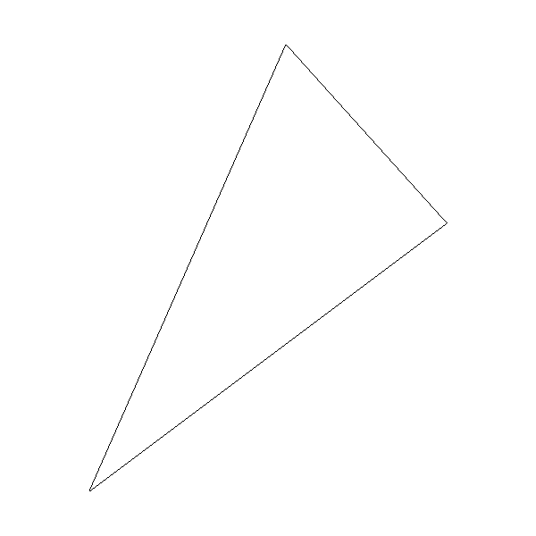
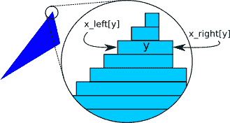
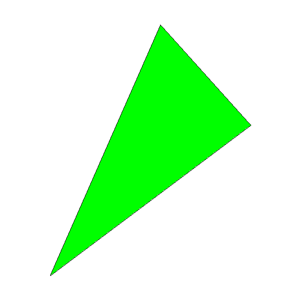

# 七、实心三角形

> 原文:[https://Gabriel gambetta . com/computer-graphics-from scratch/07-filled-triangles . html](https://gabrielgambetta.com/computer-graphics-from-scratch/07-filled-triangles.html)

在前一章中，我们迈出了绘制简单形状的第一步——即直线段——仅使用`PutPixel`和基于简单数学的算法。在这一章中，我们将重复使用一些数学来画一些更有趣的东西:一个实心三角形。

## [绘制线框三角形](#drawing-wireframe-triangles)

我们可以用`DrawLine`的方法画出三角形的轮廓:

```
DrawWireframeTriangle (P0, P1, P2, color) {
    DrawLine(P0, P1, color);
    DrawLine(P1, P2, color);
    DrawLine(P2, P0, color);
}
```

这种轮廓被称为*线框*，因为它看起来像一个由电线组成的三角形，如图 7-1 所示。



Figure 7-1: A wireframe triangle with vertices (–200,–250), (200,50), and (20,250)这是一个充满希望的开始！接下来，我们将探索如何用颜色填充三角形。

## [绘制填充三角形](#drawing-filled-triangles)

我们想画一个三角形，用我们选择的颜色填充。正如计算机图形学中经常出现的情况一样，解决这个问题的方法不止一种。我们将绘制实心三角形，把它们想象成水平线段的集合，当它们画在一起时看起来像一个三角形。图 7-2 显示了这样一个三角形，如果我们能看到单独的线段会是什么样子。



Figure 7-2: Drawing a filled triangle using horizontal segments以下是我们想要做的非常粗略的初步估计:

```
for each horizontal line y between the triangle's top and bottom
    compute x_left and x_right for this y
    DrawLine(x_left, y, x_right, y)
```

让我们从“在三角形的顶部和底部之间”开始。三角形由它的三个顶点\(P0 \)、\(P1 \)和\(p2 \)定义。如果我们将这些点按 \(y\) 的值递增排序，使得 \(y_0 \le y_1 \le y_2\) ，那么三角形所占的 \(y\) 的值的范围为 \([y_0，y_2]\) :

```
if y1 < y0 { swap(P1, P0) }
if y2 < y0 { swap(P2, P0) }
if y2 < y1 { swap(P2, P1) }
```

以这种方式对顶点进行排序使事情变得更容易:这样做之后，我们可以始终假设 \(P_0\) 是三角形的最低点， \(P_2\) 是最高点，因此我们不必处理每一种可能的排序。

接下来，我们必须计算`x_left`和`x_right`数组。这有点棘手，因为三角形有三条边，而不是两条。但是，仅考虑 \(y\) 的值，我们总会有一个从 \(P_0\) 到 \(P_2\) 的“高”边，和两个从 \(P_0\) 到 \(P_1\) 和 \(P_1\) 到 \(P_2\) 的“短”边

有一种特殊情况，当 \(y_0 = y_1\) 或\(y _ 1 = y _ 2 \)——即三角形的一边是水平的。当这种情况发生时，其他两边的高度相同，所以任何一边都可以被认为是“高”的一边。我们应该选择右边还是左边？还好，没关系；该算法将支持从左到右和从右到左的水平线，因此我们可以坚持我们的定义，即“高”的一侧是从 \(P_0\) 到 \(P_2\) 的一侧。

`x_right`的值将来自高边或连接短边；`x_left`的值将来自另一个集合。我们将从计算三边的 \(x\) 的值开始。因为我们将绘制水平线段，所以我们希望 \(y\) 的每个值都有一个值\(x \)；这意味着我们可以通过使用`Interpolate`，以 \(y\) 为自变量，以 \(x\) 为因变量来计算这些值:

```
x01 = Interpolate(y0, x0, y1, x1)
x12 = Interpolate(y1, x1, y2, x2)
x02 = Interpolate(y0, x0, y2, x2)
```

其中一边的 \(x\) 值在`x02`中；另一侧的值来自于`x01`和`x12`的串联。注意在`x01`和`x12`中有一个重复的值: \(y_1\) 的 \(x\) 值既是`x01`的最后一个值，也是

`x12`的第一个值。我们只需要去掉其中一个(我们任意选择最后一个值`x01`)，然后连接数组:

```
remove_last(x01)
x012 = x01 + x12
```

我们终于有了`x02`和`x012`，我们需要确定哪个是`x_left`，哪个是`x_right`。为此，我们可以选择任意一条水平线(比如中间那条)，比较其在`x02`和`x012`中的 \(x\) 值:如果`x02`中的 \(x\) 值小于`x012`中的值，那么我们知道`x02`一定是`x_left`；不然肯定是`x_right`。

```
m = floor(x02.length / 2)
if x02[m] < x012[m] {
    x_left = x02
    x_right = x012
} else {
    x_left = x012
    x_right = x02
}
```

现在我们有了绘制水平线段所需的所有数据。我们可以为此使用`DrawLine`。然而，`DrawLine`是一个非常通用的函数，在这种情况下，我们总是画水平的、从左到右的线，所以使用一个简单的`for`循环会更有效。这也给了我们更多的“控制”每一个我们画的像素，这在接下来的章节中会特别有用。

清单 7-1 有完整的`DrawFilledTriangle`。

```
DrawFilledTriangle (P0, P1, P2, color) {
   ❶// Sort the points so that y0 <= y1 <= y2
    if y1 < y0 { swap(P1, P0) }
    if y2 < y0 { swap(P2, P0) }
    if y2 < y1 { swap(P2, P1) }

   ❷// Compute the x coordinates of the triangle edges
    x01 = Interpolate(y0, x0, y1, x1)
    x12 = Interpolate(y1, x1, y2, x2)
    x02 = Interpolate(y0, x0, y2, x2)

   ❸// Concatenate the short sides
    remove_last(x01)
    x012 = x01 + x12

   ❹// Determine which is left and which is right
    m = floor(x012.length / 2)
    if x02[m] < x012[m] {
        x_left = x02
        x_right = x012
    } else {
        x_left = x012
        x_right = x02
    }

   ❺// Draw the horizontal segments
    for y = y0 to y2 {
        for x = x_left[y - y0] to x_right[y - y0] {
            canvas.PutPixel(x, y, color)
        }
    }
}
```

Listing 7-1: A function to draw filled triangles让我们看看这是怎么回事。该函数以任意顺序接收三角形的三个顶点作为参数。我们的算法需要他们从下到上的顺序，所以我们这样排序❶.接下来，我们计算三边❷的每个`y`值的`x`值，并连接两个“短”边❸.的数组然后我们算出哪个是`x_left`哪个是`x_right` ❹.最后，对于三角形顶部和底部之间的每个水平线段，我们获得其左右`x`坐标，并通过像素❺.绘制线段

图 7-3 显示了结果；为了验证的目的，我们先调用`DrawFilledTriangle`，然后用相同的坐标调用`DrawWireframeTriangle`，但是颜色不同。尽可能验证您的结果——这是发现代码中 bug 的非常有效的方法！



Figure 7-3: A filled triangle, with wireframe edges for verification

[源代码和现场演示> >](https://gabrielgambetta.com/cgfs/triangle-demo)

你可能会注意到三角形的黑色轮廓与绿色内部区域的*并不完全匹配；这在三角形的右下边缘尤其明显。这是因为`DrawLine`正在计算该边的 \(y = f(x)\) ，而`DrawTriangle`正在计算 \(x = f(y)\) ，由于舍入的原因，这可能会产生稍微不同的结果。为了让我们的渲染算法更快，这是我们愿意接受的近似误差。*

## [总结](#summary)

在这一章中，我们开发了一个在画布上绘制填充三角形的算法。这是从画线段开始的一步。我们还学会了把三角形想象成一组我们可以单独处理的水平线段。

In the next chapter, we’ll extend the math and the algorithm to draw a triangle filled with a color gradient; the math and the reasoning behind the algorithm will be key to the rest of the features developed in this book.