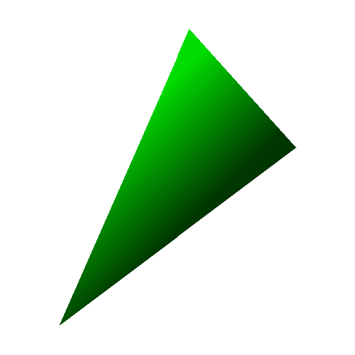
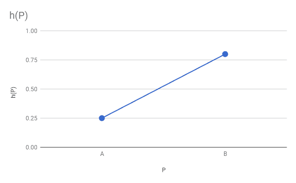

# 八、阴影三角形

> 原文:[https://gabrielgambetta . com/computer-graphics-from scratch/08-shaded-triangles . html](https://gabrielgambetta.com/computer-graphics-from-scratch/08-shaded-triangles.html)

在前一章中，我们开发了一个算法来绘制一个用纯色填充的三角形。我们这一章的目标是画一个*阴影*三角形——也就是一个填充了颜色渐变的三角形。

## [定义我们的问题](#defining-our-problem)

我们想用单一颜色的不同*阴影*填充三角形。它将如图 8-1 所示。

我们需要一个更正式的定义来定义我们要画的东西。为此，我们将为每个顶点分配一个实数值 \(h\) ，表示顶点处的颜色强度。 \(h\) 在 \([0.0，1.0]\) 范围内，其中 \(0.0\) 代表可能最暗的底纹(也就是黑色) \(1.0\) 代表可能最亮的底纹(也就是原来的颜色——不是白色！).



Figure 8-1: A shaded triangle给定三角形的基色 \(C\) 和该像素的强度 \(h\) ，为了计算像素的准确色度，我们将按通道乘: \(C_h = (R_C \cdot h，G_C \cdot h，B_C \cdot h)\) 。因此 \(h = 0.0\) 产生纯黑色， \(h = 1.0\) 产生原始颜色 \(C\) ，而 \(h = 0.5\) 产生的颜色是原始颜色的一半。

## [计算边缘阴影](#computing-edge-shading)

为了画出一个有阴影的三角形，我们需要做的就是为三角形的每个像素计算一个 \(h\) 的值，计算颜色对应的阴影，并绘制该像素。轻松点。

然而，此时我们只知道三角形顶点的 \(h\) 的值，因为我们选择了它们。我们如何计算三角形其余部分的 \(h\) 的值？

让我们从三角形的边开始。考虑边缘 \(AB\) 。我们知道 \(h_A\) 和 \(h_B\) 。在 \(M\) ， \(AB\) 的中点会发生什么？由于我们希望强度从 \(A\) 到 \(B\) 平滑变化，所以 \(h_M\) 的值必须在 \(h_A\) 和 \(h_B\) 之间。既然 \(M\) 在 \(AB\) 的中间，为什么不选择 \(h_M\) 在\(h _ A \)\(h _ B \)的中间——也就是他们的平均值？

更正式地说，我们有一个函数 \(h = f(P)\) 给每个点 \(P\) 一个强度值\(h \)；我们分别知道它在 \(A\) 和 \(B\) 、 \(h(A) = h_A\) 和 \(h(B) = h_B\) 的值。我们希望这个函数是平滑的。由于我们对 \(h = f(P)\) 一无所知，我们可以选择任何与我们*所知道的*兼容的函数，比如一个线性函数(图 8-2)。



Figure 8-2: A linear function *h*(*P*), compatible with what we know about *h*(*A*) and *h*(*B*)这与前一章中的情况非常相似:我们有一个线性函数 \(x = f(y)\) ，我们知道这个函数在三角形顶点的值，我们想要计算沿着它的边的 \(x\) 的值。我们可以以非常相似的方式计算三角形边上的 \(h\) 的值，使用`Interpolate`将 y 作为自变量(我们知道的值)，h 作为因变量(我们想要的值):

```
x01 = Interpolate(y0, x0, y1, x1)
h01 = Interpolate(y0, h0, y1, h1)

x12 = Interpolate(y1, x1, y2, x2)
h12 = Interpolate(y1, h1, y2, h2)

x02 = Interpolate(y0, x0, y2, x2)
h02 = Interpolate(y0, h0, y2, h2)
```

接下来，我们连接“短”边的 \(x\) 数组，然后确定`x02`和`x012`中哪个是`x_left`，哪个是`x_right`。同样，我们可以对 \(h\) 向量做类似的事情。

然而，我们将总是使用 \(x\) 值来确定哪边是左，哪边是右， \(h\) 值将只是“跟随” \(x\) 和 \(h\) 是屏幕上实际点的属性，所以我们不能随意混合左右两边的值。

我们可以这样编码:

```
// Concatenate the short sides
remove_last(x01)
x012 = x01 + x12

remove_last(h01)
h012 = h01 + h12

// Determine which is left and which is right
m = floor(x012.length / 2)
if x02[m] < x012[m] {
    x_left = x02
    h_left = h02

    x_right = x012
    h_right = h012
} else {
    x_left = x012
    h_left = h012

    x_right = x02
    h_right = h02
}
```

这非常类似于上一章中的相关代码部分(清单 7-1)，除了每次我们用一个`x`向量做一些事情，我们用相应的`h`向量做同样的事情。

## [计算室内遮阳](#computing-interior-shading)

最后一步是绘制实际的水平线段。对于每一段，我们知道`x_left`和`x_right`，就像上一章一样；现在我们也知道了`h_left`和`h_right`。但是这一次我们不能只是从左到右迭代并用基色绘制每个像素:我们需要为线段的每个像素计算 \(h\) 的值。

同样，我们可以假设 \(h\) 随 \(x\) 线性变化，并使用`Interpolate`来计算这些值。在这种情况下，独立变量是 \(x\) ，它从`x_left`值到我们正在着色的特定水平段的`x_right`值；因变量为 \(h\) ，其对应的`x_left`和`x_right`值为该段的`h_left`和`h_right`:

```
x_left_this_y = x_left[y - y0]
h_left_this_y = h_left[y - y0]

x_right_this_y = x_right[y - y0]
h_right_this_y = h_right[y - y0]

h_segment = Interpolate(x_left_this_y, h_left_this_y,
                        x_right_this_y, h_right_this_y)
```

或者，用更简洁的方式表达:

```
h_segment = Interpolate(x_left[y - y0], h_left[y - y0],
                        x_right[y - y0], h_right[y - y0])
```

现在只需要计算每个像素的颜色并绘制它！清单 8-1 显示了`DrawShadedTriangle`的完整伪代码。

```
DrawShadedTriangle (P0, P1, P2, color) {
   ❶// Sort the points so that y0 <= y1 <= y2
    if y1 < y0 { swap(P1, P0) }
    if y2 < y0 { swap(P2, P0) }
    if y2 < y1 { swap(P2, P1) }

    // Compute the x coordinates and h values of the triangle edges
    x01 = Interpolate(y0, x0, y1, x1)
    h01 = Interpolate(y0, h0, y1, h1)

    x12 = Interpolate(y1, x1, y2, x2)
    h12 = Interpolate(y1, h1, y2, h2)

    x02 = Interpolate(y0, x0, y2, x2)
    h02 = Interpolate(y0, h0, y2, h2)

    // Concatenate the short sides
    remove_last(x01)
    x012 = x01 + x12

    remove_last(h01)
    h012 = h01 + h12

    // Determine which is left and which is right
    m = floor(x012.length / 2)
    if x02[m] < x012[m] {
        x_left = x02
        h_left = h02

        x_right = x012
        h_right = h012
    } else {
        x_left = x012
        h_left = h012

        x_right = x02
        h_right = h02
    }

    // Draw the horizontal segments
   ❷for y = y0 to y2 {
        x_l = x_left[y - y0]
        x_r = x_right[y - y0]

       ❸h_segment = Interpolate(x_l, h_left[y - y0], x_r, h_right[y - y0])
        for x = x_l to x_r {
           ❹shaded_color = color * h_segment[x - x_l]
            canvas.PutPixel(x, y, shaded_color)
        }
    }
}
```

Listing 8-1: A function for drawing shaded triangles这个函数的伪代码与前一章中开发的函数非常相似(清单 7-1)。在水平段循环❷之前，我们以类似的方式操作 \(x\) 向量和 \(h\) 向量，如上所述。在循环内部，我们额外调用了`Interpolate` ❸来计算当前水平段中每个像素的 \(h\) 值。最后，在内部循环中，我们使用 \(h\) 的插值来计算每个像素❹.的颜色

注意，我们像在❶.之前一样对三角形顶点进行排序但是，我们现在认为这些顶点和它们的属性，比如强度值 \(h\) ，是一个不可分割的整体；也就是说，交换两个顶点的坐标也必须交换它们的属性。


[源代码和现场演示> >](https://gabrielgambetta.com/cgfs/gradient-demo)

## [总结](#summary)

在这一章中，我们扩展了上一章开发的三角形绘制代码，以支持平滑着色的三角形。注意，我们仍然可以使用它来绘制单色三角形，方法是使用 1.0 作为所有三个顶点的 \(h\) 的值。

这个算法背后的思想实际上比它看起来更普遍。 \(h\) 是强度值的事实对算法的“形状”没有影响；只有在最后，当我们要调用`PutPixel`时，我们才赋予这个值意义。这意味着我们可以使用这种算法来计算三角形顶点的任何*属性*的值，对于三角形的每个像素，只要我们假设这个值在屏幕上线性变化。

在接下来的章节中，我们将使用这种算法来改善三角形的视觉外观。因此，在继续下一步之前，最好确保您真正理解了这个算法。

In the next chapter, however, we take a small detour. Having mastered the drawing of triangles on a 2D canvas, we will turn our attention to the third dimension.