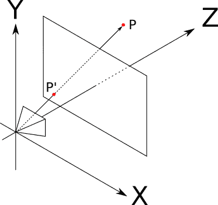
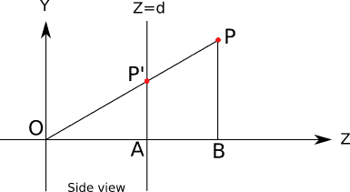
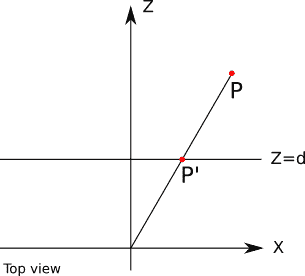
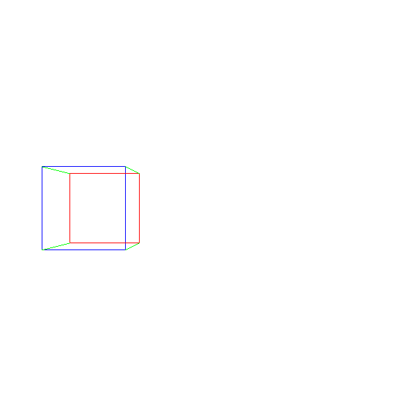

# 九、透视投影

> 原文:[https://Gabriel gambetta . com/computer-graphics-from scratch/09-perspective-projection . html](https://gabrielgambetta.com/computer-graphics-from-scratch/09-perspective-projection.html)

到目前为止，我们已经学会了在画布上绘制 2D 三角形，已知其顶点的 2D 坐标。然而，这本书的目标是渲染 3D 场景。因此，在这一章中，我们将从 2D 三角形中休息一下，专注于如何将 3D 场景坐标转换为 2D 画布坐标。然后我们将使用它在 2D 画布上绘制 3D 三角形。

## [基本假设](#basic-assumptions)

就像我们在第二章【基本光线追踪】开头所做的一样，我们将从定义一个*相机*开始。我们将使用与之前相同的约定:相机在 \(O = (0，0，0)\) ，看向 \(\vec{Z_+}\) 方向，其“上”向量为 \(\vec{Y_+}\) 。我们还将定义一个大小为 \(V_w\) 和 \(V_h\) 的矩形*视口*，其边平行于 \(\vec{X}\) 和 \(\vec{Y}\) ，与摄像机的距离为 \(d\) 。目标是在画布上绘制摄像机通过视口看到的任何东西。如果你需要复习这些概念，参考[第 2 章(基本光线追踪)](02-basic-raytracing.html)。

考虑摄像机前某处的一个点 \(P\) 。我们感兴趣的是找到 \(P\，' \) ，摄像机在视口中看到 \(P\) 的点，如图 9-1 所示。



Figure 9-1: A simple perspective projection setup. The camera sees *P* through *P ’*, which is on the projection plane.这与我们使用光线追踪相反。我们的光线跟踪器从画布中的一个点开始，并确定它可以通过该点看到什么；这里，我们从场景中的一个点开始，想要确定它在视口中的位置。

## [查找 P’](#finding-p)

为了找到 \(P\，' \) ，让我们从另一个角度来看图 9-1 所示的设置，字面意思。图 9-2 显示了从“右侧”观察的设置图，就好像我们站在 \(\vec{X}\) 轴上: \(\vec{Y_+}\) 向上， \(\vec{Z_+}\) 指向右侧， \(\vec{X_+}\) 指向我们。



Figure 9-2: The perspective projection setup, viewed from the right除了 \(O\) 、 \(P\) 和 \(P\，' \) 之外，这张图还显示了 \(A\) 和 \(B\) 点，这有助于我们对其进行推理。

我们知道 \(P\，' _z = d\) 是因为我们将 \(P\，' \) 定义为视口上的一个点，我们知道视口嵌入在平面 \(Z = d\) 中。

我们还可以看到，三角形 \(OP\，' A\) 和 \(OPB\) 是相似的，因为它们对应的边( \(P\，' A\) 和 \(PB\) ， \(OP\) 和 \(OP\，' \) 和 \(OA\) 和\(OB \)。这意味着他们的比例是相同的；例如:

\[{|P\，' A | \ over | OA | } = { | PB | \ over | OB | } \]

由此，我们得到

\[|P\，' A | = { | PB | \ cdot | OA | \ over { | OB | } } \]

方程中每段的(有符号)长度是我们已知或感兴趣的点的坐标: \(|P\，' A| = P\，' _y\) ， \(|PB| = P_y\) ， \(|OA| = P\，' _z = d\) 和(| OB | = P _ z \)。如果我们把这些代入我们得到的方程

\[P\，' _y = {P_y \cdot d \over P_z}\]

我们可以画一个类似的图，这次从上面看设置: \(\vec{Z_+}\) 向上， \(\vec{X_+}\) 指向右边， \(\vec{Y_+}\) 指向我们(图 9-3)。



Figure 9-3: Top view of the perspective projection setup以同样的方式再次使用相似的三角形，我们可以推导出

\[P\，' _x = {P_x \cdot d \over P_z}\]

我们现在有了 \(P\，' \) 的所有三个坐标。

## [投影方程](#the-projection-equation)

让我们把这些放在一起。给定场景中的一个点 \(P\) 和一个标准的摄像机和视口设置，我们可以计算 \(P\) 在视口中的投影，我们称之为 \(P\，' \) ，如下所示:

\[P\，' _x = {P_x \cdot d \over P_z}\]

\[P\，' _y = {P_y \cdot d \over P_z}\]

\[P\，' _z = d\]

\(P\，' \) 在视口上，但仍然是 3D 空间中的一个点。我们如何在画布中获得相应的点？

我们可以立即删除 \(P\，' _z\) ，因为每个投影点都在视口平面上。接下来我们需要将 \(P\，' _x\) 和 \(P\，' _y\) 转换为画布坐标 \(C_x\) 和 \(C_y\) 。 \(P\，' \) 仍然是场景中的一个点，所以它的坐标是用场景单位表示的。我们可以用视口的宽度和高度来划分它们。这些也用场景单位表示，所以我们暂时获得无单位值。最后，我们将它们乘以画布的宽度和高度，以像素表示:

\[C_x = {{P\，' _x \cdot C_w} \over {V_w}}\]

\[C_y = {{P\，' _y \cdot C_h} \over {V_h}}\]

这种视口到画布的变换与我们在本书光线追踪部分使用的画布到视口的变换完全相反。有了这个，我们终于可以从场景中的一个点到屏幕上的一个像素了！

## [投影方程的性质](#properties-of-the-projection-equation)

在我们继续之前，投影方程有一些有趣的性质值得讨论。

上面的等式应该与我们日常观察现实世界的经验相一致。例如，物体离得越远，看起来就越小；事实上，如果我们增加 \(P_z\) ，我们会得到更小的 \(P\，' _x\) 和 \(P\，' _y\) 值。

然而，当我们过多地降低 \(P_z\) 的值时，事情就不再那么直观了；对于负值的 \(P_z\) ，也就是说，当一个物体在相机后面的*时，这个物体仍然被投影，但是颠倒了！当然，当 \(P_z = 0\) 时，我们会被零除，宇宙会内爆。我们需要找到一种方法来避免这些不愉快的情况；现在，我们假设每个点都在摄像机前面，在后面的章节中处理这个问题。*

透视投影的另一个基本属性是它保持点对齐:如果三个点在空间中对齐，它们的投影将在视口中对齐。换句话说，直线总是被投影成直线。这听起来可能太明显而不值得一提，但请注意，例如，两条线之间的*角*并不保留:在现实生活中，我们看到平行线在地平线上“会聚”，例如在高速公路上行驶时。

直线总是被投影成直线的事实对我们来说是极其方便的:到目前为止我们一直在谈论投影一个点，但是投影一条线段，甚至一个三角形呢？由于这个性质，两点间线段的投影就是两点投影间的线段；三角形的投影是由它的顶点的投影形成的三角形。

## [投影我们的第一个 3D 物体](#projecting-our-first-3d-object)

这意味着我们可以继续绘制我们的第一个 3D 对象:一个立方体。我们定义了它的 8 个顶点的坐标，并在构成立方体边缘的 12 对顶点的投影之间画出线段，如清单 9-1 所示:

```
ViewportToCanvas(x, y) {
  return (x * Cw/Vw, y * Ch/Vh);
}

ProjectVertex(v) {
  return ViewportToCanvas(v.x * d / v.z, v.y * d / v.z)
}

// The four "front" vertices
vAf = [-2, -0.5, 5]
vBf = [-2,  0.5, 5]
vCf = [-1,  0.5, 5]
vDf = [-1, -0.5, 5]

// The four "back" vertices
vAb = [-2, -0.5, 6]
vBb = [-2,  0.5, 6]
vCb = [-1,  0.5, 6]
vDb = [-1, -0.5, 6]

// The front face
DrawLine(ProjectVertex(vAf), ProjectVertex(vBf), BLUE);
DrawLine(ProjectVertex(vBf), ProjectVertex(vCf), BLUE);
DrawLine(ProjectVertex(vCf), ProjectVertex(vDf), BLUE);
DrawLine(ProjectVertex(vDf), ProjectVertex(vAf), BLUE);

// The back face
DrawLine(ProjectVertex(vAb), ProjectVertex(vBb), RED);
DrawLine(ProjectVertex(vBb), ProjectVertex(vCb), RED);
DrawLine(ProjectVertex(vCb), ProjectVertex(vDb), RED);
DrawLine(ProjectVertex(vDb), ProjectVertex(vAb), RED);

// The front-to-back edges
DrawLine(ProjectVertex(vAf), ProjectVertex(vAb), GREEN);
DrawLine(ProjectVertex(vBf), ProjectVertex(vBb), GREEN);
DrawLine(ProjectVertex(vCf), ProjectVertex(vCb), GREEN);
DrawLine(ProjectVertex(vDf), ProjectVertex(vDb), GREEN);
```

Listing 9-1: Drawing a cube我们得到类似图 9-4 的结果。



Figure 9-4: Our first 3D object projected on a 2D canvas: a cube

[源代码和现场演示> >](https://gabrielgambetta.com/cgfs/perspective-demo)

成功！我们已经成功地从一个物体的几何 3D 表示到它的 2D 表示，就像从我们的合成相机看到的那样！

不过，我们的方法非常手工化。它有许多局限性。如果我们想要渲染两个立方体呢？我们需要复制大部分代码吗？如果我们想渲染一个立方体以外的东西呢？如果我们想让用户从一个文件中加载一个 3D 模型呢？我们显然需要一种更加数据驱动的方法来表示 3D 几何图形。

## [总结](#summary)

在这一章中，我们发展了从场景中的 3D 点到画布上的 2D 点的数学。由于透视投影的特性，我们可以立即将其扩展到投影线段，然后扩展到 3D 对象。

But we have left two important issues unresolved. First, Listing 9-1 mixes the perspective projection logic with the geometry of the cube; this approach clearly won’t scale. Second, because of the limitations of the perspective projection equation, it can’t handle objects that are behind the camera. We will address these issues in the next two chapters.