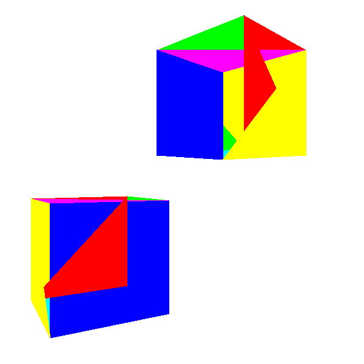
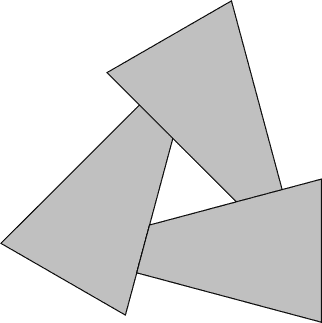
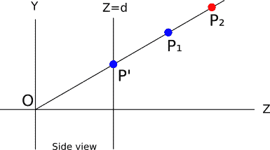
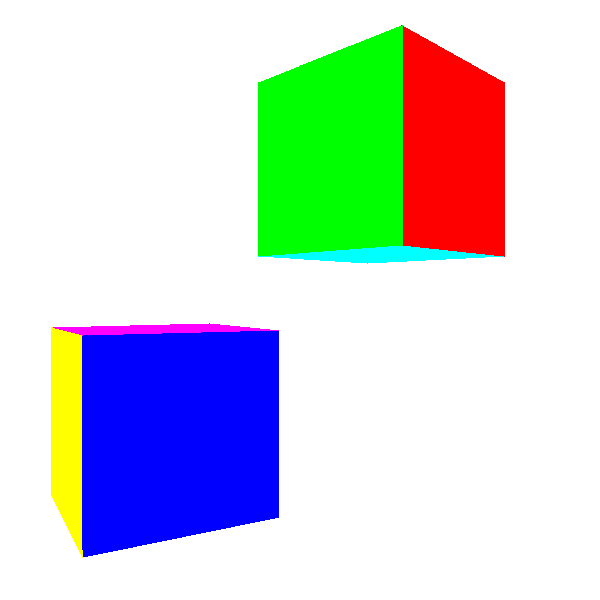
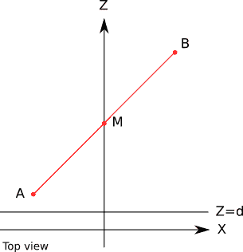
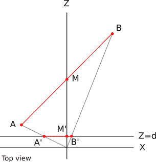
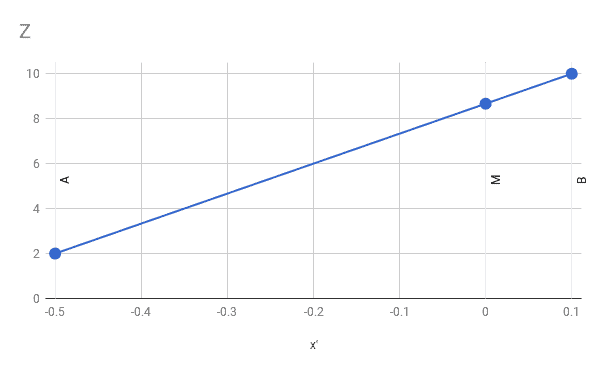
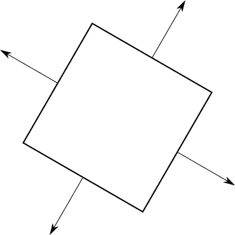
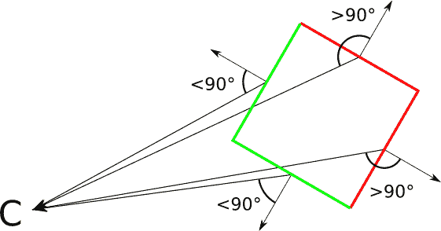
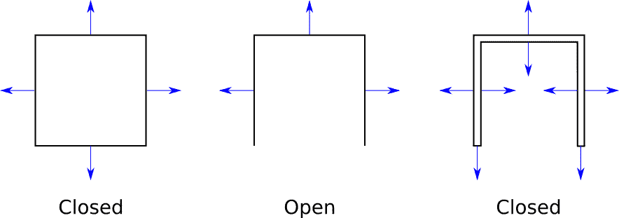

# 十二、隐藏表面移除

> 原文:[https://gabrielgambetta . com/computer-graphics-from scratch/12-hidden-surface-removal . html](https://gabrielgambetta.com/computer-graphics-from-scratch/12-hidden-surface-removal.html)

我们现在可以从任何角度渲染任何场景，但最终的图像在视觉上很简单:我们在线框中渲染对象，给人的印象是我们在看一组对象的蓝图，而不是对象本身。

这本书的其余章节侧重于提高渲染场景的视觉质量。到本章结束时，我们将能够渲染看起来立体的物体(相对于线框)。我们已经开发了一种绘制填充三角形的算法，但是正如我们将看到的，在 3D 场景中正确使用该算法并不像看起来那么简单！

## [渲染实体物体](#rendering-solid-objects)

当我们想让固体看起来是固体时，想到的第一个主意是使用我们在第 7 章[(填充三角形)](07-filled-triangles.html)中开发的函数`DrawFilledTriangle`，用随机颜色画出物体的每个三角形(图 12-1)。



Figure 12-1: Using `DrawFilledTriangle` instead of `DrawWireframeTriangle` doesn’t produce the results we expect.图 12-1 中的形状看起来不太像立方体，是吗？如果你仔细观察，你会发现问题是什么:立方体背面的一部分被绘制在正面的上面！这是因为我们盲目地在画布上以“随机顺序”绘制 2D 三角形，或者更准确地说，是按照它们在模型的`Triangles`列表中定义的顺序，而没有考虑它们之间的空间关系。

您可能想回到模型定义并改变三角形的顺序来解决这个问题。然而，如果我们的场景包括旋转的立方体的另一个实例\(180^\circ\】，我们将回到最初的问题。简而言之，没有一个“正确的”三角形顺序适用于每个实例和相机方向。我们做什么呢

## [画家的算法](#painters-algorithm)

这个问题的第一个解决方案被称为*画家算法*。现实生活中的画家首先绘制背景，然后用前景对象覆盖它们的一部分。我们可以通过将场景中的所有三角形从后往前画来达到同样的效果。为此，我们将应用模型和相机变换，并根据三角形到相机的距离对它们进行排序。

这解决了上面解释的“没有单一正确顺序”的问题，因为现在我们正在为对象和相机的特定相对位置寻找正确的顺序。

虽然这确实会以正确的顺序绘制三角形，但它有一些缺点，使它不切实际。

第一，扩展性不好。人类已知最高效的排序算法是 \(O(n \cdot \log(n))\) ，这意味着如果我们将三角形的数量增加一倍，运行时间将增加一倍以上。(举例来说，对 100 个三角形进行排序大约需要 200 次操作；对 200 个三角形进行排序需要 460，而不是 400；对 800 个三角形进行排序需要 2322 次运算，而不是 1840 次！)换句话说，这适用于小场景，但随着场景复杂性的增加，它很快成为性能瓶颈。

第二，它要求我们一次知道三角形的全部列表。这需要大量的内存，并阻止我们使用类似流的方法来渲染。我们希望我们的渲染器像一条管道，模型三角形从一端进入，像素从另一端出来，但该算法直到每个三角形都被转换和排序后才开始绘制像素。

第三，即使我们愿意忍受这些限制，也有三角形的正确排序根本不存在的情况。考虑图 12-2 中的情况。我们*将永远*无法以产生正确结果的方式对这些三角形进行排序。



Figure 12-2: There is no way to sort these triangles “back-to-front.”## [深度缓冲](#depth-buffering)

三角形层面的排序问题我们解决不了，那就试试像素层面的吧。

对于画布上的每个像素，我们希望用“正确的”颜色来绘制它，其中“正确的”颜色是最接近相机的对象的颜色。在图 12-3 中，那就是\(P1 \)。



Figure 12-3: Both *P<sub>1</sub>* and *P<sub>2</sub>* project to the same *P ’* on the canvas. Because *P<sub>1</sub>* is closer to the camera than *P<sub>2</sub>*, we want to paint *P ’* the color of *P<sub>1</sub>*.在渲染过程中的任何时候，画布上的每个像素代表场景中的一个点(在我们绘制任何东西之前，它代表无限远的一个点)。假设对于画布上的每个像素，我们保留了它当前代表的点的 \(Z\) 坐标。当我们需要决定是否用一个对象的颜色来绘制一个像素时，只有当我们要绘制的点的 \(Z\) 坐标小于已经存在的点的 \(Z\) 坐标时，我们才会这样做。这保证了代表场景中点的像素永远不会被代表远离相机的点的像素所覆盖。

让我们回到图 12-3。假设因为模型中三角形的顺序，我们想先画\(p2 \)，再画\(P1 \)。当我们绘制\(p2 \)时，像素被绘制成红色，其关联的 \(Z\) 值就变成了\(Z _ { p2 } \)。然后我们要画 \(P_1\) ，由于\(Z _ { P _ 2 }>Z _ { P _ 1 } \)，我们把像素画成蓝色，我们得到正确的结果。

在这个特殊的例子中，不管 \(Z\) 的值是多少，我们都会得到正确的结果，因为这些点碰巧以方便的顺序出现。但是如果我们想先画\(P1 \)，再画\(p2 \)呢？我们先把像素涂成蓝色，存储\(Z _ { P1 } \)；但是当我们想画\(p2 \)时，我们看到的是\(Z _ { p2 }>Z _ { P1 } \)，所以我们*不要*画它——因为如果我们画了，\(P1 \)就会被更远的\(p2 \)遮住！我们又得到一个蓝色像素，这是正确的结果。

在实现方面，我们需要一个缓冲区来存储画布上每个像素的 \(Z\) 坐标；我们称之为*深度缓冲*。它与画布具有相同的尺寸，但是它的元素是表示深度值的实数，而不是像素。

但是 \(Z\) 的值从何而来呢？这些应该是点在变换后透视投影前的 \(Z\) 值。然而，这仅仅给出了顶点的 \(Z\) 值；我们需要一个 \(Z\) 值用于每个三角形的每个像素。

这是我们在[第 8 章(阴影三角形)](08-shaded-triangles.html)中开发的属性映射算法的另一个应用。为什么不使用 \(Z\) 作为属性，并将其插入三角形的整个面，就像我们之前对颜色强度值所做的那样？现在你已经知道怎么做了:取`z0`、`z1`和`z2`的值；计算`z01`、`z02`、`z012`；将它们组合得到`z_left`和`z_right`；然后，对于每个水平段，计算`z_segment`。最后，我们这样做，而不是盲目地调用`PutPixel(x, y, color)`:

```
z = z_segment[x - xl]
if (z < depth_buffer[x][y]) {
    canvas.PutPixel(x, y, color)
    depth_buffer[x][y] = z
}
```

为了正确工作，`depth_buffer`中的每个条目都应该初始化为 \(+\infty\) (或者只是“一个非常大的值”)。这就保证了我们第一次要画一个像素的时候，条件会为真，因为场景中的任何一点都比无限远的一点更靠近相机。

我们现在得到的结果要好得多——请看图 12-4。



Figure 12-4: The cubes now look like cubes, regardless of the ordering of their triangles.

[源代码和现场演示> >](https://gabrielgambetta.com/cgfs/depth-demo)

### [用 1/Z 代替 Z](#why-1z-instead-of-z)

结果看起来好得多，但我们正在做的是微妙的错误。顶点的 \(Z\) 的值是正确的(毕竟它们来自数据)，但在大多数情况下，其余像素的 \(Z\) 的线性插值是不正确的。在这一点上，这甚至可能不会导致明显的差异，但这将在以后成为一个问题。

要了解这些值是如何错误的，请考虑从 \(A (-1，0，2)\) 到 \(B (1，0，10)\) 的一条线段的简单情况，其中点 \(M\) 在 \((0，0，6)\) 。具体来说，因为 \(M\) 是 \(AB\) 的中点，所以我们知道 \(M_z = (A_z + B_z) / 2 = 6\) 。图 12-5 显示了这条线段。



Figure 12-5: A line segment *AB* and its midpoint *M*让我们用 \(d = 1\) 来计算这些点的投影。应用透视投影方程，我们得到 \(A\，' _x = A_x / A_z = -1 / 2 = -0.5\) 。同理， \(B\，' _x = 0.1\) 和 \(M\，' _x = 0\) 。图 12-6 显示了投影点。



Figure 12-6: The points *A*, *B*, and *M* projected onto the projection plane\(A\，' B\，' \) 是视口上的水平段。我们知道 \(A_z\) 和 \(B_z\) 的值。让我们看看如果我们尝试使用线性插值计算 \(M_z\) 的值会发生什么。隐含的线性函数如图 12-7 所示。



Figure 12-7: The values of *A<sub>z</sub>* and *B<sub>z</sub>* for *A<sub>x’</sub>* and *B<sub>x’</sub>* define a linear function *z = f(x’)*.函数的斜率是常数，所以我们可以写成

\[{ M_z - A_z \over M\，' _x - A\，' _x } = { B_z - A_z \over B\，' _x - A\，' _x }\]

我们可以操纵该表达式来求解 \(M_z\) :

\[M_z = A_z + (M\，' _x - A\，' _x) ({B_z - A_z \over B\，' _x - A\，' _x})\]

如果我们把已知的值代入并做一些算术，我们得到

\[M _ z = 2+(0-(-0.5))({ 10-2 \过 0.1-(-0.5)})= 2+(0.5)({ 8 \过 0.6}) = 8.666\]

这上面说 \(M_z\) 的值是 \(8.666\) ，但我们确切知道它实际上是 \(6\) ！

我们哪里出错了？我们使用线性插值，我们知道线性插值效果很好，我们给它输入正确的值，这些值来自数据，那么为什么结果是错误的呢？

我们的错误隐藏在我们使用线性插值时所做的隐含假设中:我们插值的函数一开始就是线性的！在这种情况下，事实证明它不是。

如果 \(Z = f(x '，y')\) 是 \(x'\) 和 \(y'\) 的线性函数，对于 \(A\) 、 \(B\) 、 \(C\) 的某些值，我们可以写成 \(Z = Ax' + By' + C\) 。这种函数具有这样的性质，即两点之间的值的差异取决于两点之间的差异，而不取决于点本身:

[f(x '+\ delta x，y' + \Delta y) - f(x '，y)=[a(x '+\ delta x)+b(y '+\ delta y)+c]–[a \ CDO x '+b \ CDO y '+c]]T2]\[= a(x '+\ delta x-x)]+b(y '+\ delta y-y '+c-c \]]

也就是说，对于给定的屏幕坐标差异， \(Z\) 中的差异将总是相同的。

更正式地说，包含我们正在研究的线段的平面的方程是

\[Ax + By + Cz + D = 0\]

另一方面，我们有透视投影方程:

\[x' = {{x \cdot d} \over z}\]

\[y' = {{x \cdot d} \over z}\]

我们可以从这些中得到 \(x\) 和 \(y\) :

\[x = {{z \cdot x'} \over d}\]

\[y = {{z \cdot y'} \over d}\]

如果我们用这些表达式替换平面方程中的 \(x\) 和 \(y\) ，我们得到

\[{ Ax ' z+By ' z \ over D }+Cz+D = 0 \]

乘以 \(d\) 然后求解 \(z\) ，

\[Ax'z + By'z + dCz + dD = 0\]

\[(Ax' + By' + dC)z + dD = 0\]

\[z = {-dD \ over Ax '+By '+dC } \]

这显然是*而不是*\(x ' \)和 \(y'\) 的线性函数，这就是为什么对 \(z\) 的值进行线性插值会给出不正确的结果。

但是，如果我们计算 \(1/z\) 而不是 \(z\) ，我们得到

\[1/z = { Ax '+By '+dC \ over-dD } \]

这明明*就是*是 \(x'\) 和 \(y'\) 的线性函数。这意味着我们可以对 \(1/z\) 的值进行线性插值，并得到正确的结果。

为了验证这一点，让我们计算 \(M_z\) 的插值，但这次使用的是 \(1/z\) 的线性插值:

\[{ M _ { 1 \过 z }-A _ { 1 \过 z } \过 M ' _ x-A ' _ x } = { B _ { 1 \过 z }-A _ { 1 \过 z } \过 B'_x - A'_x }\]

\[M _ { 1 \ over z } = A _ { 1 \ over z }+(M ' _ x-A ' _ x)({ B _ { 1 \ over z }-A _ { 1 \ over z } \ over B ' _ x-A ' _ x })\]

\[M _ { 1 \ over z } = { 1 \ over 2 }+(0-(-0.5))({ { 1 \ over 10 }-{ 1 \ over 2 } \ over 0.1-(-0.5)})= 0.166666 \]

因此

\[M _ z = { 1 \ over M _ { 1 \ over z } } = { 1 \ over 0.166666 } = 6 \]

这个值是正确的，因为它与我们最初根据线段的几何形状计算的 \(M_z\) 相匹配。

所有这些意味着我们需要使用 \(1/z\) 的值，而不是 \(z\) 的值来进行深度缓冲。伪代码中唯一的实际区别是，缓冲区中的每个条目都应该初始化为 \(0\) (概念上是 \(1 / +\infty\) )，并且比较应该是反向的(我们保留了 \(1/z\) 的较大值，它对应于 \(z\) 的较小值)。

## [背面剔除](#back-face-culling)

深度缓冲产生期望的结果。但是我们能让事情变得更快吗？

回到正方体，即使每个像素最终都有正确的颜色，但它们中的许多都被涂了几次。例如，如果立方体的背面在正面之前渲染，许多像素将被绘制两次。这可能代价高昂。到目前为止，我们已经为每个像素计算了 \(1/z\) ，但是很快我们将添加更多的属性，比如照明。随着我们需要执行的每像素操作数量的增加，计算永远不可见的像素变得越来越浪费。

在我们进入所有这些计算之前，我们能更早地丢弃像素吗？事实证明，我们甚至可以在开始渲染之前就丢弃整个三角形。

到目前为止，我们一直在非正式地谈论*正面*和*背面*。想象每个三角形都有两条不同的边；同时看到三角形的两边是不可能的。为了区分两边，我们将在每个三角形上贴一个假想的箭头，垂直于它的表面。然后我们拿着立方体，确保每个箭头都指向外面。图 12-8 显示了这个想法。



Figure 12-8: A cube viewed from above, with arrows on each triangle pointing out这些箭头让我们将每个三角形分类为“前”或“后”，这取决于它们是指向相机还是远离相机。更正式的说法是，如果视图矢量和这个箭头(实际上是三角形的一个法向量)形成的角度小于 \(90^\circ\) ，则三角形是朝前的；否则，它是朝后的(图 12-9)。



Figure 12-9: The angle between the view vector and the normal vector of a triangle lets us classify it as front- facing or back-facing.在这一点上，我们需要对我们的 3D 模型施加一个限制:它们是*闭合的*。封闭的确切定义是相当复杂的，但幸运的是一个直观的理解就足够了。我们一直在使用的立方体是封闭的；我们只能看到它的外表。如果我们去掉它的一个面，它就不会闭合，因为我们可以看到它的内部。这并不意味着我们不能拥有有洞或凹面的物体；我们只是用薄“墙”来模拟这些一些例子见图 12-10。



Figure 12-10: Some examples of open and closed objects为什么要施加这种限制？封闭对象有一个有趣的特性，即无论模型或相机的方向如何，正面集完全覆盖背面集。这意味着我们根本不需要绘制背面，节省了宝贵的计算时间。

由于我们可以丢弃(剔除)所有的背面，这个算法被称为*背面剔除*。它的伪代码对于一个可以将我们的渲染时间减少一半的算法来说非常简单！

```
CullBackFaces(object, camera) {
  for T in object.triangles {
    if T is back-facing {
      remove T from object.triangles
    }
  }
}
```

Listing 12-1: The back face culling algorithm让我们更详细地看看如何确定一个三角形是正面还是背面。

### [分类三角形](#classifying-triangles)

假设我们有一个三角形的法向量 \(\vec{N}\) 和从三角形的一个顶点到摄像机的向量 \(\vec{V}\) 。现在假设 \(\vec{N}\) 指向对象的外部。为了将三角形分类为面向前还是面向后，我们计算 \(\vec{N}\) 和 \(\vec{V}\) 之间的角度，并检查它们是否在彼此的【\(90^\circ\】内。

我们可以再次使用点积的性质来简化这个过程。记住如果 \(\alpha\) 是 \(\vec{N}\) 和 \(\vec{V}\) 之间的角度，那么

\[{ \ lang le \ vec { n }，\ vec { v } \ rangle } \ over { | \ vec { n } | } = \ cos(\ \ alpha)\ t1]

因为 \(\cos(\alpha)\) 对于 \(|\alpha| \le 90^\circ\) 来说是非负的，所以我们只需要知道这个表达式的符号就可以把一个三角形归类为面向前还是面向后。注意 \(|\vec{N}|\) 和 \(|\vec{V}|\) 始终为正，所以不影响表达式的符号。因此

\[\ mathrm { sign }(\ lang le \ vec { n }，\ vec { v } \ rangle)= \ mathrm { sign }(\ cos(\ alpha)]\

分类标准很简单:

边缘情况\(\乐浪\vec{N}，\vec{V} \rangle = 0\) 对应于我们正面看三角形边缘的情况——也就是说，当相机和三角形共面时。我们可以用任何一种方式对这个三角形进行分类，而不会对结果产生太大影响，因此我们选择将其分类为背面，以避免处理退化的三角形。

我们从哪里得到法向量？原来有一个向量运算，即*叉积*\(\ vec { A } \ times \ vec { B } \)，它采用两个向量 \(\vec{A}\) 和 \(\vec{B}\) ，并产生一个垂直于这两个向量的向量(关于此运算的定义，请参见[附录 A(线性代数)](A0-linear-algebra.html))。换句话说，三角形表面上两个向量的叉积就是该三角形的法向量。通过将三角形的顶点相减，我们可以很容易地得到三角形上的两个矢量。所以计算三角形 \(ABC\) 的法向量的方向很简单:

\[\vec{V_1} = B - A\] \[\vec{V_2} = C - A\] \[\vec{N} = \vec{V_1} \times \vec{V_2}\]

请注意，“法向量的方向”与“法向量”是不同的这有两个原因。第一个是 \(|\vec{N}|\) 不一定等于 \(1\) 。这并不重要，因为规范化 \(\vec{N}\) 将是微不足道的，因为我们只关心\(\乐浪\vec{N}，\vec{V} \rangle\) 的符号。

第二个原因是，如果 \(\vec{N}\) 是 \(ABC\) 的法向量，那么 \(\vec{-N}\) 也是法向量，在这种情况下，我们非常关心 \(\vec{N}\) 指向的方向，因为这正是让我们将三角形分为正面或背面的原因。

而且两个向量的叉积是不可交换的:\(\ vec { V _ 1 } ~ \ times ~ \ vec { V _ 2 } =-({ \ vec { V _ 2 } \ times \ vec { V _ 1 } } \)。换句话说，向量在运算中的顺序很重要。由于我们根据 \(A\) 、 \(B\) 和 \(C\) 定义了\(v1 \)和\(v2 \)，这意味着三角形中顶点的顺序很重要。我们不能再将三角形 \(ABC\) 和 \(ACB\) 视为同一个三角形。

幸运的是，这些都不是随机的。给定叉积运算的定义，我们定义\(v1 \)和\(v2 \)的方式，以及我们使用的坐标系(X 向右，Y 向上，Z 向前)，有一个非常简单的规则来确定法向量的方向:如果当你从相机看三角形 \(ABC\) 的顶点时，它们是顺时针方向的，那么上面计算的法向量将指向相机——也就是说，相机正看着前方

我们只需要在手动设计 3D 模型时记住这条规则，并在查看其正面时按顺时针顺序列出每个三角形的顶点，这样当我们以这种方式计算它们时，它们的法线会指向“外面”。当然，我们到目前为止使用的示例立方体模型遵循这个规则。

## [总结](#summary)

在这一章中，我们制作了我们的渲染器，它以前只能渲染线框物体，现在能够渲染实体外观的物体。这比仅仅使用`DrawFilledTriangle`而不是`DrawWireframeTriangle`更复杂，因为我们需要靠近相机的三角形来遮挡远离相机的三角形。

我们探索的第一个想法是从后向前画三角形，但是这有一些我们讨论过的缺点。更好的想法是在像素级工作；这个想法让我们想到了一种叫做深度缓冲的技术，不管我们画三角形的顺序如何，它都能产生正确的结果。

我们最终探索了一种可选但有价值的技术，它不会改变结果的正确性，但可以使我们免于渲染场景中大约一半的三角形:背面剔除。由于一个封闭对象的所有面向后的三角形都被它的所有面向前的三角形覆盖，所以根本没有必要画面向后的三角形。我们提出了一个简单的代数方法来确定一个三角形是正面还是背面。

Now that we can render solid-looking objects, we’ll devote the rest of this book to making these objects look more realistic.