# 十三、阴影

> 原文:[https://gabrielgambetta . com/computer-graphics-from scratch/13-shading . html](https://gabrielgambetta.com/computer-graphics-from-scratch/13-shading.html)

让我们继续使我们的图像更加真实；在这一章中，我们将研究如何给场景添加灯光，以及如何照亮场景中的物体。首先，让我们看一下术语。

## [阴影与照明](#shading-vs.-illumination)

本章的标题是“阴影”，而不是“照明”；这是两个不同但密切相关的概念。*照明*指的是计算场景中单个点上光线效果所需的数学和算法；*阴影*处理将光线在离散点上的效果扩展到整个物体的技术。

在第三章(光)中，我们看了所有我们需要知道的关于照明的知识。我们可以定义环境光、点光和平行光，并且可以计算

给定场景中任意点的位置和该点的曲面法线，该点的照明:

\[I _ p = I _ a+\ sum _ { I = 1}^{n} I _ I \ cdot \ left[{ { { \乐浪\vec{N}，\ vec { l _ I } \ rangle } \ over { | \ vec { n } | \ vec { l _ I } | } }+\ left({ { \乐浪\vec{R_i}，\ vec { v } \ rangle } \ over { | \ vec { r _ I } | \ vec { v } | } }

这个照明方程表达了光线如何照亮场景中的一个点。这在光线跟踪器中的工作方式与在光栅化器中的工作方式完全相同。

更有趣的部分，我们将在本章中探讨，是如何将我们开发的“一点照明”算法扩展到“三角形每一点照明”算法。

## [平面阴影](#flat-shading)

让我们从简单的开始。因为我们可以计算一个点的照度，所以我们可以选择一个三角形中的任意一点(例如，它的中心)，计算该点的照度，并使用它来着色整个三角形。为了进行实际的着色，我们可以将三角形的颜色乘以照度值。图 13-1 显示了结果。

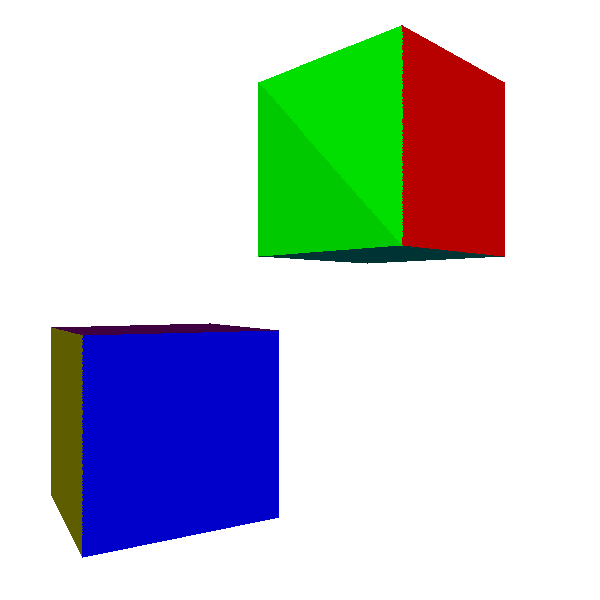

Figure 13-1: In flat shading, we compute illumination at the center of the triangle and use it for the entire triangle.结果是有希望的。三角形中的每一个点都有相同的法线，所以只要光线离它相当远，每一个点的光线矢量*大约*平行，并且每一个点接收*大约*相同量的光线。构成立方体各边的两个三角形之间的不连续性，在图 13-1 的绿色面上尤其明显，是光线矢量*近似*，而不是*精确*平行的结果。

那么，如果我们对一个每个点都有不同法线的物体，如图 13-2 中的球体，尝试这种技术会发生什么呢？

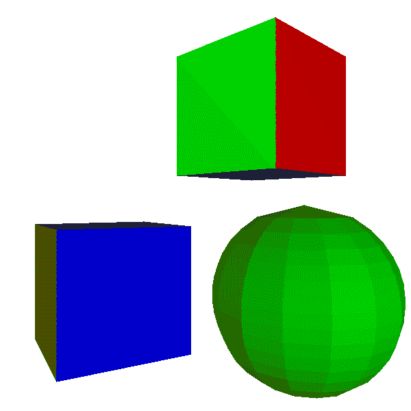

Figure 13-2: Flat shading works reasonably well for objects with flat faces, but not so well for objects that are supposed to be curved.不太好。很明显，这个物体不是一个真正的球体，而是一个由扁平的三角形面片组成的近似体。因为这种光照使弯曲的物体看起来是平的，所以叫做*平明暗*。

## [【美食着色】](#gouraud-shading)

我们如何消除照明中的这些不连续性？我们可以计算三角形三个顶点的照度，而不是只计算三角形中心的照度。这给了我们在 \(0.0\) 和 \(1.0\) 之间的三个照明值，三角形的每个顶点一个。这使我们处于与第八章[(阴影三角形)](08-shaded-triangles.html)完全相同的情况:我们可以直接使用`DrawShadedTriangle`，使用照明值作为“强度”属性。

这种技术被称为 *Gouraud shading* ，以 Henri Gouraud 的名字命名，他在 1971 年提出了这个想法。图 13-3 显示了将其应用于立方体和球体的结果。

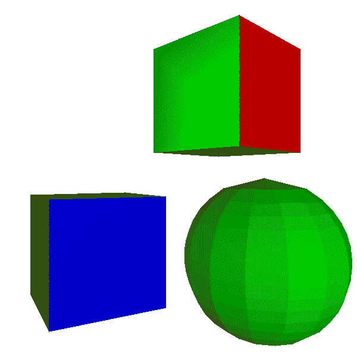

Figure 13-3: In Gouraud shading, we compute illumination at the vertices of the triangle and interpolate them across its surface.立方体看起来更好:不连续性消失了，因为每个面的两个三角形共享两个顶点，并且它们具有相同的法线，所以这两个顶点处的照明对两个三角形来说是相同的。

然而，球体看起来仍然是多面的，其表面上的不连续性看起来确实是错误的。这并不奇怪:我们将球体视为平面的集合。特别是，尽管每个三角形与其相邻的三角形共享顶点，但它们有不同的法线。图 13-4 显示了这个问题。

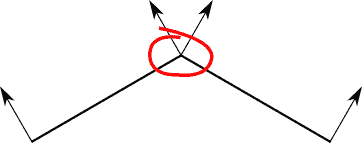

Figure 13-4: We get two different values for the illumination at the shared vertex, because they depend on the normals of the triangles, which are different.让我们后退一步。事实上，我们使用平面三角形来表示一个弯曲的物体是我们技术的限制，而不是物体本身的属性。

球体模型中的每个顶点对应于球体上的一个点，但它们定义的三角形只是其表面的近似。让模型中的顶点尽可能接近地代表球体中的点是一个好主意。这意味着，除了别的以外，对每个顶点使用实际的球体法线，如图 13-5 所示。

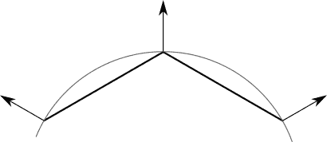

Figure 13-5: We can give each vertex the normal of the curved surface it represents.请注意，这不适用于立方体；尽管三角形共享顶点位置，但每个面都需要独立于其他面进行着色。立方体的顶点没有单一的“正确的”法线。

我们的渲染器无法知道一个模型应该是一个弯曲对象的近似还是一个平面对象的精确表示。毕竟，立方体是球体的非常粗糙的近似！为了解决这个问题，我们将使三角形法线成为模型的一部分，这样它的设计者就可以做出这个决定。

有些物体，如球体，每个顶点只有一条法线。其他对象，如立方体，对于使用顶点的每个三角形都有不同的法线。所以我们不能让法线成为顶点的属性；它们需要是使用它们的三角形的属性:

```
model {
    name = cube
    vertices {
        0 = (-1, -1, -1)
        1 = (-1, -1,  1)
        2 = (-1,  1,  1)
        ...
    }
    triangles {
        0 = {
            vertices = [0, 1, 2]
            normals = [(-1, 0, 0), (-1, 0, 0), (-1, 0, 0)]
        }
        ...
    }
}
```

图 13-6 显示了使用 Gouraud 着色和适当的顶点法线渲染的场景。

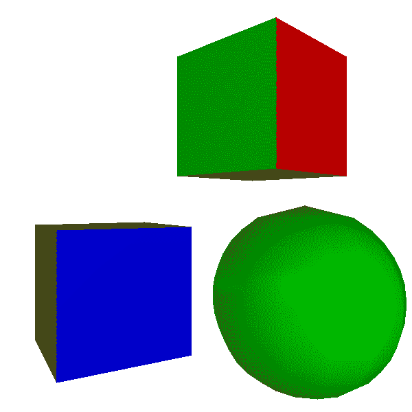

Figure 13-6: Gouraud shading with normal vectors specified in the model. The cubes still look like cubes, and the sphere now looks like a sphere.立方体仍然看起来像立方体，而球体现在看起来非常像球体。事实上，你只能通过观察它的轮廓来判断它是由三角形组成的。这可以通过使用更多更小的三角形来改善，代价是需要更多的计算能力。

然而，当我们试图渲染闪亮的物体时，Gouraud 着色开始失效；球体上的镜面高光显然是不现实的。

这表明了一个更普遍的问题。当我们移动一个点光源非常靠近一个大脸时，我们自然会期望它看起来更亮，镜面效果变得更明显；然而，Gouraud 阴影产生了完全相反的结果(图 13-7)。

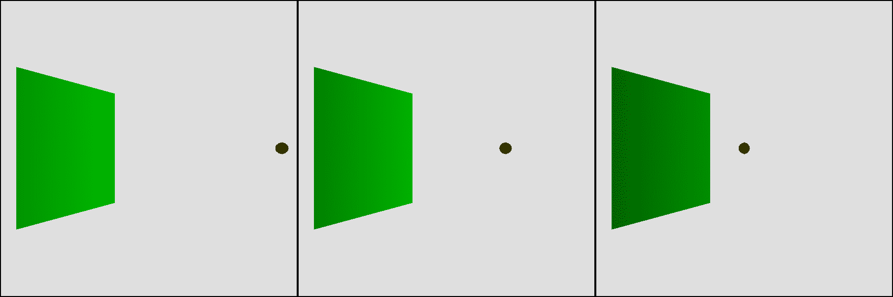

Figure 13-7: Contrary to our expectations, the closer the point light is to a face, the darker it looks.我们预计三角形中心附近的点会接收到大量光线，因为 \(\vec{L}\) 和 \(\vec{N}\) 大致平行。然而，我们不是在三角形的中心计算照明，而是在它的顶点。在那里，光线离表面越近，*与法线的角度越大，所以它们接受的照明就越少。这意味着每个内部像素的亮度值是两个小值之间插值的结果，也是一个低值，如图 13-8 所示。*

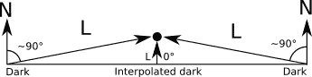

Figure 13-8: Interpolating illumination from the vertices, which are dark, results in a dark center, although the normal is parallel to the light vector at that point.那么，该怎么办呢？

## [Phong Shading](#phong-shading)

我们可以克服 Gouraud 着色的局限性，但像往常一样，在质量和资源使用之间有一个权衡。

平面着色涉及每个三角形的单一照明计算。Gouraud 着色需要对每个三角形进行三次照明计算，加上跨三角形的单一属性(照明)的插值。质量的下一步要求我们计算三角形每个像素的照度。

从理论角度来看，这听起来并不特别复杂；我们已经计算了一个或三个点的光照，而且我们毕竟计算了光线跟踪器的每像素光照。这里棘手的是弄清楚光照方程的输入来自哪里。回想一下，包含环境光、漫射光和镜面反射光的完整照明方程为:

\[I _ p = I _ a+\ sum _ { I = 1}^{n} I _ I \ left({ { \乐浪\vec{N}，\ vec { l _ I } \ rangle } \ over { | \ vec { n } | \ vec { l _ I } | } }+\ left({ { \乐浪\vec{R}，\ vec { v } \ rangle } \ over { | \ vec { v } | } } \right)^s\right)\]

首先我们需要 \(\vec{L}\) 。对于方向灯，给出 \(\vec{L}\) 。对于点光源， \(\vec{L}\) 定义为从场景中的点 \(P\) 到光源位置 \(Q\) 的向量。但是，我们并不是对三角形的每个像素都有 \(P\) ，只对顶点有。

我们有的是 \(P\) 的投影；也就是我们将要在画布上绘制的 \(x'\) 和 \(y'\) ！我们知道这一点

\[x' = {xd \over z}\]

\[y' = {xd \over z}\]

作为深度缓冲算法的一部分，我们还有一个插值的但几何上正确的值 \(1 \over z\) ,所以

\[x' = xd{1 \over z}\]

\[y' = yd{1 \over z}\]

我们可以从这些值中恢复出 \(P\) :

\[x = { x ' \ over d { 1 \ over z } } \]

\[y = { y ' \ over d { 1 \ over z } } \]

\[z = {1 \over {1 \over z}}\]

我们还需要 \(\vec{V}\) 。这是从相机(我们知道)到 \(P\) (我们刚刚计算的)的向量，所以 \(\vec{V}\) 简单来说就是 \(P - C\) 。

接下来，我们需要 \(\vec{N}\) 。我们只知道三角形顶点的法线。当你只有一把锤子时，每个问题看起来都像钉子；我们的锤子是——你可能猜到了——属性值的线性插值。所以让我们取每个顶点上的 \(N_x\) 、 \(N_y\) 和 \(N_z\) 的值，并把它们中的每一个作为我们可以线性插值的属性。然后，在每个像素处，我们将插值分量重新组合成一个向量，将其归一化，并将其用作该像素处的法线。

这项技术被称为 *Phong shading* ，以裴祥风的名字命名，他在 1973 年发明了这项技术。图 13-9 显示了结果。

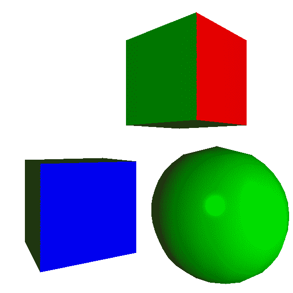

Figure 13-9: Phong shading. The surface of the sphere looks smooth and the specular highlight is clearly visible.

[源代码和现场演示> >](https://gabrielgambetta.com/cgfs/shading-demo)

球体现在看起来好多了。它的表面显示了适当的曲率，并且镜面高光看起来定义良好。然而，轮廓仍然暴露了这样一个事实，即我们正在渲染一个由三角形组成的近似值。这不是着色算法的缺点，着色算法仅确定三角形表面的每个像素的颜色，但对三角形本身的形状没有控制。这个球体近似使用 420 个三角形；我们可以通过使用更多的三角形来获得更平滑的轮廓，代价是更差的性能。

Phong 阴影也解决了光线靠近人脸的问题，现在给出了预期的结果(图 13-10)。

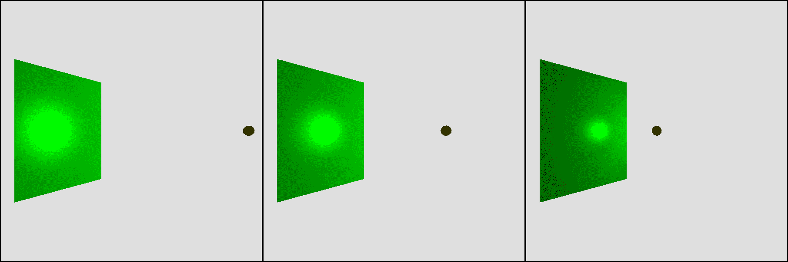

Figure 13-10: The closer the light is to the surface, the brighter and better defined the specular highlight looks.在这一点上，我们已经匹配了第一部分中开发的光线跟踪器的功能，除了阴影和反射。使用完全相同的场景定义，图 13-11 显示了我们正在开发的光栅化器的输出。

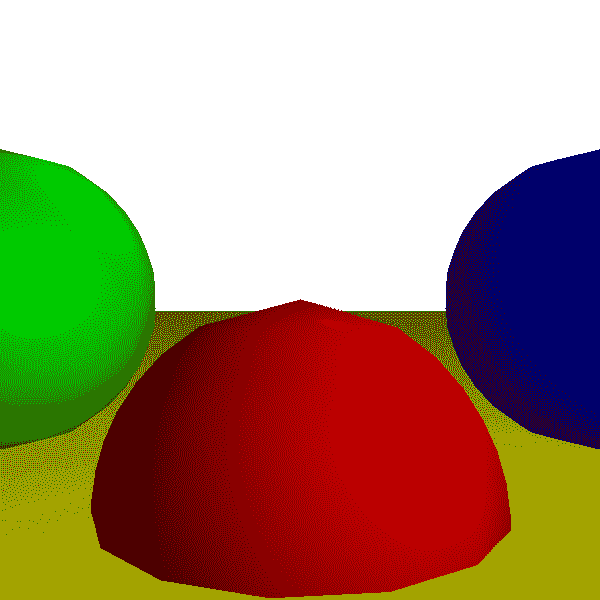

Figure 13-11: The reference scene, rendered by the rasterizer作为参考，图 13-12 显示了同一场景的光线追踪版本。

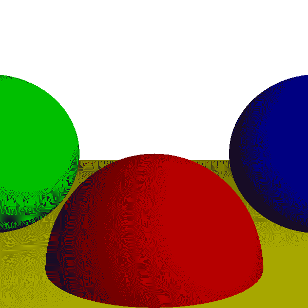

Figure 13-12: The reference scene, rendered by the raytracer尽管使用了非常不同的技术，这两个版本看起来几乎一模一样。这是意料之中的，因为场景定义是相同的。唯一可见的区别可以在球体的轮廓中找到:光线跟踪器将它们渲染为数学上完美的对象，但是我们使用三角形的近似来进行光栅化。

另一个区别是两个渲染器的性能。这非常依赖于硬件和实现，但一般来说，光栅化器每秒可以产生高达 60 次或更多的复杂场景的全屏图像，这使它们适合于交互式应用程序，如视频游戏，而光线跟踪器可能需要几秒钟来渲染同一场景一次。这种差异将来可能会消失；近年来硬件的进步使得光线跟踪器的性能比光栅化器更具竞争力。

## [总结](#summary)

在这一章中，我们给光栅化器添加了照明。我们使用的照明方程与第三章中的完全相同，因为我们使用的是相同的照明模型。然而，在光线跟踪器计算每个像素的照明方程的情况下，我们的光栅化器可以支持各种不同的技术来实现性能和图像质量之间的特定平衡。

最快的着色算法，也产生最不吸引人的结果，是平面着色:我们计算三角形中一个点的照度，并将其用于三角形中的每个像素。这导致非常多面的外观，尤其是对于近似曲面的对象，如球体。

在质量阶梯的上一步，我们有 Gouraud 着色:我们计算一个三角形的三个顶点的照度，然后在三角形的面上插入这个值。这使对象具有更平滑的外观，包括弯曲的对象。然而，这种技术无法捕捉更微妙的照明效果，如镜面高光。

最后，我们研究了 Phong 着色。很像我们的光线跟踪器，它计算每个像素的照明方程，产生最好的结果和最差的性能。Phong 着色的技巧是知道如何计算所有必要的值来评估照明方程；同样，答案是线性插值——在这种情况下，是法向量。

In the next chapter, we’ll add even more detail to the surface of our triangles, using a technique that we haven’t studied for the raytracer: texture mapping.