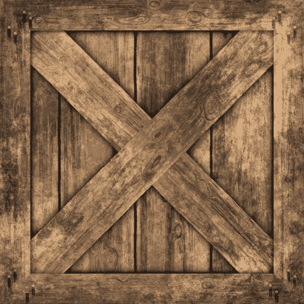
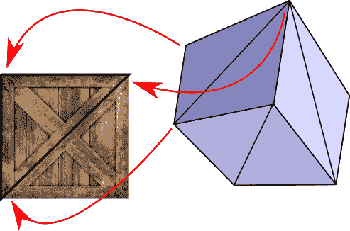
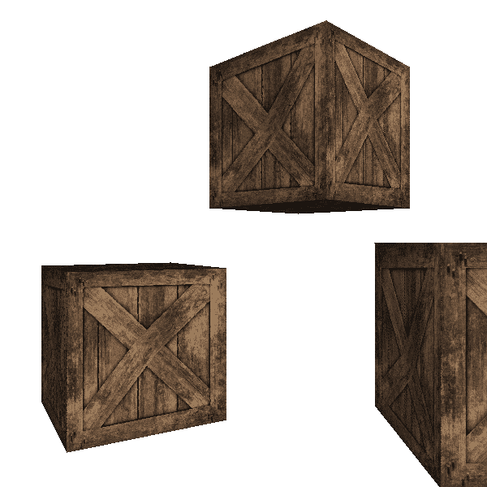
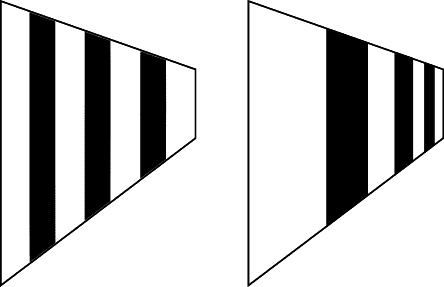
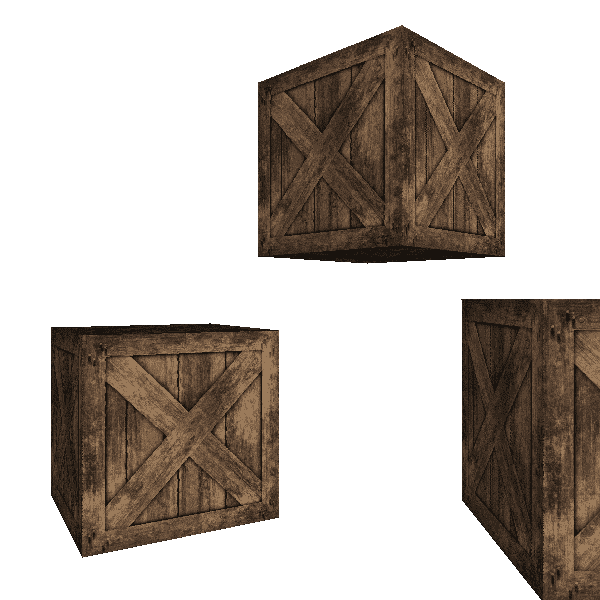
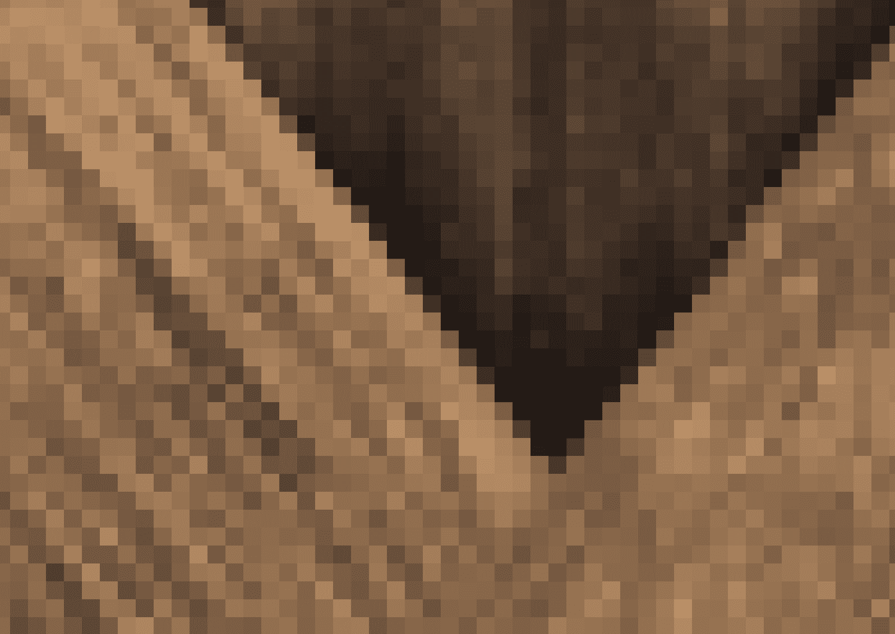
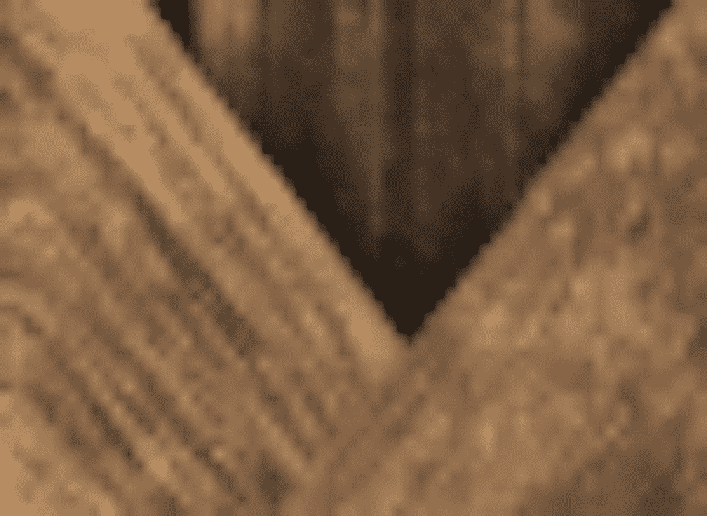
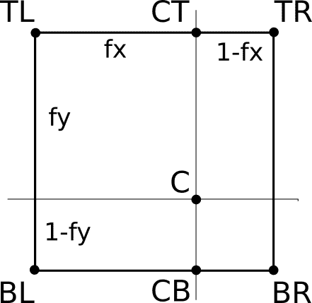
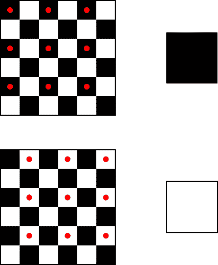

# 十四、纹理

> 原文:[https://gabrielgambetta . com/computer-graphics-from scratch/14-textures . html](https://gabrielgambetta.com/computer-graphics-from-scratch/14-textures.html)

我们的光栅化器可以渲染立方体或球体之类的物体。但是我们通常不想渲染立方体、球体这样的抽象几何物体；相反，我们想要渲染真实世界的物体，比如板条箱和行星或者骰子和弹珠。在这一章中，我们将看看如何通过使用*纹理*来增加物体表面的视觉细节。

## [画板条箱](#painting-a-crate)

假设我们希望我们的场景有一个木箱。我们如何把一个立方体变成一个木箱？一种选择是添加许多三角形来复制木头的纹理、钉子的头部等等。这是可行的，但是会增加场景的几何复杂度，导致性能下降。

另一个选择是伪造细节:我们不是修改一个物体的几何形状，而是在它上面“画”一些看起来像木头的东西。除非你近距离观察板条箱，否则你不会注意到区别，而且计算成本明显低于添加大量几何细节。

请注意，这两个选项并不是不兼容的:您可以在添加几何体和在几何体上绘画之间选择适当的平衡，以达到您需要的图像质量和性能。既然我们知道如何处理几何，我们将探索第二种选择。

首先，我们需要一个图像来绘制我们的三角形；在这种情况下，我们称这个图像为纹理。图 14-1 显示了一个木箱纹理。



Figure 14-1: Wooden crate texture (by Filter Forge— Attribution 2.0 Generic (CC BY 2.0) license)接下来，我们需要指定如何将纹理应用到模型中。我们可以在每个三角形的基础上定义这个映射，通过指定纹理的哪些点应该在三角形的每个顶点上(图 14-2)。



Figure 14-2: We associate a point in the texture with each vertex of the triangle.为了定义这个映射，我们需要一个坐标系来引用纹理中的点。请记住，纹理只是一个图像，表示为矩形像素阵列。我们可以使用 \(x\) 和 \(y\) 坐标来讨论纹理中的像素，但是我们已经在画布上使用了这些名称。因此，我们使用 \(u\) 和 \(v\) 作为纹理坐标，并将纹理的像素称为*纹理像素*(是*纹理像素*纹理像素*像素*元素的缩写)。

我们将把这个 \((u，v)\) 坐标系的原点固定在纹理的左上角。我们还将声明 \(u\) 和 \(v\) 是范围 \([0，1]\) 中的实数，而不管纹理的实际纹理元素尺寸。这非常方便，原因有几个。例如，我们可能希望使用较低或较高分辨率的纹理，这取决于我们有多少可用的内存；因为我们不依赖于实际的像素尺寸，我们可以改变分辨率，而不必修改模型本身。我们可以将 \(u\) 和 \(v\) 分别乘以纹理宽度和高度，得到实际的纹理元素索引 \(tx\) 和 \(ty\) 。

纹理映射的基本思想很简单:我们为三角形的每个像素计算 \((u，v)\) 坐标，从纹理中获取适当的纹理元素，并用该颜色绘制像素。但是模型只为三角形的三个顶点指定了 \(u\) 和 \(v\) 坐标，我们需要为每个像素指定坐标。 . .

到现在为止，你可能已经明白这是怎么回事了。没错，就是我们的好朋友线性插值。我们可以使用属性映射在三角形的面上插入 \(u\) 和 \(v\) 的值，在每个像素上给出 \((u，v)\) 。由此我们可以计算 \((tx，ty)\) ，获取纹理元素，应用阴影，并用结果颜色绘制像素。你可以在图 14-3 中看到这样做的结果。



Figure 14-3: The texture looks deformed when applied to the objects.结果有点令人失望。板条箱的外部形状看起来很好，但如果你密切注意对角的木板，你会注意到它们看起来变形了，好像以奇怪的方式弯曲。哪里出了问题？

就像在第 12 章(隐藏表面移除)中一样，我们做了一个隐含的假设，但这个假设并不成立:也就是说， \(u\) 和 \(v\) 在屏幕上线性变化。事实显然并非如此。考虑一个非常长的走廊的墙壁，墙壁上涂有交替的垂直黑白条纹。随着墙壁向远处退去，垂直条纹看起来应该会越来越细。如果我们使 \(u\) 坐标随 \(x'\) 线性变化，我们会得到不正确的结果，如图 14-4 所示。



Figure 14-4: Linear interpolation of \(u\) and \(v\) (left) doesn’t produce the expected perspective-correct results (right).情况和我们在[第十二章(消隐)](12-hidden-surface-removal.html)遇到的很像，解决方法也很像:虽然 \(u\) 和 \(v\) 在屏幕坐标上不是线性的，但是 \(u \over z\) 和 \(v \over z\) 是。(该证明与 \({1 \over z}\) 证明非常相似:考虑 \(u\) 在 3D 空间中线性变化，用它们的屏幕空间表达式替换 \(x\) 和 \(y\) 。)由于我们已经在每个像素上有了\(1 \过 z\) 的插值，所以只需插值\(u \过 z\) 和\(v \过 z\) 并返回 \(u\) 和 \(v\) 即可:

\[u = { { u \ over z } \ over { 1 \ over z } } \]

\[v = { { v \ over z } \ over { 1 \ over z } } \]

这产生了我们期望的结果，如图 14-5 所示。



Figure 14-5: Linear interpolation of *u*/*z* and *v*/*z* does produce perspective-correct results.图 14-6 并排显示了两个结果，以便于理解它们的区别。


Figure 14-6: A comparison of the “linear *u* and *v*” result (left) and the “linear *u*/*z* and *v*/*z*” result (right)

[源代码和现场演示> >](https://gabrielgambetta.com/cgfs/textures-demo)

这些例子看起来很好，因为纹理的大小和我们应用它的三角形的大小，以像素为单位，大致相似。但是如果三角形比纹理大几倍或者小几倍会怎么样呢？接下来我们将探讨这些情况。

## [双线性滤波](#bilinear-filtering)

假设我们把摄像机放在离其中一个立方体很近的地方。我们会看到类似图 14-7 的东西。



Figure 14-7: A textured object rendered from up close图像看起来很模糊。为什么会这样？屏幕上三角形的像素比纹理的纹理像素多，所以每个纹理像素映射到许多连续的像素。

我们在插值纹理坐标 \(u\) 、 \(v\) ，是介于 \(0.0\) 、 \(1.0\) 之间的实值。随后，给定纹理尺寸 \(w\) 和 \(h\) ，我们将 \(u\) 和 \(v\) 坐标乘以 \(w\) 和 \(h\) 映射到 \(tx\) 和 \(ty\) 纹理元素坐标但是因为纹理是一个整数索引的像素数组，我们将 \(tx\) 和 \(ty\) 四舍五入到最接近的整数。为此，这种基本技术被称为*最近邻过滤*。

即使 \((u，v)\) 在三角形表面平滑变化，产生的纹理坐标从一个完整的像素“跳到”下一个像素，导致我们在图 14-7 中看到的块状外观。

我们可以做得更好。除了向下舍入 \(tx\) 和 \(ty\) 之外，我们可以将分数纹理元素坐标 \((tx，ty)\) 解释为描述四个整数纹理元素坐标之间的位置*(通过向上和向下舍入 \(tx\) 和 \(ty\) 的组合获得)。我们可以采用周围整数纹理元素的四种颜色，并计算分数纹理元素的线性插值颜色。这将产生一个明显更平滑的结果(图 14-8)。*



Figure 14-8: A textured object rendered from up close, using interpolated colors我们把周围的四个像素分别叫做 \(TL\) 、 \(TR\) 、 \(BL\) 、 \(BR\) (分别表示左上、右上、左下、右下)。我们就把 \(tx\) 、 \(ty\) 的小数部分分别叫做 \(fx\) 、 \(fy\) 。图 14-9 显示了 \(C\) ，由 \((tx，ty)\) 描述的精确位置，被整数坐标的纹理元素包围，以及到它们的距离。



Figure 14-9: We linearly interpolate a color at *C* from the four texels that surround it.首先，我们对 \(CT\) 处的颜色进行线性插值，这是在 \(TL\) 和 \(TR\) 之间:

\【CT =(1-FX)\ CDT TL+FX \ CDT tr \]

注意， \(TR\) 的权重是 \(fx\) ，而不是 \((1 - fx)\) 。这是因为随着 \(fx\) 越来越接近 1.0，我们希望 \(CT\) 越来越接近 \(TR\) 。的确，如果 \(fx = 0.0\) ，那么 \(CT = TL\) ，如果 \(fx = 1.0\) ，那么 \(CT = TR\) 。

我们可以计算 \(CB\) ，在 \(TL\) 和 \(TR\) 之间，用类似的方法:

\【CB =(1-FX)\ CDO bl+FX \ CDO br \]

最后，我们计算 \(C\) ，在 \(CT\) 和 \(CB\) 之间线性插值:

\【c =(1-fy)\ CDO Bt+fy \ CDO CB \]

在伪代码中，我们可以编写一个函数来获得对应于分数纹理元素的插值颜色:

```
GetTexel(texture, tx, ty) {
  fx = frac(tx)
  fy = frac(ty)
  tx = floor(tx)
  ty = floor(ty)

  TL = texture[tx][ty]
  TR = texture[tx+1][ty]
  BL = texture[tx][ty+1]
  BR = texture[tx+1][ty+1]

  CT = fx * TR + (1 - fx) * TL
  CB = fx * BR + (1 - fx) * BL

  return fy * CB + (1 - fy) * CT
}
```

这个函数使用`floor()`，它将一个数字向下舍入到最接近的整数，还使用`frac()`，它返回一个数字的小数部分，可以定义为`x - floor(x)`。

这种技术被称为*双线性过滤*(因为我们做了两次线性插值，每个维度一次)。

## [mipmap 映射](#mipmapping)

让我们考虑相反的情况，从远处渲染一个物体。在这种情况下，纹理的纹理像素比三角形的像素多得多。为什么这是一个问题可能不太明显，所以我们将使用一个精心选择的情况来说明。

考虑一个正方形的纹理，其中一半的像素是黑色的，一半的像素是白色的，呈棋盘状排列(图 14-10)。


Figure 14-10: A black-and-white checkerboard texture假设我们将这个纹理映射到视口中的一个正方形上，这样当它被绘制在画布上时，正方形的像素宽度正好是纹理像素宽度的一半。这意味着实际上只有四分之一的纹理元素会被使用。

我们直觉地认为正方形看起来是灰色的。然而，考虑到我们进行纹理映射的方式，我们可能会不走运，得到所有的白色像素，或者所有的黑色像素。诚然，我们可能很幸运，得到 50/50 的黑白像素组合，但我们期望的 50%的灰色并不能得到保证。看看图 14-11，它显示了不幸的情况。



Figure 14-11: Mapping a big texture on a small object can lead to unexpected results, depending on which texels happen to be selected.如何解决这个问题？在某种意义上，正方形的每个像素代表纹理的一个 \(2\times2\) 纹理像素区域，因此我们可以计算该区域的平均颜色，并将该颜色用于像素。平均黑白像素会给我们提供我们正在寻找的灰色。

然而，这可能很快变得非常计算昂贵。假设正方形更远，所以它是纹理宽度的十分之一。这意味着正方形中的每个像素代表纹理的一个\(10 \ X10 \)纹理元素区域。我们必须为每个想要渲染的像素计算 100 个纹理像素的平均值！

幸运的是，这是我们可以用一点额外的内存代替大量计算的情况之一。让我们回到最初的情况，正方形是纹理宽度的一半。我们可以*预先计算*原始大小一半的纹理，而不是一次又一次地计算我们想要为每个像素渲染的四个纹理元素的平均值，其中一半大小纹理中的每个纹理元素都是原始纹理中相应的四个纹理元素的平均值。稍后，当渲染一个像素时，我们可以在这个较小的纹理中查找纹理元素，或者甚至应用双线性过滤，如前一节所述。

通过这种方式，我们获得了平均四个像素的更好的渲染质量，但代价是一次纹理查找的计算成本。这确实需要一些预处理时间(例如，加载纹理时)和更多的内存(存储全尺寸和半尺寸的纹理)，但总的来说这是一个值得的权衡。

那么我们上面讨论的\(10 \乘以\) 大小的场景呢？我们可以进一步使用这种技术，还可以预先计算原始纹理的四分之一、八分之一和十六分之一大小的版本(如果我们愿意，可以降低到一个 \(1\times1\) 纹理)。然后，当渲染一个三角形时，我们将使用其比例与其大小最匹配的纹理，并在没有额外运行时成本的情况下获得平均数百个(如果不是数千个)像素的所有好处。

这项强大的技术被称为 *mipmapping* 。这个名字来源于拉丁语的表达 *multum in parvo* ，意思是“小中有大”

计算所有这些较小规模的纹理确实需要消耗内存，但它比你想象的要小得多。

假设纹理的原始区域，以纹理元素为单位，为 \(A\) ，宽度为 \(w\) 。半宽纹理的宽度为 \(w \over 2\) ，但只需要 \(A \over 4\) 个纹理元素；四分之一宽纹理需要 \(A \over 16\) 纹理元素；诸如此类。图 14-12 显示了原始纹理和前三个缩小版本。


Figure 14-12: A texture and its progressively smaller mipmaps我们可以将纹理大小的总和表示为一个无穷级数:

\[A+\ frac { A } { 4 }+\ frac { A } { 16 }+\ frac { A } { 64 }+\, .\, .= \sum_{n=0}^\infty \frac{a}{4^n}\]

该系列收敛到 \(A \cdot\) 4/3，或 \(A \cdot 1.3333\) ，这意味着所有更小的纹理下至 \(1\times1\) 纹理元素只比原始纹理多占用三分之一的空间。

## [三线性滤波](#linear-filtering)

让我们更进一步。想象一个远离相机的物体。我们使用最适合其大小的小中见大贴图级别来渲染它。

现在想象一下，摄像机向物体移动。在某一点上，最合适的小中见大贴图级别的选择将从一帧到下一帧发生变化，这将导致微妙但明显的差异。

当选择一个小中见大贴图级别时，我们选择一个与纹理和方块的相对大小最匹配的级别。例如，对于比纹理小 10 倍的正方形，我们可以选择比原始纹理小 8 倍的小中见大贴图级别，并对其应用双线性过滤。然而，我们也可以考虑最接近匹配相对大小的两个小中见大贴图级别(在这种情况下，小 8 倍和 16 倍)并在它们之间进行线性插值，这取决于小中见大贴图大小比率和实际大小比率之间的“距离”。

因为来自每个小中见大贴图级别的颜色是双线性插值的，我们在顶部应用另一个线性插值，这种技术被称为*三线性过滤*。

## [总结](#summary)

在这一章中，我们给了我们的光栅化器一个巨大的质量飞跃。在本章之前，每个三角形可以有一种颜色；现在我们可以在上面画任意复杂的图像。

We have also discussed how to make sure the textured triangles look good, regardless of the relative size of the triangle and the texture. We presented bilinear filtering, mipmapping, and trilinear filtering as solutions to the most common causes of low-quality textures.