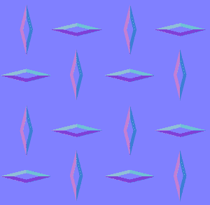
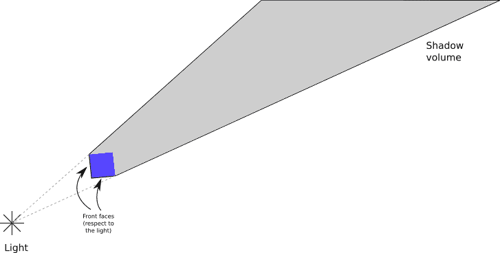
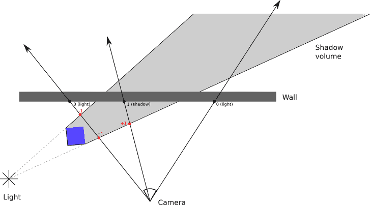
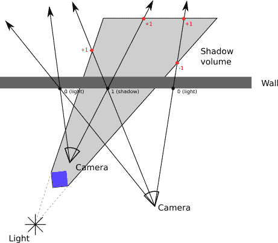

# 十五、扩展光栅化器

> 原文:[https://gabrielgambetta . com/computer-graphics-from scratch/15-extending-the-rasterizer . html](https://gabrielgambetta.com/computer-graphics-from-scratch/15-extending-the-rasterizer.html)

我们将以结束第一部分的同样方式结束本书的第二部分:用一组我们在前几章开发的光栅化器的可能扩展。

## [法线贴图](#normal-mapping)

在[第 13 章(阴影)](13-shading.html)中，我们看到了一个表面的法向量如何对它的外观有很大的影响。例如，法线的正确选择可以使多面物体看起来平滑弯曲；这是因为法线的正确选择改变了光线与表面的交互方式，从而改变了我们大脑猜测物体形状的方式。不幸的是，除了让曲面看起来平滑弯曲，我们无法通过插值法线做更多的事情。

在第 14 章(纹理)中，我们看到了如何通过在表面上“绘画”来添加假细节。这种技术称为纹理映射，它让我们对表面的外观进行更精细的控制。然而，纹理映射不会改变三角形的形状——它们仍然是平的。

*法线贴图*结合了这两种思想。我们可以使用法线来改变光线与表面相互作用的方式，从而改变表面的外观形状；我们可以使用属性映射为三角形的不同部分分配不同的属性值。通过结合这两个想法，法线贴图让我们在像素级别定义表面法线。

为此，我们将一个*法线贴图*关联到每个三角形。法线贴图类似于纹理贴图，但是它的元素是法线向量而不是颜色。在渲染时，我们不像 Phong shading 那样计算插值法线，而是使用法线贴图来获取我们正在渲染的特定像素的法线向量，与纹理贴图获取该特定像素的颜色的方式相同。然后我们用这个向量来计算这个像素的亮度。

图 15-1 显示了一个应用了纹理贴图的平面，以及应用法线贴图时不同光线方向的效果。

图 15-1 中的三幅图像都是一个带有纹理的平面正方形(即两个三角形)的渲染图，如(a)所示。当我们添加法线贴图和适当的每像素阴影时，我们创建了额外的几何细节的幻觉。在(b)和(c)中，钻石的明暗取决于入射光的方向，我们的大脑将此解释为钻石具有体积。

有几个实际的注意事项要记住。首先，法线贴图中向量的方向相对于它们所应用的三角形的表面。用于此的坐标系称为*切空间*，其中两个轴(通常为 \(X\) 和 \(Z\) )与表面相切(即嵌入)，剩余的矢量垂直于表面。在渲染时，在相机空间中表示的三角形的法向量根据法向量图中的向量被修改，以获得可用于照明方程的最终法向量。这使得法线贴图独立于场景中对象的位置和方向。

第二，编码法线贴图的一种非常流行的方式是作为纹理，将 \(X\) 、 \(Y\) 和 \(Z\) 的值映射到 \(R\) 、 \(G\) 和 \(B\) 的值。这使法线贴图具有非常典型的紫色外观，因为紫色是红色和蓝色的组合，但没有绿色，编码表面的平坦区域。图 15-2 显示了在图 15-1 的例子中使用的法线贴图。

Figure 15-2: The normal map used for the examples in Figure 15-1, encoded as a RGB texture虽然这种技术可以极大地提高场景中表面的感知复杂性，但它也不是没有限制。例如，由于平面保持平坦，它不能改变对象的轮廓。出于同样的原因，当从极端角度或近距离查看法线贴图表面时，或者当法线贴图所表示的特征与表面的大小相比太大时，这种错觉就会消失。这种技术更适合微妙的细节，如皮肤上的毛孔，灰泥墙上的图案，或橘子皮的不规则外观。因此，该技术也被称为*凹凸贴图*。

## [环境映射](#environment-mapping)

我们开发的光线跟踪器的一个最显著的特点是能够显示相互反射的物体。在我们的光栅化器中，创建一个相对令人信服但有些虚假的反射实现是可能的。

假设我们有一个场景代表一所房子中的一个房间，我们想渲染一个放置在房间中间的反射物体。对于表示该对象表面的每个像素，我们知道它所表示的点的 3D 坐标、该点的表面法线，并且由于我们知道相机的位置，我们还可以计算到该点的视图向量。我们可以相对于表面法线反射视图矢量，以获得反射矢量，就像我们在[第 4 章(阴影和反射)](04-shadows-and-reflections.html)中所做的一样。

此时，我们想知道从反射矢量方向来的光的颜色。如果这是一个光线追踪器，我们只要沿着那个方向追踪一条光线就能找到答案。但是，这不是光线跟踪器。怎么办？

*环境映射*为这个问题提供了一个可能的答案。假设在渲染房间内的对象之前，我们在其中间放置一台摄像机，并渲染场景六次——每个垂直方向一次(上、下、左、右、前、后)。您可以想象相机在一个假想的立方体中，立方体的每一边都是其中一个渲染的视口。我们保留这六个渲染作为纹理。我们将这一组六个纹理称为*立方体贴图*，这就是为什么这种技术也被称为*立方体贴图*。

然后我们渲染反射物体。当我们需要反射颜色时，我们可以使用反射向量的方向来选择立方体贴图的纹理之一，然后使用该纹理的纹理元素来获得在该方向看到的颜色的近似值——所有这些都不需要跟踪单个光线！

这种技术有一些缺点。立方体贴图从单个点捕捉场景的外观。如果我们渲染的反射物体不在那个点上，反射物体的位置将不会完全符合我们的预期，所以很明显这只是一个近似值。如果反射物体在房间内移动，这将特别明显，因为反射的场景不会随着物体的移动而改变。

这种限制也表明了该技术的最佳应用:如果“房间”足够大，离对象足够远，也就是说，如果对象的移动相对于房间的大小来说很小，那么真实反射和预渲染环境贴图之间的差异可能会被忽略。例如，这对于表现深空中反射的宇宙飞船的场景将非常有效，因为“房间”(遥远的恒星和星系)对于所有实际目的来说都是无限远的。

另一个缺点是，我们不得不将场景中的对象分为两类:属于“房间”的静态对象，可以在反射中看到，以及可以反射的动态对象。在某些情况下，这可能是清楚的(墙壁和家具是房间的一部分；人不是)，但即使这样，动态对象也不会反映在其他动态对象上。

值得一提的最后一个缺点与立方体贴图的分辨率有关。在光线跟踪器中，我们可以跟踪非常精确的反射，在这种情况下，我们需要在精确度(高分辨率立方体贴图纹理产生更清晰的反射)和内存消耗(高分辨率立方体贴图纹理需要更多内存)之间进行权衡。实际上，这意味着环境贴图不会产生像真实光线跟踪反射那样清晰的反射，尤其是在近距离观察反射物体时。

## [阴影](#shadows)

我们开发的光线跟踪器的特点是几何形状正确，非常清晰的阴影。这些是核心算法的自然延伸。光栅化器的架构使得实现阴影稍微复杂一点，但并非不可能。

让我们从形式化我们试图解决的问题开始。为了正确地渲染阴影，每次我们计算像素和灯光的照明方程时，我们都需要知道像素是否实际上被灯光照亮，或者相对于灯光它是否在对象的阴影中。

使用光线跟踪器，我们可以通过跟踪从表面到灯光的光线来回答这个问题；在光栅化器中，我们没有这样的工具，所以我们必须采取不同的方法。让我们探索两种不同的方法。

### [模版阴影](#stencil-shadows)

*模板阴影*是一种渲染边缘非常清晰的阴影的技术(想象一个阳光灿烂的日子里物体投射的阴影)。这些通常被称为*硬阴影*。

我们的光栅化器在一次*过程*中渲染场景；它遍历场景中的每个三角形并将其渲染到画布上，每次都计算完整的照明方程(基于每个三角形、每个顶点或每个像素，具体取决于着色算法)。在这个过程的最后，画布包含场景的最终渲染。

我们将从修改光栅化器开始，在几个*通道*中渲染场景，每个通道对应场景中的一个光线(包括环境光)。像以前一样，每个过程都经过每个三角形，但它计算照明方程时只考虑与该过程相关联的灯光。

这给了我们一组被每种光分别照亮的场景的图像。我们可以将它们组合在一起——也就是说，一个像素一个像素地添加——给我们最终的场景渲染。该最终图像与单程版本产生的图像相同。图 15-3 显示了我们参考场景的三个光线通道和最终合成。

这让我们简化了我们的目标，即“多次渲染具有来自多个光源的阴影的场景”到“多次渲染具有来自单个光源的阴影的场景”现在，我们需要找到一种方法来渲染一个被单一光线照亮的场景，同时让光线阴影中的像素完全变黑。

为此，我们引入了*模板缓冲*。与深度缓冲区一样，它与画布具有相同的维度，但其元素是整数。我们可以将它用作呈现操作的模板，例如，修改我们的呈现代码，仅当模板缓冲区中的相应元素的值为零时，才在画布上绘制像素。

如果我们可以设置模板缓冲区，使得被照亮的像素的值为零，阴影中的像素的值不为零，那么我们就可以用它来只绘制被照亮的像素。

#### [创建阴影体](#creating-shadow-volumes)

为了设置模板缓冲，我们使用了一个叫做*阴影体积*的东西。阴影体积是“包裹”在灯光阴影中的空间体积周围的 3D 多边形。

我们为每个可能在场景中投射阴影的物体构建一个阴影体。首先，我们确定哪些边缘是物体轮廓的一部分；这些是正面三角形和背面三角形之间的边(我们可以使用点积来对三角形进行分类，就像我们在[第 12 章(隐藏表面移除)](12-hidden-surface-removal.html)中对背面剔除技术所做的那样)。然后，对于这些边缘中的每一个，我们将它们从光的方向挤出，一直到无限远——或者，实际上，到场景之外的一个非常大的距离。

这给了我们阴影体积的“侧面”。体积的“正面”由对象本身的正面三角形组成，体积的“背面”可以通过创建一个多边形来计算，该多边形的边是挤出边的“远”边。

图 15-4 显示了一个立方体相对于点光源的阴影体。

Figure 15-4: The shadow volume of a cube with respect to a point light接下来，我们将看到如何使用阴影体积来确定画布中的哪些像素相对于灯光处于阴影中。

#### [计算阴影体积线交点](#counting-shadow-volumeray-intersections)

想象一条光线从相机开始进入场景，直到它碰到一个表面。在此过程中，它可能会进入和离开任意数量的卷影。

我们可以用一个从零开始的计数器来记录。每当光线进入一个阴影体，我们增加计数器；每次它离开，我们就减少它。当光线到达一个表面时，我们停下来看着计数器。如果它是零，意味着光线进入的阴影体积和它离开的一样多，所以这个点必须被照亮；如果它不为零，这意味着光线至少在一个阴影体积内，因此该点必须在阴影中。图 15-5 显示了几个这样的例子。

然而，这只适用于相机本身不在阴影体积内的情况！如果光线在阴影体积内开始，并且在到达表面之前没有离开，我们的算法将错误地得出它被照亮的结论。

Figure 15-5: Counting the intersections between rays and shadow volumes tells us whether a point along the ray is illuminated or in shadow.我们可以检查这种情况，并相应地调整计数器，但是计算一个点包含多少阴影体是一项开销很大的操作。幸运的是，有一种方法可以克服这种限制，这种方法更简单、更便宜，尽管有些违背直觉。

光线是无限的，但阴影体积不是无限的。这意味着光线总是在阴影体积之外开始和结束。这反过来意味着光线进入阴影体的次数总是和它离开阴影体的次数一样多；整个射线的计数器必须始终为零。

假设我们在光线到达表面后跟踪光线和阴影体的交点。如果计数器的值为零，那么在光线到达表面之前该值也必须为零*。如果计数器有一个非零值，它在表面的另一侧一定有相反的值。*

这意味着在光线到达表面之前计算光线和阴影体积之间的交点相当于计算它之后的交点——但是在这种情况下，我们不必担心相机的位置！图 15-6 显示了这种技术如何总是产生正确的结果。

Figure 15-6: The counters have a value of zero for points that receive light, and a nonzero value for points that are in shadow, regardless of whether the camera is inside or outside the shadow volume.#### [设置模板缓冲器](#setting-up-the-stencil-buffer)

我们正在使用光栅化器，而不是光线跟踪器，所以我们需要找到一种方法来保持这些计数器，而不需要实际计算光线和阴影体之间的任何交集。我们可以通过使用模板缓冲区来做到这一点。

首先，我们将场景渲染为仅由环境光照明。环境光没有投射阴影，所以我们可以在不改变光栅化器的情况下做到这一点。这给了我们一个我们需要用来合成最终渲染的图像，但是它也给了我们场景的深度信息，就像从相机看到的一样，包含在深度缓冲区中。我们需要为接下来的步骤保留这个深度缓冲。

接下来，对于每个灯光，我们遵循以下步骤:

1.  将阴影体积的背面“渲染”到模板缓冲区，每当像素*未通过*深度缓冲测试时，递增其值。这将计算光线在撞击最近的曲面后离开阴影体积的次数。

2.  将阴影体积的正面“渲染”到模板缓冲区，每当像素*未通过*深度缓冲测试时，就减少其值。这将计算光线在撞击最近的曲面后进入阴影体积的次数。

注意，在“渲染”步骤中，我们只对修改模板缓冲区感兴趣；不需要将像素写入画布，因此也不需要计算光照或纹理。我们也不写深度缓冲区，因为阴影体的边实际上不是场景中的物理对象。相反，我们使用我们在环境照明过程中计算的深度缓冲。

完成此操作后，模板缓冲区中被照亮的像素值为零，阴影中的像素值为其他值。因此，我们正常渲染场景，由对应于该过程的单一光线照亮，只在模板缓冲区的值为零的像素上调用`PutPixel`。

对每个灯光重复这个过程，我们最终得到一组与每个灯光照亮的场景相对应的图像，并正确地考虑了阴影。最后一步是将所有图像逐个像素地叠加在一起，形成最终的场景渲染。

使用模板缓冲渲染阴影的想法可以追溯到 20 世纪 90 年代初，但是最初的实现有几个缺点。这里描述的深度失败变体在 1999 年和 2000 年期间被独立发现过几次，最著名的是约翰·卡马克在制作*毁灭战士 3* 时发现的，这就是为什么这个变体也被称为*卡马克的反向*。

### [阴影贴图](#shadow-mapping)

另一个众所周知的在光栅化器中渲染阴影的技术叫做*阴影映射*。这会渲染边缘不太清晰的阴影(想象一下阴天物体投射的阴影)。这些通常被称为*软阴影*。

重申一下，我们试图回答的问题是，给定表面上的一个点和一束光，这个点是否接受到来自那束光的照明？这相当于确定在光和点之间是否有物体。

使用光线跟踪器，我们跟踪一条从点到光的光线。在某种意义上，我们在问这个点是否能“看见”光，或者，换句话说，光是否能“看见”这个点。

这就引出了阴影贴图的核心思想。我们从光线的角度渲染场景，保留深度缓冲。类似于我们如何创建上面描述的环境贴图，我们渲染场景六次，最后得到六个深度缓冲区。这些深度缓冲区，我们称之为*阴影贴图*，让我们确定光线在任何给定方向上“看到”的最近表面的距离。

对于平行光来说，情况稍微复杂一些，因为它们没有位置来渲染。相反，我们需要从*方向*渲染场景。这需要使用一个*正投影*，而不是我们通常的透视投影。使用透视投影和点光源，每条光线都从一个点开始；使用正交投影和平行光，每条光线都相互平行，共享同一个方向。

当我们想要确定一个点是否在阴影中时，我们计算从光到该点的距离和方向。我们使用方向在阴影贴图中查找相应的条目。如果这个深度值小于从点到灯光的距离，这意味着有一个表面比我们照亮的点更靠近灯光，因此这个点在那个表面的阴影中；否则，光线可以无障碍地“看到”该点，因此该点被光线照亮。

请注意，阴影贴图的分辨率有限，通常低于画布。根据点和灯光的距离和相对方向，这可能会导致阴影看起来呈块状。为了避免这种情况，我们还可以对周围深度条目的深度进行采样，并确定该点是否位于阴影的边缘(如周围条目中的深度不连续所证明的)。如果是这种情况，我们可以使用类似于双线性过滤的技术，就像我们在[第 14 章(纹理)](14-textures.html)中所做的那样，得出一个介于 0.0 和 1.0 之间的值，代表*该点从光线中可见的程度*，并将其乘以光线的照度；这使阴影贴图创建的阴影具有特有的模糊外观。避免块状外观的其他方法包括以不同的方式对阴影贴图进行采样——例如，查看*百分比接近过滤*。

## [总结](#summary)

Like in [Chapter 5 (Extending the Raytracer)](05-extending-the-raytracer.html), this chapter briefly introduced several ideas you can explore by yourself. These extend the rasterizer developed over the previous chapters to bring its features closer to those of the raytracer, while retaining its speed advantage. There’s always a trade-off, and in this case it comes in the form of less accurate results or increased memory consumption, depending on the algorithm.