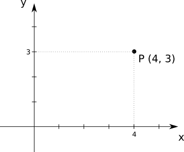
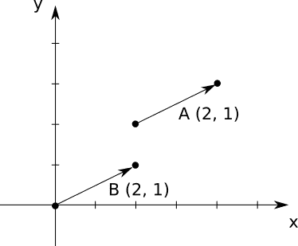
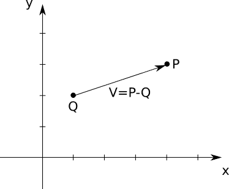
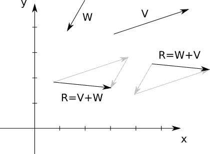
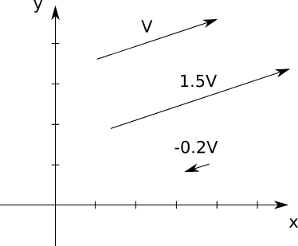
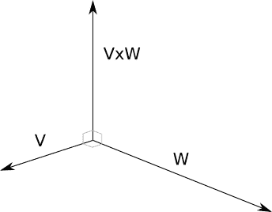

# 附录 A、线性代数

> 原文:[https://gabrielgambetta . com/computer-graphics-from scratch/A0-linear-algebra . html](https://gabrielgambetta.com/computer-graphics-from-scratch/A0-linear-algebra.html)

这个附录是线性代数的备忘单。该主题包括一组工具、它们的属性以及你可以使用的它们的功能。如果你对所有这一切背后的理论感兴趣，你可以拿起任何入门线性代数教科书。

这里的重点是二维和三维代数，因为这是本书的要求。

## [点](#points)

一个*点*代表坐标系内的一个位置。

我们将一个点表示为括号中的一系列数字 — 例如， \((4，3)\) 。我们用大写字母来指代点，如 \(P\) 或 \(Q\) 。

点序列中的每个数字被称为一个*坐标*。坐标数就是该点的*维度*。一个有两个坐标的点叫做二维，或 2D。

数字的顺序很重要； \((4，3)\) 和 \((3，4)\) 不一样。按照惯例，坐标在二维系中被称为 \(x\) 和 \(y\) ，在三维系中被称为 \(x\) 、 \(y\) 、\(z \)；所以点 \((4，3)\) 有一个 \(x\) 坐标 \(4\) 和一个 \(y\) 坐标 \(3\) 。图 A-1 显示了 \(P\) ，一个坐标为 \((4，3)\) 的二维点。

图 A-1：二维点 *P* 具有坐标 （4， 3）。

我们也可以用下标来表示一个点的具体坐标，比如 \(P_x\) 或者 \(Q_y\) 。所以点 \(P\) 也可以方便地写成 \((P_x，P_y，P_z)\) 。

## [向量](#vectors)

一个*向量*代表两点之间的差值。直观上，把一个向量想象成一个箭头，连接一个点和另一个点；或者，把它想象成从一点到另一点的说明。

### [表示向量](#representing-vectors)

我们用括号中的一组数字来表示向量，并用大写字母来指代它们。这和我们用来表示点的方法是一样的，所以我们在上面加了一个小箭头来表示它们是向量而不是点。例如， \((2，1)\) 是一个向量，我们可能决定称之为 \(\vec{A}\) 。图 A-2 显示了两个相等的向量， \(\vec{A}\) 和 \(\vec{B}\) 。

图 A-2：向量\(\vec{\mathsf{A}}\) 和 \(\vec{\mathsf{B}}\) 相等。向量没有位置。

尽管向量与点共享其表示形式，它并不表示位置，也没有位置；毕竟，它是两个位置之间的*差*。当你有一个类似图 A-2 的图时，你必须在某处画出向量；但是向量 \(\vec{A}\) 和 \(\vec{B}\) 是相等的，因为它们代表相同的位移。

另外，点 \((2，1)\) 和向量 \((2，1)\) 是不相关的。当然，向量 \((2，1)\) 从 \((0，0)\) 到 \((2，1)\) ，但是它从 \((5，5)\) 到 \((7，6)\) 也是如此。

向量的特征在于由它们的*方向*(它们指向的角度)和它们的*大小*(它们有多长)。

方向可以进一步分解为*方位*(他们所在的线的斜率)和*指向*(他们沿着那条线指向可能的两种方式中的哪一种)。例如，指向右侧的向量和指向左侧的向量都具有相同的水平方向，但它们具有相反的意义。然而，我们在本书的任何地方都没有进行这种区分。

### [向量幅度](#vector-magnitude)

你可以从向量的坐标计算出它的大小。幅值也被称为向量的*长度*或*范数*。它通过将向量放在垂直线之间来表示，如 \(|\vec{V}|\) ，计算如下:

\[| \ vec { v } | = \sqrt{{v_x}^2+{v_y}^2+{v_z}^2}\]

幅值等于 \(1.0\) 的向量称为*单位向量*。

## [点和向量运算](#point-and-vector-operations)

现在我们已经定义了点和向量，让我们来探索一下我们可以用它们做什么。

### [点的差](#subtracting-points)

向量是两点之差。换句话说，你可以用两个点相减，得到一个向量:

\[\vec{V} = P - Q\]

在这种情况下，你可以把 \(\vec{V}\) 想象成从 \(Q\) “去” \(P\) ，如图 A-3。

图 A-3：矢量 \(\vec{\mathsf{V}}\) 是 \(P\) 和 \(Q\) 之间的差。

从代数上来说，你可以分别用每个坐标相减:

\[(V_x，V_y，V_z) = (P_x，P_y，P_z) - (Q_x，Q_y，Q_z) = (P_x - Q_x，P_y - Q_y，P_z - Q_z)\]

### [点和向量进行相加](#adding-a-point-and-a-vector)

我们可以逐个坐标地改写上面的等式:

\[V _ x = P _ x-Q _ x \]\[V _ y = P _ y-Q _ y \]\[V _ z = P _ z-Q _ z \]

这些只是字母，所以所有通常的规则都适用。这意味着你可以进行下面的操作:

\[Q _ x+V _ x = P _ x \]\[Q _ y+V _ y = P _ y \]\[Q _ z+V _ z = P _ z \]

并再次对坐标进行分组，

\[Q + \vec{V} = P\]

换句话说，你可以在一个点上加一个向量，得到一个新点。这具有直观和几何意义：给定一个起始位置(一个点)和一个位移(一个向量)，你最终会到达一个新的位置(另一个点)。图 A-4 给出了一个例子。

图 A-4：把 \(\vec{\mathsf{V}}\) 加给 *Q* ，我们得到 *P* 。

### [向量加法](#adding-vectors)

你可以把两个向量进行相加。从几何上讲，想象一下把一个向量放在另一个向量的“后面”，如图 A-5 所示。

图 A-5：两个向量进行相加。加法是可交换的。请记住，向量没有位置。

如你所见，向量加法是可交换的——也就是说，操作数的顺序无关紧要。在图中我们可以看到 \(\vec{V} + \vec{W} = \vec { W }+\vec { V } \) 。

从代数上来说，你可以单独对坐标进行加法运算:

\[\vec{V} + \vec{W} = (V_x，V_y，V_z) + (W_x，W_y，W_z) = (V_x + W_x，V_y + W_y，V_z + W_z)\]

### [将向量乘以数字](#multiplying-a-vector-by-a-number)

你可以用一个数字乘以一个向量。这被称为*标量积*。这使得向量变得更短或更长，如图 A-6 所示。

图 A-6：将向量乘以数字

如果数字是负数，向量会指向另一个方向：这意味着它改变了它的指向，从而改变了它的方向。但是一个向量乘以一个数字永远不会改变它的方向——也就是说，它会保持在同一条线上。

从代数角度来看，你可以将各个坐标和数字进行相乘:

\( k \cdot \vec{V} \) = \( k \cdot (V_x，V_y，V_z) \) = (\(k \cdot V_x，k \cdot V_ y，k \cdot V_z\)) \)

你还可以将向量除以数字。就像数字一样，除以 \(k\) 相当于乘以 \(\frac{1}{k}\) 。像往常一样，被零除是不起作用的。

向量乘除的应用之一就是*归一化*一个向量——也就是把它变成一个单位向量。这会将向量的大小更改为 \(1.0\) ，但不会更改它的其他属性。为此，我们只需将向量除以其长度:

\( \vec{V_{normalized}} = \frac{\vec{V}}{|\vec{V}|} \)

### [向量乘法](#multiplying-vectors)

你可以将一个向量乘以另一个向量。有趣的是，有很多方法可以定义这样的操作。我们将关注两种对我们有用的乘法:点积和叉积。

#### [点积](#dot-product)

两个向量之间的*点积*(也称为*内积*)给你一个数字。它使用点运算符来表示，如在 \( \vec{V} \cdot \vec{W}\) 中。也写在尖括号之间，如 \(\lang\vec{V}，\vec{W} \rangle\) 。

用代数方法，将各个坐标相乘，然后相加:

\[ \langle \vec{V}，\vec{W} \rangle \] = \[ \langle(V_x，V_y，V_z)，(W_x，W_y，W_ z) \rangle \] = \(V_x \cdot W_x + V_y \cdot W_y+V_z \cdot W_z \)

几何上， \( \vec{V}\) 和 \(\vec{W}\) 的点积与它们的长度和它们之间的角度 \(\alpha\) 有关。精确的公式巧妙地将线性代数和三角学联系在一起:

\[ \langle \vec{V}，\vec{W} \rangle \] = \[ |\vec{V}| \cdot |\vec{W}| \cdot \text { cos }(\alpha) \]

这两个公式中的任何一个都有助于我们看到点积是可换的(即，\(\langle \vec{V}，\vec{W} \rangle \) = \(\langle\ vec { W }，\vec{V} \rangle\) )，以及它对于标量积是可分配的(即，\( k \cdot \langle \vec{V}，\vec{W} \rangle \) = \( \langle k \cdot \vec{V}，\vec{W} \rangle \))。

第二个公式的一个有趣的推论是，如果 \(\vec{V}\) 和 \(\vec{W}\) 垂直，那么 cos \((\alpha) = 0\) 因而\(\langle \vec{V}，\vec{W} \rangle\) 也为零。如果 \(\vec{V}\) 和 \(\vec{W}\) 是单位向量，那么\(\langle \vec{V}，\vec{W} \rangle\) 总是在 \(-1.0\) 和 \(1.0\) 之间，其中 \(1.0\) 意味着它们是相等的，而\(−1.0\)意味着它们是相反的。

第二个公式还表明，点积可用于计算两个向量之间的角度:

\[ 
    \alpha = {cos} ^{-1}  ( \frac { \langle \vec{V}，\vec{W} \rangle}{|\vec{V}| \cdot |\vec{W}| })
    \]

请注意，向量与其自身的点积\(\langle \vec{V}，\vec{V} \rangle\) ，减少到其长度的平方:

\[
    \langle \vec{V}，\vec{V} \rangle = { V_ x } ^ 2+{ V_ y } ^ 2+{ V_ z } ^ 2 = { | \vec { V} | } ^ 2 \]

这表明了另一种计算向量长度的方法，即向量与其自身的点积的平方根:

\[
    |\vec{V}| = \sqrt { \langle \vec {V}，\vec {V} \rangle }\]

#### [叉积](#cross-product)

两个向量的叉积给出了另一个向量。它使用交叉运算符来表示，如 \(\vec{V} \times \vec{W}\) 。

两个向量的叉积是垂直于两个向量的向量。在本书中，我们只在三维向量上使用叉积，如图 A-7 所示。

图 A-7：两个向量的交叉积是垂直于两个向量的向量。

它的计算比点积稍微复杂一点。比如要计算 \(\vec { R } = \vec { V } \times \vec { W } \)，则

\[R _ x = V _ y \cdot W _ z-V _ z \cdot W _ y \]\[R _ y = V _ z \cdot W _ x-V _ x \cdot W _ z \]\[R _ z = V _ x \cdot W _ y-V _ y \cdot W _ x \]

叉积是不可交换的。具体来说，\(\vec { V } \times \vec { W } =-(\vec { W } \times \vec { V })\)。

我们使用叉积来计算曲面的*法向量*——即垂直于曲面的单位向量。为此，我们在曲面上取两个向量，计算它们的叉积，并对结果进行归一化。

## [矩阵](#matrices)

一个*矩阵*是一个数字的矩形阵列。出于本书的目的，矩阵代表可以应用于点或向量的*变换*，我们用大写字母来指代它们，例如 \(M\) 。这和我们提到点的方式是一样的，但是通过上下文可以清楚地知道我们是在谈论矩阵还是点。

矩阵的特征在于它的列和行的大小。例如，这是一个\(4 \times 3\) 矩阵:

$$
\begin{pmatrix} 
1 & 2 & 3 & 4 \\
-3 & -6 & 9 & 12 \\ 
0 & 0 & 1 & 1 
\end{pmatrix}
$$

## [矩阵运算](#matrix-operations)

让我们看看我们能用矩阵和向量做些什么。

### [矩阵相加](#adding-matrices)

只要具有相同的大小，你可以把两个矩阵进行相加。加法是一个元素一个元素地完成的:

\[
    \begin {pmatrix}     
    a&b&c \\  
    d&e&f \\     
    g&h&I 
    \end {pmatrix} +
    \begin{pmatrix} 
    j&k&l \\ 
    m&n&o \\
    p&q&r
    \end {pmatrix} =
    \begin{pmatrix} 
    a+j&b+k&c+l \\ 
    d+m&e+n&f+o \\
    g+p&h+q&i+r
    \end {pmatrix}
\]

### [用一个数乘以一个矩阵](#multiplying-a-matrix-by-a-number)

你可以用一个数乘以一个矩阵。你只需将矩阵的每个元素乘以这个数字:

\[ n \cdot \begin{pmatrix} 
a&b&c \\ 
d&e&f \\ 
g&h&I 
\end{pmatrix}  = 
    \begin{pmatrix} 
    n\cdot a &n\cdot b &n\cdot c\\
    n\cdot d &n\cdot e &n\cdot f\\
    n\cdot g &n\cdot h &n\cdot i
    \end{pmatrix}
    \]

### [矩阵乘法](#multiplying-matrices)

你可以将两个矩阵相乘，只要它们的大小兼容：第一个矩阵中的列数必须与第二个矩阵中的行数相同。例如，你可以将一个\(2 \times 3\) 矩阵乘以一个\(3 \times 4\) 矩阵，但不能反过来！与数字不同，矩阵乘法的顺序很重要，即使你要将两个可以按任意顺序相乘的方阵相乘。

两个矩阵相乘的结果是另一个矩阵，其行数与左侧矩阵相同，列数与右侧矩阵相同。继续我们上面的例子，一个\(2 \times 3\) 矩阵乘以一个\(3 \times 4\) 矩阵的结果是一个\(2 \times 4\) 矩阵。

让我们看看如何将两个矩阵 A 和 B 相乘:

\[A = \begin {pmatrix} A&B&c \\ 
d&e&f 
\end {pmatrix} \]

\[B = \begin {pmatrix} g&h&I&j \\ 
k&l&m&n \\ 
o&p&q&r 
\end {pmatrix} \]

为了更清楚地说明问题，让我们把 A 和 B 中的值分组为向量:让我们把 A 写成一列行(水平)向量，把 B 写成一行列(垂直)向量。例如，A 的第一行是向量 \((a，B，c)\) ，B 的第二列是向量 \((h，l，p)\) :

\[A = \begin{pmatrix} 
(a,b,c)\\ 
(d,e,f)
\end {pmatrix} \]

\[B = 
\begin{pmatrix} 
\begin{pmatrix} g\\ k\\ o \end{pmatrix}
&\begin{pmatrix} h\\ l\\ p \end{pmatrix}
&\begin{pmatrix} i\\ m\\ q \end{pmatrix}
&\begin{pmatrix} j\\ n\\ r \end{pmatrix}
\end{pmatrix}
\]

让我们给这些向量命名:

\[A = \begin{pmatrix}-\vec{A_0}- \\ -\vec {A_1 }-\end{pmatrix} \]

\[B = \begin{pmatrix} 
|&|&|&| \\
\vec {B_0}&
\vec {B_1}&
\vec {B_2}&
\vec {B_3}\\
|&|&|&|
\end{pmatrix} \]

我们知道 A 是\(2 \times 3\) 的矩阵，B 是\(3 \times 4\) 的矩阵，所以我们知道结果会是一个\(2 \times 4\) 的矩阵:

\[\begin{pmatrix}
-\vec { A_0 }-\\
-\vec { A_ 1 }-
\end {pmatrix} \cdot 
\begin{pmatrix} 
|&|&|&| \\
\vec {B_0}&
\vec {B_1}&
\vec {B_2}&
\vec {B_3}\\
|&|&|&|
\end{pmatrix} =
\begin{pmatrix} 
c_{00}&c_{01}&c_{02}&c_{03} \\
c_{10}&c_{11}&c_{12}&c_{13} 
\end{pmatrix}\]

现在我们可以对结果矩阵的元素应用一个简单的公式：结果的行 \(r\) 和列 \(c\) 中元素的值——即 \(c _ { RC } \) ——是 \(\textbf{A}\) 中对应的行向量和 \(\textbf{B}\) 中的列向量的点积，即：

\[\begin{pmatrix}
-\vec { A_0 }-\\
-\vec { A_ 1 }-
\end {pmatrix} \cdot 
\begin{pmatrix} 
|&|&|&| \\
\vec {B_0}&
\vec {B_1}&
\vec {B_2}&
\vec {B_3}\\
|&|&|&|
\end{pmatrix} =
\begin{pmatrix} 
\langle \vec{A_0},\vec{B_0}\rangle &\langle \vec{A_0},\vec{B_1}\rangle &\langle \vec{A_0},\vec{B_2}\rangle &\langle \vec{A_0},\vec{B_3}\rangle  \\
\langle \vec{A_1},\vec{B_0}\rangle &\langle \vec{A_1},\vec{B_1}\rangle &\langle \vec{A_1},\vec{B_2}\rangle &\langle \vec{A_1},\vec{B_3}\rangle  
\end{pmatrix}\]

例如 \(c_{01} = \langle \vec{A_0}，\vec{B_1} \rangle\) ，可以扩展为\(A \cdot h+B \cdot l+c \cdot p \)。

### [矩阵和向量相乘](#multiplying-a-matrix-and-a-vector)

你可以把一个 *n* 维向量想象成一个\(n \times 1\) 垂直矩阵或者一个\(1 \times n\) 水平矩阵，并且像你乘任何两个兼容矩阵一样乘。例如，下面是如何将一个\(2 \times 3\) 矩阵和一个 3D 向量相乘:

\[ 
    \begin{pmatrix} 
    a&b&c \\ 
    d&e&f \\  
    \end{pmatrix} \cdot 
    \begin {pmatrix} 
    x \\ y \\ z 
    \end {pmatrix} = 
    \begin{pmatrix} 
    a \cdot x+b \cdot y+c \cdot z \\ 
    d \cdot x+e \cdot y+f \cdot z
    \end{pmatrix}\]

由于矩阵和向量（或向量和矩阵）相乘的结果也是向量，在我们的例子中，矩阵表示变换，我们可以把它称为矩阵*变换*向量。
